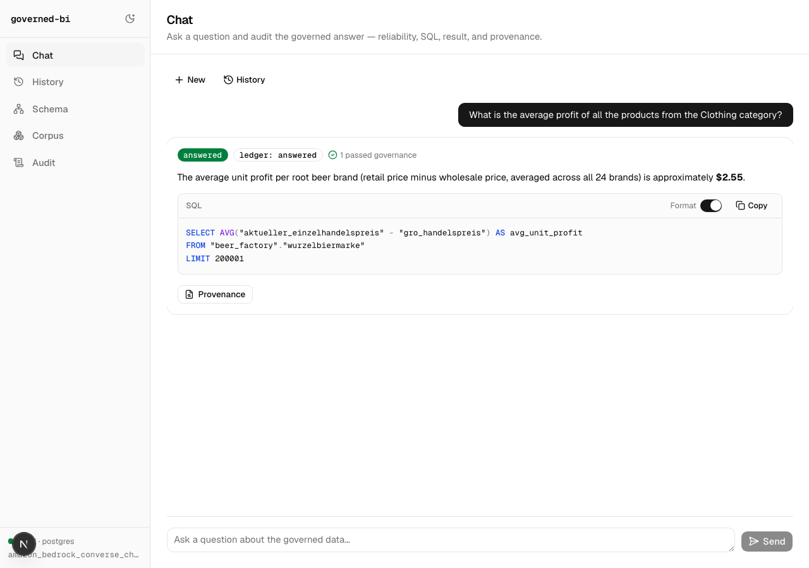

# governed-bi

**Ask your database questions in English. Get an answer, the SQL behind it, or a reason it could
not answer.**

[](https://github.com/Minhao-Zhang/governed-bi/actions/workflows/ci.yml)

[](LICENSE)

governed-bi turns a business question into read-only SQL, checks that SQL before it runs, and
hands back the statement along with the answer. When it cannot find what a question needs, it
says so instead of guessing.

## What is unusual about it

**The governance boundary is a missing tool, not a prompt.** The model proposes SQL; it never
holds a database handle. The connector is closed over inside `build_tools`, and the two tools that
execute put the statement through a six-layer deterministic check first. The tables retrieval found
for a question are the only tables the query may touch, so a retrieval miss surfaces as a refusal
you can see rather than an answer computed over whatever was nearby.

**The measurement knows its own noise floor.** Two runs of this engine with the configuration held
fixed disagree on 12.7% of outcomes (172 of 1,351), which puts SE(net) near 1.0pp — 0.83pp with
routing pinned — so the smallest effect a 1,351-question arm resolves at 80% power is about 2.3pp.
Arms are compared with paired McNemar over discordant pairs, never by subtracting two EX numbers,
and the threshold is written down before the run rather than once the number is visible.

**Accuracy is quoted at a stated coverage.** On arm `v4`, corpus `BIRD-corpus` @ `30872d3`, 1,351
questions across 57 schemas: the engine commits to 1,278 turns (94.6% coverage) at **0.714** and
declines 73 (5.4%) — when its own context on the turn was insufficient, not because it judged the
question hard. Score the same run with every turn forced to an answer and it is **EX 0.676**, the
figure BIRD reports. Same 913 correct answers, two denominators.

[Open work](docs/open-work.md) is long on purpose: it lists every defect this project has found in
itself, including the defects in its own measuring instrument.

## What it looks like


Read the SQL, not the answer. The question says "root beer brand" and "star rating"; the statement
says `wurzelbiermarke.markenname` and `sternbewertung`. Nobody typed those. The physical schema
here is deliberately obfuscated — this is the [BIRD-Obfuscation](https://github.com/Minhao-Zhang/BIRD-Obfuscation)
lake, where table and column names carry no English meaning — and the mapping from business
vocabulary onto them lives in the semantic layer you curate. That layer is the product. The
trailing `LIMIT` is a row guard the engine appends to every statement.

Now the half that matters more. Asked for something the licensed schema does not contain, it does
not improvise — it stops:


It names what it could not map — "sales region", "employee headcount" — states that it cannot
build a valid query without help, and waits. An engine without this returns a confident, plausible,
wrong number computed over whatever tables happened to be nearby. That is the failure this design
exists to make structurally unavailable.

The pause is a real `interrupt()`, not a dead end. Answer it and the same turn resumes:



"Reasoning · 2 steps" is the interrupt seen from both sides.

Both are real turns. **They are a demonstration, not a measurement**: one small schema, restored
locally, on a model and corpus pairing that is not any arm in `runs/eval/`. Nothing in them is a
quotable figure — for those, see [how well it works](#how-well-it-works) below and
[failure modes](docs/failure-modes.md).

The interface is [governed-bi-ui](https://github.com/Minhao-Zhang/governed-bi-ui), a separate
Next.js client that holds no database handle either — it is a consumer of the same governed HTTP
surface described in [the usage guide](docs/usage.md). Everything shown above is also available
from the command line.

## What the layers actually do

Every statement is parsed and inspected before the database sees it. The stack rejects writes,
rejects a function call it does not permit, rejects a bare `SELECT *`, rejects a reference it
cannot bind to exactly one source, rejects an excluded column, and rejects any table the question
did not license. A seventh layer, cost, is declared and ships disabled.

Each turn also leaves a record of what ran, what was rejected, and why, so you can audit an answer
after the fact rather than taking it on faith. [Architecture](docs/architecture.md) has the
wiring; [ADR 0006](docs/adr/0006-execution-time-governance.md) has the layer stack and the ten
bypasses it was built against.

## Requirements

- [uv](https://docs.astral.sh/uv/)
- Python 3.13
- A Postgres database
- A semantic layer (see below)

## Install

```bash
uv sync
```

Copy `.env.example` to `.env` and fill in three values:

```bash
GOVERNED_BI_PG_DSN=host=127.0.0.1 port=5432 dbname=... user=... password=...
OPENAI_API_KEY=sk-...
GOVERNED_BI_CORPUS_DIR=../BIRD-corpus
```

## Usage

One question from the command line:

```bash
uv run python -m governed_bi.serve --schema <schema> -q "your question"
```

As a server, with a streaming API for chat interfaces. This one needs a fourth value —
`GOVERNED_BI_API_KEY`, the shared key every route but `GET /livez` requires. Leaving it unset
does not leave the server open; it makes the server refuse every request with 401.

```bash
GOVERNED_BI_API_KEY=$(openssl rand -hex 32) uv run langgraph dev
```

Every environment variable and both API surfaces are in [the usage guide](docs/usage.md).

## The semantic layer

governed-bi does not read your database and guess. It reads a semantic layer you curate: files
describing your tables, columns, joins, metrics and business vocabulary. That is where "Oklahoma"
learns to mean `'OKC'`, and where "active customer" gets a definition your finance team agrees
with.

A ready-made one for the BIRD benchmark lake is in a separate repository,
[BIRD-corpus](https://github.com/Minhao-Zhang/BIRD-corpus): 13,304 assets across 57 schemas. Point
`GOVERNED_BI_CORPUS_DIR` at your own to serve your own data. The format is in
[corpus format](docs/corpus-format.md).

## How well it works

Arm `v4`, engine `3c0079a`, corpus [`BIRD-corpus`](https://github.com/Minhao-Zhang/BIRD-corpus) @
`30872d3`, 1,351 questions across 57 schemas.

| | |
|---|---:|
| Correct, among the questions it answered | **0.714** (n = 1,278, 94.6% coverage) |
| Questions it declined | 73 (5.4%) |
| Declined questions it would have got **wrong** | **77.4%** (48 of the 62 that can be priced) |
| Correct over all 1,351 turns — unfiltered BIRD EX | 0.676 |

Two things keep that table honest.

**The declines are not a difficulty estimate.** The 73 are 20 refusals, 4 clarifications, and 49
turns that spent all five query attempts without a passing statement. Every refusal and
clarification is a retrieval failure — 19 of the 20 end on `r_table_not_licensed`, and all 4
clarifications licensed nothing at all — and 26 of the 49 capped turns were not fully covered
either. What abstention tracks is whether this engine had enough context on the turn, not how hard
the question is.

A governance-off contrast arm puts a bound on that. WrenAI runs the same questions against the
same database with a refusal rate of 0; it answers all 73 declined questions and gets 56.2% of
them right, against 68.5% on the 1,278 this engine commits to. The ratio is 1.22×, so the declined
set is mostly answerable. That arm differs from this engine on every dimension at once, so it
bounds the claim rather than attributing it. And 77.4% is a figure over a subset the dataset
selected, not a random one: 62 of the 73 carry a gold fingerprint, and for the other 11 what the
engine would have got is unknown rather than zero.

**About 4 points of that EX are shape, not retrieval.** Arm `v5` is `v4` with one paragraph about
result-column selection deleted from the prompt and nothing else changed; EX falls 0.676 → 0.635
(−4.07pp, paired McNemar p = 4.9e-06, 143 discordant). The grader hashes result rows, so aligning
the output column set to the reference answer is worth points that nothing inside the engine
checks. Every system reporting EX on this benchmark carries some of that; measuring it costs a
second arm.

How the measurement works, and where the engine still gets things wrong, are in
[measurement](docs/measurement.md) and [failure modes](docs/failure-modes.md).

## Documentation

| | |
|---|---|
| [Usage](docs/usage.md) | install, configure, serve |
| [Architecture](docs/architecture.md) | how a turn is put together |
| [Corpus format](docs/corpus-format.md) | writing a semantic layer |
| [Measurement](docs/measurement.md) | running an evaluation and reading the result |
| [Failure modes](docs/failure-modes.md) | how the engine gets things wrong |
| [ADRs](docs/adr/) | the binding design decisions |
| [Open work](docs/open-work.md) | the defect list, the instrument's own defects included |
| [governed-bi-ui](https://github.com/Minhao-Zhang/governed-bi-ui) | the Next.js client shown above, in its own repository |

## Project status

Research code, actively developed, no production users. The API and the corpus format still
change. [Open work](docs/open-work.md) lists what is unfinished and what is known to be wrong.

## License

MIT (see [LICENSE](LICENSE)), copyright 2026 Minhao Zhang.

The bundled data is third-party: `data/bird/beer_factory.sqlite` comes from the
[BIRD benchmark](https://bird-bench.github.io/) under
[CC BY-SA 4.0](https://creativecommons.org/licenses/by-sa/4.0/). See
[`data/bird/NOTICE`](data/bird/NOTICE).
