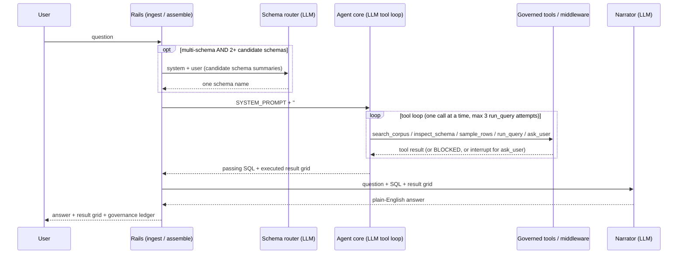

# Agentic BI Analyst: LLM Call Walkthrough

This traces one question through the serve path (`analyst.agent`) call by call, showing
the *exact* text the model receives at each step. It complements [Analyst](analyst.md),
which describes the surrounding rails; here the goal is narrower: every system
prompt reproduced verbatim, every user/human message shown with the placeholders where
dynamic content is injected, and the tool loop shown as an illustrative transcript.

> Implementation: [`src/governed_bi/analyst/agent.py`](../src/governed_bi/analyst/agent.py),
> [`context.py`](../src/governed_bi/analyst/context.py),
> [`tools.py`](../src/governed_bi/analyst/tools.py),
> [`narrate.py`](../src/governed_bi/analyst/narrate.py),
> [`retrieval/schema_router.py`](../src/governed_bi/retrieval/schema_router.py).

## Overview: up to three model calls

One question makes **up to three** model calls, in this order:

- **(A) Schema routing**: only on the multi-schema path, and only when retrieval
  shortlisted **2 or more** candidate schemas. Zero candidates route to `""`; exactly
  one candidate is picked with **no LLM call**. Single-schema deployments skip this
  entirely.
- **(B) The agent core**: a LangChain `create_agent` tool loop. This is the main
  event: it may invoke the model many times as it calls tools, one at a time.
- **(C) The narrator**: one call that phrases the executed result grid into plain
  English. Skipped for refusals and when no narrator is configured.

(A) and (C) are single-shot calls that flow through the same seam:
`chat.complete(system, user)`. `LangChainChatClient.complete` (`llm/langchain_client.py`)
builds the message list `[("system", system), ("human", user)]` and invokes the model
once. (B) is different in shape: it is a `create_agent` built with `system_prompt=`
plus a `HumanMessage`, and the model is called repeatedly inside that agent's own loop.

## (A) Schema routing

`retrieval/schema_router.py`'s `select_schema` picks one schema from the candidates
BM25 retrieval shortlisted.

**System prompt (verbatim):**

```text
You route a natural-language question to exactly ONE database schema. You are given candidate schemas and their tables. Reply with ONLY the single schema name (verbatim, no punctuation) that can answer the question. It must be exactly one of the candidate names.
```

**User message (assembled):**

```text
Question: [USER_QUESTION]

Candidate schemas:
[SCHEMA_SUMMARIES]

Answer with exactly one of: [CANDIDATE_1, CANDIDATE_2, ...]
```

`[SCHEMA_SUMMARIES]` is each candidate rendered by `_schema_pick_summary` as one block:

```text
schema: [SCHEMA_NAME]
  - [PHYSICAL_TABLE]: [SHORT_DESCRIPTION]
  - [PHYSICAL_TABLE]: [SHORT_DESCRIPTION]
  ... (up to 15 tables, then "… (N more tables)")
```

Deterministic guards around the call: an unparseable or out-of-set reply falls back to
`candidates[0]` (the top BM25 rank) rather than raising.

## (B) The agent core

### System prompt

`agent_core_node` hands `create_agent` the module-level `SYSTEM_PROMPT` with the
assembled `## Governed context` block appended:

```python
system_prompt = f"{SYSTEM_PROMPT}\n\n## Governed context\n{context_block}"
```

`SYSTEM_PROMPT` (verbatim, `analyst/agent.py`):

```text
You answer questions over a governed data warehouse by writing **one read-only SELECT**.

The `## Governed context` below has been assembled for this question — its tables are already licensed and its joins, metrics, few-shot examples, and reliability caveats are curated, authoritative guidance. **Prefer it over guessing.** Follow the few-shot examples' style, use the listed joins, and never use a column marked DO NOT USE.

Write SQL using only identifiers shown in the context, then call `run_query`. If the context is missing a table or example you need, call `search_corpus` for more, and `inspect_schema` any table **not** already listed before querying it (that licenses it). Use `sample_rows` if you need to see real values. If `run_query` returns BLOCKED or an error, read it, fix the SQL, and retry (max 3). Never guess an identifier. Call tools **one at a time**.
```

### The `## Governed context` block

`context.py`'s `_render` builds this block from the deterministic `assemble` node's
output. Retrieval, join planning, and licensing all already ran before the model sees
anything. Sections appear in this order and are omitted when empty (`## Tables` is
always present):

```text
## Conversation so far (oldest first; use ONLY to resolve references in the latest question, e.g. 'that', 'last year')
  [ROLE]: [CONTENT]
  ...

## Tables (use ONLY these physical identifiers)
### [PHYSICAL_NAME][  [reachable only via a join]]  (grain: [GRAIN])
  [TABLE_DESCRIPTION]
    - [COLUMN] ([LOGICAL_TYPE], [ROLE]): [DESCRIPTION][  [SUSPECT - DO NOT USE: CAVEAT]]

## Joins (physical equality; prefer high-confidence)
  [ON_CLAUSE]  ([CARDINALITY], confidence [N.NN][, LOW CONFIDENCE])

## Business terms
  [TERM] (synonyms: [S1], [S2]) -> [BINDS_TO]

## Metrics (meaning; map to physical columns)
  [METRIC] = [EXPRESSION]  over [BASE_TABLE]  (dimensions: [D1], [D2])

## Reliability caveats (DO NOT USE these columns)
  [TABLE].[COLUMN]: [CAVEAT]

## Governance rules (must honour)
  ([KIND]) [STATEMENT]

## Example questions with gold SQL
  Q: [QUESTION]
  A: [SQL]

## Skills (routing / gotchas / patterns)
### [SKILL_ID] ([KIND])
[SKILL_BODY]
```

A concrete instance for a question retrieval scoped to `beer_factory`'s `transaction`
and `customers` tables (few-shots/terms/metrics/rules trimmed to what's realistic for
this scope):

```text
## Tables (use ONLY these physical identifiers)
### transaction  (grain: one row = one sale)
  One row per sale of a root beer unit to a customer.
    - TransactionID (integer, primary_key): unique sale identifier
    - RootBeerID (integer, foreign_key): root beer unit that was sold
    - PurchasePrice (decimal, measure): sale price, USD
### customers  [reachable only via a join]  (grain: one row = one customer)
  One row per customer of the root beer factory.
    - CustomerID (integer, primary_key): unique customer identifier
    - ZipCode (integer, dimension): postal code, stored as an integer  [SUSPECT - DO NOT USE: Stored as INTEGER, so leading zeros are lost. Unreliable as a postal key or for display; cast/pad before use.]

## Joins (physical equality; prefer high-confidence)
  transaction.CustomerID = customers.CustomerID  (many_to_one, confidence 0.90)

## Business terms
  brand (synonyms: root beer brand, label, make) -> table 'rootbeerbrand'

## Metrics (meaning; map to physical columns)
  total revenue = SUM(PurchasePrice)  over transaction  (dimensions: customer, brand, transaction_date)
  average star rating = AVG(StarRating)  over rootbeerreview  (dimensions: brand)

## Reliability caveats (DO NOT USE these columns)
  customers.ZipCode: Stored as INTEGER, so leading zeros are lost. Unreliable as a postal key or for display; cast/pad before use.

## Governance rules (must honour)
  (business_rule) The ingredient and availability flags on rootbeerbrand (CaneSugar, CornSyrup, Honey, ArtificialSweetener, Caffeinated, Alcoholic, AvailableInCans, AvailableInBottles, AvailableInKegs) are stored as the TEXT strings 'TRUE' and 'FALSE', not as integers or booleans. Filter with = 'TRUE', never = 1.

## Example questions with gold SQL
  Q: Which root beer brand has the highest average review rating?
  A: SELECT b.BrandName, AVG(r.StarRating) AS avg_rating
FROM rootbeerreview AS r
JOIN rootbeerbrand AS b ON r.BrandID = b.BrandID
WHERE r.StarRating IS NOT NULL
GROUP BY b.BrandName
ORDER BY avg_rating DESC

## Skills (routing / gotchas / patterns)
### skill_beer_factory_routing (routing)
# Beer factory: routing & gotchas

## Scope
Sales, customers, root beer brands, and reviews for a root beer factory.
`transaction` is the sales fact table; `rootbeer` is the unit dimension, which
rolls up to `rootbeerbrand`.

## Routing triggers
- Revenue / sales questions use `metric_revenue` [...]
- Rating / review-quality questions use `metric_avg_rating` [...]

## Gotchas
- Ingredient and availability flags on `rootbeerbrand` are the strings
  `'TRUE'`/`'FALSE'`, not integers [...]
- `customers.ZipCode` is an INTEGER, so leading zeros are lost [...]
- `transaction.CreditCardNumber` is PII and is excluded; never select it.
```

Note what is absent: `transaction.CreditCardNumber` never appears. It is
`governance.excluded`, so it is removed before the corpus is ever retrieved or
rendered, not merely flagged. Only `suspect` columns (curator-inferred, soft) show up
tagged `DO NOT USE`; `excluded` columns (human-set, hard) are invisible to the model
entirely.

### First human message

The inner agent's initial state is just the raw question, nothing else:

```python
agent_input = {
    "messages": [HumanMessage(content=question)],
    "licensed": seed_licensed,   # pre-populated table ids (Amendment 1)
    "ledger": [],
}
```

So the first human turn the model sees is literally:

```text
[USER_QUESTION]
```

### The tool loop

The model is offered four tools always, and a fifth (`ask_user`) only when
clarification is enabled. Tool calls are forced sequential
(`model.bind(parallel_tool_calls=False)`), and the system prompt itself repeats "Call
tools one at a time", so each step below is a separate model turn.

**Tools available (name, then the docstring the model sees as its description):**

- **`search_corpus(query)`**: "Find more governed context for a query beyond what you
  were given. Returns matching tables plus curated content — few-shot Q→SQL exemplars,
  metric expressions, and business terms. Use when the seeded context is missing a
  table/example you need; then `inspect_schema` any new table before querying it."
- **`inspect_schema(table_id)`**: "Show a table's columns+types and LICENSE it for
  this turn. You cannot query a table until you have inspected it. Call tools one at a
  time."
- **`sample_rows(table_id, n=5)`**: "Preview up to n rows of an already-licensed table
  (read-only, RLS via identity). Only allowlisted columns are returned — never excluded
  or suspect columns. Guardrailed and executed by governance middleware."
- **`run_query(sql)`**: "Execute a read-only SELECT. Guardrailed + audited by
  middleware. Only use identifiers from tables you have inspected. If BLOCKED, fix and
  retry."
- **`ask_user(question, why)`** (HITL only, when clarification is enabled): "Ask the
  user ONE short clarifying question and wait for their answer. Use ONLY when the
  question is genuinely ambiguous and the governed context cannot resolve it (e.g. two
  competing definitions of a term) — never for things you can answer by inspecting the
  schema or corpus. State plainly in `why` what is ambiguous. Returns the user's
  answer; continue with it."

**Illustrative transcript** (placeholders for anything dynamic):

```text
assistant → tool_call: search_corpus(query="[REFINED_QUERY]")
tool     → [SEARCH RESULT: matching tables + few-shots + metrics + terms + rules]

assistant → tool_call: inspect_schema(table_id="[TABLE_ID]")
tool     → table_id: [TABLE_ID]
           physical: [PHYSICAL_NAME]
           description: [TABLE_DESCRIPTION]
           columns:
             - [COL]: [PHYSICAL_TYPE] ([LOGICAL_TYPE])[ [SUSPECT — do not use]]
             ...
           # ^ this call also LICENSES the table (adds it to the turn's `licensed` set)

assistant → tool_call: run_query(sql="[GENERATED SELECT]")
tool     → columns: [[COL1], [COL2], ...]
           rows:
           [ROW_1]
           [ROW_2]
           ... ([N] rows total)
           # OR, on a guardrail failure:
           BLOCKED ([LAYER]): [REASON]
           # model reads the reason, fixes the SQL, and retries (attempt cap: 3)

assistant → [FINAL ANSWER TEXT]
```

`run_query` and `sample_rows` are intercepted and executed by `GovernanceMiddleware`;
the tool bodies in `tools.py` just `raise RuntimeError(...)` if ever reached directly.
The model never touches the database; every call is normalized (`sqlglot
identify=True`), guardrailed (L1-L5), and logged to the governance ledger before
anything runs. `inspect_schema` is what *licenses* a table (adds its id to the turn's
`licensed` set). The seeded context tables from Amendment 1 are already licensed, so
in practice most turns use these tools for **refinement**, not discovery.

**The `ask_user` (HITL) branch**, when clarification is enabled and genuinely needed:

```text
assistant → tool_call: ask_user(question="[Q]", why="[WHY]")
            # this call raises `interrupt(...)`; the graph pauses here
graph    → surfaces a clarification request to the client and waits
client   → [USER_ANSWER]  (or declines)
graph    → resumes the paused agent, feeding [USER_ANSWER] back as the tool's return value
assistant → continues the turn using [USER_ANSWER]
```

A decline resolves to the sentinel `"USER_DECLINED: the user did not answer; do not
guess."` and the outer rails short-circuit to a refusal rather than re-running the
agent.

## (C) The narrator

After a `run_query` passes and the SQL executes, `narrate.py`'s `LlmAnswerNarrator`
(when configured) phrases the result into plain English.

**System prompt (verbatim, `_NARRATOR_SYSTEM`):**

```text
You turn the result of a database query into a short, plain-English answer for a business user.

Rules:
- Answer the user's question directly, using ONLY the values in the result rows. Never invent, estimate, or round beyond what is shown.
- Be concise: one or two sentences. Do not restate the SQL or mention tables, columns, or "the query".
- If the result is a single value, state it plainly.
- If it is a list/ranking, summarise the top rows and note how many there are in total; do not read out every row (the full table is shown alongside your answer).
- If the result has no rows, say that nothing matched.
```

**User message (assembled):**

```text
Question: [USER_QUESTION]

SQL that ran:
[FINAL_SQL]

Result:
[RESULT_GRID]
```

`[RESULT_GRID]` is rendered as a pipe-delimited table, capped at 30 rows:

```text
[COL1] | [COL2]
-------------
[VAL1] | [VAL2]
...
... ([N] rows total)
```

The narrator is grounded by construction: it sees only the question, the already-run
SQL, and the already-bounded result grid. It cannot change the SQL, the guardrail
verdict, or the reliability tier. If the model returns an empty string, a deterministic
fallback (`_fallback_text`) fills in instead, so the answer text is never blank.

## End-to-end sequence



**See also:** [Analyst](analyst.md) for the full rails/guardrail design;
[ADR 0002](adr/0002-governed-agentic-serve-runtime.md) for why the agentic core exists;
[Asset schemas](asset-schemas.md) for what a `TableAsset`/`JoinAsset`/etc. looks like
before it is rendered into this context block.
