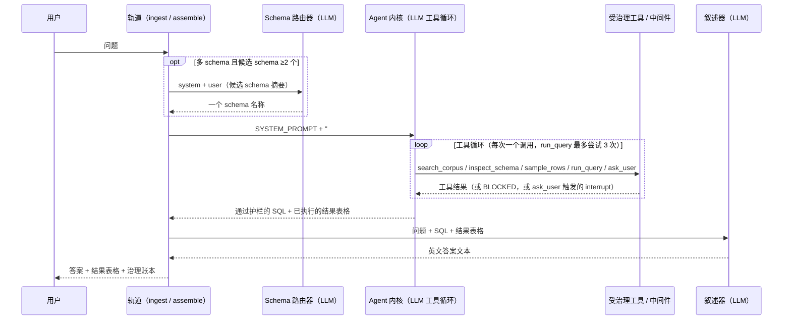

# Agentic BI Analyst：LLM 调用全流程

本文逐次调用地追踪一个问题如何流经服务路径（`analyst.agent`），展示模型在每一步
实际收到的*逐字*文本。它是 [Analyst](analyst.zh.md) 的补充。那份文档描述的是周围
的轨道（rails）；这里的目标更窄：把每一条系统提示逐字重现，把每一条 user/human
消息连同动态内容注入处的占位符一起展示，并把工具循环呈现为一份示意性的对话记录。

> 实现：[`src/governed_bi/analyst/agent.py`](../src/governed_bi/analyst/agent.py)、
> [`context.py`](../src/governed_bi/analyst/context.py)、
> [`tools.py`](../src/governed_bi/analyst/tools.py)、
> [`narrate.py`](../src/governed_bi/analyst/narrate.py)、
> [`retrieval/schema_router.py`](../src/governed_bi/retrieval/schema_router.py)。

## 概览：最多三次模型调用

一个问题最多会触发**三次**模型调用，顺序如下：

- **(A) Schema 路由**：仅在多 schema 路径上发生，且仅当检索初筛出**2 个或以上**
  候选 schema 时才会调用。零个候选会路由到 `""`；恰好一个候选则**无需 LLM 调用**
  即可直接选定。单 schema 部署完全跳过这一步。
- **(B) Agent 内核**：一个 LangChain `create_agent` 工具循环。这是主戏所在：它
  会在逐个调用工具的过程中多次调用模型。
- **(C) 叙述器（narrator）**：一次调用，把已执行的结果表格措辞成通顺的英文。遇到
  拒答，或未配置 narrator 时会被跳过。

(A) 与 (C) 都是单次调用，走的是同一个 seam：`chat.complete(system, user)`。
`LangChainChatClient.complete`（`llm/langchain_client.py`）会构建消息列表
`[("system", system), ("human", user)]` 并调用模型一次。(B) 的形态则不同：它是一个
以 `system_prompt=` 加一条 `HumanMessage` 构建出的 `create_agent`，模型会在该 agent
自身的循环内部被反复调用。

## (A) Schema 路由

`retrieval/schema_router.py` 中的 `select_schema` 会从 BM25 检索初筛出的候选中
选定一个 schema。

**系统提示（逐字）：**

```text
You route a natural-language question to exactly ONE database schema. You are given candidate schemas and their tables. Reply with ONLY the single schema name (verbatim, no punctuation) that can answer the question. It must be exactly one of the candidate names.
```

**用户消息（拼装而成）：**

```text
Question: [USER_QUESTION]

Candidate schemas:
[SCHEMA_SUMMARIES]

Answer with exactly one of: [CANDIDATE_1, CANDIDATE_2, ...]
```

`[SCHEMA_SUMMARIES]` 是每个候选经 `_schema_pick_summary` 渲染成的一个区块：

```text
schema: [SCHEMA_NAME]
  - [PHYSICAL_TABLE]: [SHORT_DESCRIPTION]
  - [PHYSICAL_TABLE]: [SHORT_DESCRIPTION]
  ... (up to 15 tables, then "… (N more tables)")
```

这次调用外围包着确定性的守卫：无法解析或超出候选集合的回复，会回退到
`candidates[0]`（BM25 排名最高者），而不会抛出异常。

## (B) Agent 内核

### 系统提示

`agent_core_node` 把模块级的 `SYSTEM_PROMPT` 交给 `create_agent`，并在末尾附上
已组装好的 `## Governed context` 区块：

```python
system_prompt = f"{SYSTEM_PROMPT}\n\n## Governed context\n{context_block}"
```

`SYSTEM_PROMPT`（逐字，`analyst/agent.py`）：

```text
You answer questions over a governed data warehouse by writing **one read-only SELECT**.

The `## Governed context` below has been assembled for this question — its tables are already licensed and its joins, metrics, few-shot examples, and reliability caveats are curated, authoritative guidance. **Prefer it over guessing.** Follow the few-shot examples' style, use the listed joins, and never use a column marked DO NOT USE.

Write SQL using only identifiers shown in the context, then call `run_query`. If the context is missing a table or example you need, call `search_corpus` for more, and `inspect_schema` any table **not** already listed before querying it (that licenses it). Use `sample_rows` if you need to see real values. If `run_query` returns BLOCKED or an error, read it, fix the SQL, and retry (max 3). Never guess an identifier. Call tools **one at a time**.
```

### `## Governed context` 区块

`context.py` 中的 `_render` 会依据确定性的 `assemble` 节点的输出来组装这个区块。
在模型看到任何东西之前，检索、连接规划与授权（licensing）都已经跑完。各个小节
按以下顺序出现，为空时会被省略（`## Tables` 除外，它总是存在）：

```text
## Conversation so far (oldest first; use ONLY to resolve references in the latest question, e.g. 'that', 'last year')
  [ROLE]: [CONTENT]
  ...

## Tables (use ONLY these physical identifiers)
### [PHYSICAL_NAME][  [reachable only via a join]]  (grain: [GRAIN])
  [TABLE_DESCRIPTION]
    - [COLUMN] ([LOGICAL_TYPE], [ROLE]): [DESCRIPTION][  [SUSPECT - DO NOT USE: CAVEAT]]

## Joins (physical equality; prefer high-confidence)
  [ON_CLAUSE]  ([CARDINALITY], confidence [N.NN][, LOW CONFIDENCE])

## Business terms
  [TERM] (synonyms: [S1], [S2]) -> [BINDS_TO]

## Metrics (meaning; map to physical columns)
  [METRIC] = [EXPRESSION]  over [BASE_TABLE]  (dimensions: [D1], [D2])

## Reliability caveats (DO NOT USE these columns)
  [TABLE].[COLUMN]: [CAVEAT]

## Governance rules (must honour)
  ([KIND]) [STATEMENT]

## Example questions with gold SQL
  Q: [QUESTION]
  A: [SQL]

## Skills (routing / gotchas / patterns)
### [SKILL_ID] ([KIND])
[SKILL_BODY]
```

下面是一个具体实例：某个问题的检索范围被限定到 `beer_factory` 的 `transaction`
与 `customers` 两张表（few-shots / terms / metrics / rules 都已按这个范围做了
裁剪，保留符合实际的部分）：

```text
## Tables (use ONLY these physical identifiers)
### transaction  (grain: one row = one sale)
  One row per sale of a root beer unit to a customer.
    - TransactionID (integer, primary_key): unique sale identifier
    - RootBeerID (integer, foreign_key): root beer unit that was sold
    - PurchasePrice (decimal, measure): sale price, USD
### customers  [reachable only via a join]  (grain: one row = one customer)
  One row per customer of the root beer factory.
    - CustomerID (integer, primary_key): unique customer identifier
    - ZipCode (integer, dimension): postal code, stored as an integer  [SUSPECT - DO NOT USE: Stored as INTEGER, so leading zeros are lost. Unreliable as a postal key or for display; cast/pad before use.]

## Joins (physical equality; prefer high-confidence)
  transaction.CustomerID = customers.CustomerID  (many_to_one, confidence 0.90)

## Business terms
  brand (synonyms: root beer brand, label, make) -> table 'rootbeerbrand'

## Metrics (meaning; map to physical columns)
  total revenue = SUM(PurchasePrice)  over transaction  (dimensions: customer, brand, transaction_date)
  average star rating = AVG(StarRating)  over rootbeerreview  (dimensions: brand)

## Reliability caveats (DO NOT USE these columns)
  customers.ZipCode: Stored as INTEGER, so leading zeros are lost. Unreliable as a postal key or for display; cast/pad before use.

## Governance rules (must honour)
  (business_rule) The ingredient and availability flags on rootbeerbrand (CaneSugar, CornSyrup, Honey, ArtificialSweetener, Caffeinated, Alcoholic, AvailableInCans, AvailableInBottles, AvailableInKegs) are stored as the TEXT strings 'TRUE' and 'FALSE', not as integers or booleans. Filter with = 'TRUE', never = 1.

## Example questions with gold SQL
  Q: Which root beer brand has the highest average review rating?
  A: SELECT b.BrandName, AVG(r.StarRating) AS avg_rating
FROM rootbeerreview AS r
JOIN rootbeerbrand AS b ON r.BrandID = b.BrandID
WHERE r.StarRating IS NOT NULL
GROUP BY b.BrandName
ORDER BY avg_rating DESC

## Skills (routing / gotchas / patterns)
### skill_beer_factory_routing (routing)
# Beer factory: routing & gotchas

## Scope
Sales, customers, root beer brands, and reviews for a root beer factory.
`transaction` is the sales fact table; `rootbeer` is the unit dimension, which
rolls up to `rootbeerbrand`.

## Routing triggers
- Revenue / sales questions use `metric_revenue` [...]
- Rating / review-quality questions use `metric_avg_rating` [...]

## Gotchas
- Ingredient and availability flags on `rootbeerbrand` are the strings
  `'TRUE'`/`'FALSE'`, not integers [...]
- `customers.ZipCode` is an INTEGER, so leading zeros are lost [...]
- `transaction.CreditCardNumber` is PII and is excluded; never select it.
```

请注意其中缺失的部分：`transaction.CreditCardNumber` 从未出现过。它属于
`governance.excluded`，因此早在语料被检索或渲染之前就已被移除，而不仅仅是被打上
标记。只有 `suspect` 列（curator 推断得出，软性）才会带着 `DO NOT USE` 标签出现；
`excluded` 列（人工设定，硬性）则对模型完全不可见。

### 首条 human 消息

内层 agent 的初始状态只有原始问题本身，别无其他：

```python
agent_input = {
    "messages": [HumanMessage(content=question)],
    "licensed": seed_licensed,   # pre-populated table ids (Amendment 1)
    "ledger": [],
}
```

因此模型看到的第一条 human 轮次，字面上就是：

```text
[USER_QUESTION]
```

### 工具循环

模型始终会被提供四个工具，第五个（`ask_user`）只在启用澄清（clarification）功能
时才会出现。工具调用被强制串行执行（`model.bind(parallel_tool_calls=False)`），
系统提示本身也反复申明“Call tools one at a time”，因此下面的每一步都是一次
独立的模型轮次。

**可用工具（先给出名称，再给出模型所看到的、作为该工具描述的文档字符串
（docstring））：**

- **`search_corpus(query)`**：“Find more governed context for a query beyond what you
  were given. Returns matching tables plus curated content — few-shot Q→SQL exemplars,
  metric expressions, and business terms. Use when the seeded context is missing a
  table/example you need; then `inspect_schema` any new table before querying it.”
- **`inspect_schema(table_id)`**：“Show a table's columns+types and LICENSE it for
  this turn. You cannot query a table until you have inspected it. Call tools one at a
  time.”
- **`sample_rows(table_id, n=5)`**：“Preview up to n rows of an already-licensed table
  (read-only, RLS via identity). Only allowlisted columns are returned — never excluded
  or suspect columns. Guardrailed and executed by governance middleware.”
- **`run_query(sql)`**：“Execute a read-only SELECT. Guardrailed + audited by
  middleware. Only use identifiers from tables you have inspected. If BLOCKED, fix and
  retry.”
- **`ask_user(question, why)`**（仅 HITL，启用澄清功能时才存在）：“Ask the
  user ONE short clarifying question and wait for their answer. Use ONLY when the
  question is genuinely ambiguous and the governed context cannot resolve it (e.g. two
  competing definitions of a term) — never for things you can answer by inspecting the
  schema or corpus. State plainly in `why` what is ambiguous. Returns the user's
  answer; continue with it.”

**示意性对话记录**（动态内容以占位符表示）：

```text
assistant → tool_call: search_corpus(query="[REFINED_QUERY]")
tool     → [SEARCH RESULT: matching tables + few-shots + metrics + terms + rules]

assistant → tool_call: inspect_schema(table_id="[TABLE_ID]")
tool     → table_id: [TABLE_ID]
           physical: [PHYSICAL_NAME]
           description: [TABLE_DESCRIPTION]
           columns:
             - [COL]: [PHYSICAL_TYPE] ([LOGICAL_TYPE])[ [SUSPECT — do not use]]
             ...
           # ^ this call also LICENSES the table (adds it to the turn's `licensed` set)

assistant → tool_call: run_query(sql="[GENERATED SELECT]")
tool     → columns: [[COL1], [COL2], ...]
           rows:
           [ROW_1]
           [ROW_2]
           ... ([N] rows total)
           # OR, on a guardrail failure:
           BLOCKED ([LAYER]): [REASON]
           # model reads the reason, fixes the SQL, and retries (attempt cap: 3)

assistant → [FINAL ANSWER TEXT]
```

`run_query` 与 `sample_rows` 会被 `GovernanceMiddleware` 拦截并代为执行；
`tools.py` 里的工具函数体如果真被直接触达，也只会 `raise RuntimeError(...)`。模型
从不直接接触数据库：每一次调用在真正运行之前都会先被规范化（`sqlglot
identify=True`）、过五层护栏（L1-L5），并记入治理账本。`inspect_schema` 才是真正
*授权（license）*一张表的动作（把它的 id 加入本轮的 `licensed` 集合）。由于
Amendment 1 播种的上下文表已经预先获得授权，实际上大多数轮次里，这些工具的作用
是**精炼（refinement）**，而非**发现（discovery）**。

**`ask_user`（HITL）分支**，出现在澄清功能已启用且确有必要时：

```text
assistant → tool_call: ask_user(question="[Q]", why="[WHY]")
            # this call raises `interrupt(...)`; the graph pauses here
graph    → surfaces a clarification request to the client and waits
client   → [USER_ANSWER]  (or declines)
graph    → resumes the paused agent, feeding [USER_ANSWER] back as the tool's return value
assistant → continues the turn using [USER_ANSWER]
```

用户拒绝回答会解析为哨兵值（sentinel）`"USER_DECLINED: the user did not answer; do
not guess."`，外层轨道（rails）会直接短路到拒答，而不会重新运行 agent。

## (C) 叙述器（narrator）

当一次 `run_query` 通过护栏并执行之后，`narrate.py` 中的 `LlmAnswerNarrator`
（如果已配置）会把结果措辞成通顺的英文。

**系统提示（逐字，`_NARRATOR_SYSTEM`）：**

```text
You turn the result of a database query into a short, plain-English answer for a business user.

Rules:
- Answer the user's question directly, using ONLY the values in the result rows. Never invent, estimate, or round beyond what is shown.
- Be concise: one or two sentences. Do not restate the SQL or mention tables, columns, or "the query".
- If the result is a single value, state it plainly.
- If it is a list/ranking, summarise the top rows and note how many there are in total; do not read out every row (the full table is shown alongside your answer).
- If the result has no rows, say that nothing matched.
```

**用户消息（拼装而成）：**

```text
Question: [USER_QUESTION]

SQL that ran:
[FINAL_SQL]

Result:
[RESULT_GRID]
```

`[RESULT_GRID]` 会被渲染成一张以竖线分隔的表格，最多 30 行：

```text
[COL1] | [COL2]
-------------
[VAL1] | [VAL2]
...
... ([N] rows total)
```

narrator 从结构上就是接地（grounded）的：它只能看到问题、已经执行过的 SQL，以及
已经限界过的结果表格。它无法改变 SQL、护栏裁决，或可靠性档位。如果模型返回空
字符串，一个确定性的兜底（`_fallback_text`）会补上文本，因此答案文字永远不会
是空的。

## 端到端流程



**另见：** [Analyst](analyst.zh.md) 了解完整的轨道/护栏设计；
[ADR 0002](adr/0002-governed-agentic-serve-runtime.md) 了解 agentic 内核为何存在；
[Asset schemas](asset-schemas.zh.md) 了解 `TableAsset`/`JoinAsset` 等资产在被渲染
进这个上下文区块之前是什么样子。
