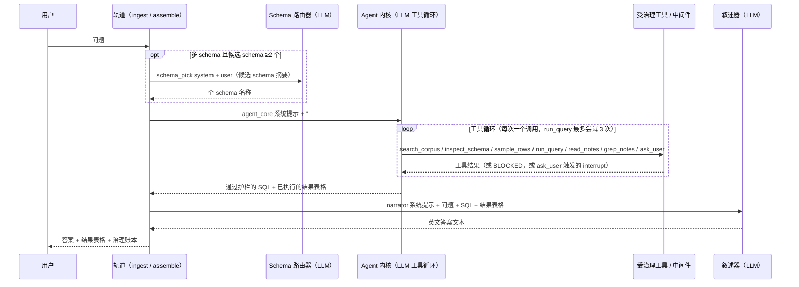

# Agentic BI Analyst：LLM 调用全流程

本文逐次调用地追踪一个问题如何流经服务路径（`analyst.agent`）：哪个阶段发出
哪条提示词、user/human 消息在动态内容注入处长什么样、每次调用外围又有哪些
确定性的守卫。它是 [Analyst](analyst.zh.md) 的补充——那份文档描述的是周围
的轨道（rails）。

**提示词文本本身不在这里重现。** 这条路径发出的每一条系统提示，都是
`governed_bi.prompts` 里一条具名、带版本号的记录——`src/governed_bi/prompts/registry.py`
是唯一真相源，在这里逐字引用，只要一次编辑或一个新变体出现就会立刻和源头
脱节（这份文档的上一版就正是这样脱节的）。要看某个阶段的确切文本，请直接去
查 registry；要看 `v1` 与更新的变体之间到底差在哪、一次运行怎么选定一个
变体、这个选择又是怎么打戳到它产出的每一行上的，见
[提示词变体实验](prompt-experiments.zh.md)。

> 实现：[`src/governed_bi/analyst/agent.py`](../src/governed_bi/analyst/agent.py)、
> [`context.py`](../src/governed_bi/analyst/context.py)、
> [`note_inject.py`](../src/governed_bi/analyst/note_inject.py)、
> [`tools.py`](../src/governed_bi/analyst/tools.py)、
> [`narrate.py`](../src/governed_bi/analyst/narrate.py)、
> [`retrieval/schema_router.py`](../src/governed_bi/retrieval/schema_router.py)、
> [`prompts/registry.py`](../src/governed_bi/prompts/registry.py)。

## 概览：最多三次模型调用

一个问题最多会触发**三次**模型调用，顺序如下：

- **(A) Schema 路由**——registry 阶段 `schema_pick`。仅在多 schema 路径上
  发生，且仅当检索初筛出**2 个或以上**候选 schema 时才会调用。零个候选会
  路由到 `""`；恰好一个候选则**无需 LLM 调用**即可直接选定。单 schema 部署
  完全跳过这一步。
- **(B) Agent 内核**——registry 阶段 `agent_core`。一个 LangChain
  `create_agent` 工具循环。这是主戏所在：它会在逐个调用工具的过程中多次
  调用模型。
- **(C) 叙述器（narrator）**——registry 阶段 `narrator`。一次调用，把已
  执行的结果表格措辞成通顺的英文。遇到拒答，或未配置 narrator 时会被跳过。

(A) 与 (C) 都是单次调用，走的是同一个 seam：`chat.complete(system, user)`。
`LangChainChatClient.complete`（`llm/langchain_client.py`）会构建消息列表
`[("system", system), ("human", user)]` 并调用模型一次。(B) 的形态则不同：
它是一个以 `system_prompt=` 加一条 `HumanMessage` 构建出的 `create_agent`，
模型会在该 agent 自身的循环内部被反复调用。

## (A) Schema 路由

`retrieval/schema_router.py` 中的 `pick_schema` 会从 `shortlist_schemas`
排出的候选里选定一个 schema（按向量相似度排序，没有 embedder 时才退回
BM25——见 [Data-lake run](plans/datalake-run.md)）。

**系统提示：** `prompts.text("schema_pick", prompt_variants)`，在 serve
技术栈构建时（`build_serve_rails`）解析一次，而不是每轮都解析。目前存在
两个变体（`v1`、`v2`——两者的差别见
[提示词变体实验](prompt-experiments.zh.md#三个真正存在的变体)）；两者都
要求模型把问题拆解成它需要的具体部分（实体、过滤条件、连接、要返回的值
或度量），再拿每个候选去逐一核对，因为近乎重复的同胞 schema（两个同主题
的 schema，或一个 schema 和它的 `_2` 孪生体）在主题与表描述文本上读起来
很像，真正的差别只在列的用词上。

**用户消息（由 `pick_schema` 拼装而成）：**

```text
Question: [USER_QUESTION]

Candidate schemas (most relevant first):
[SCHEMA_SUMMARIES]

Answer with exactly one of: [CANDIDATE_1, CANDIDATE_2, ...]
```

`[SCHEMA_SUMMARIES]` 是每个候选经 `_schema_pick_summary` 渲染成的一个区块：

```text
schema: [SCHEMA_NAME]
  - [PHYSICAL_TABLE]: [SHORT_DESCRIPTION][  [cols: C1, C2, ...]]
  ... (up to 15 tables, then "… (N more tables)")
```

`[cols: ...]` 这个后缀只有在 `schema_pick_max_columns > 0` 时才会按表出现
（数据湖驱动器默认把它设成 12；`0` 会退回只有名称的摘要）——真正能把两个
表描述读起来一样的同胞 schema 区分开的，正是这份列的用词。

**这次调用外围的确定性守卫，精确说来**（`pick_schema` / `_parse_schema_reply`）：

- 0 个候选 → `SchemaPick("")`，不调用 LLM。
- 1 个候选 → `SchemaPick(candidates[0])`，不调用 LLM。
- 2 个及以上候选 → 发起上面那次调用，然后回复会对着固定的候选列表来
  解析，绝不当作自由文本直接信任，判定顺序如下：(1) 回复最后一行独自
  出现一个裸的候选名（两个提示词变体都是这么要求的），视为干净的选定；
  (2) 否则，找一个*带标签*的答案（“Final answer: x” / “chosen: x”），
  从后往前扫描；(3) 在非最后一行找到一个精确的裸名称，或 (4) 某一行按
  词边界匹配到恰好一个候选名的子串——(3) 与 (4) 都会返回一个选定结果，
  但会标上 `fallback="parsed_nonfinal_line"`，因为模型没有把答案放在它
  被要求的位置；(5) 一个解析不了的回复，或调用本身抛出异常，都会降级为
  `SchemaPick(candidates[0], "unparseable_reply"/"call_failed")`——取
  检索排名最高的那个，绝不会凭空造一个不在候选列表里的名字。
- 上面每一种 `fallback` 原因都会被带在返回的 `SchemaPick` 上，并体现在
  provenance 里（`schema_pick_fallback`），这样一行降级过的记录就绝不会
  被当成一次真正的模型决策来计分。

## (B) Agent 内核

Registry 阶段 `agent_core`。`build_serve_rails` 每次构建技术栈只解析一次
提示词文本（`agent_core_prompt = prompts.text("agent_core", prompt_variants)`），
而 `agent_core_node` 会在每一轮都往后面追加已组装好的上下文与当前时间：

```python
system_prompt = agent_core_prompt
if context_block:
    system_prompt = f"{agent_core_prompt}\n\n## Governed context\n{context_block}"
system_prompt = f"{system_prompt}\n\n## Current time\n{now_local:%Y-%m-%d %H:%M:%S %Z (UTC%z)} ..."
```

目前存在三个变体（`v1`/`v2`/`v3`；见
[提示词变体实验](prompt-experiments.zh.md#三个真正存在的变体)）。三者形状
相同——优先采信已授权的治理上下文而不是凭空猜测，谨慎选表（哪怕列名对得
上，也要拒绝一份可疑/重复/备选的拷贝），只用已展示的标识符写 SQL，返回
的正是问题所问的东西，然后再执行——但 `v2` 把“拒绝错误的那份拷贝”变成了
独立的一步、带可见输出（说明问题的每个部分用了哪张表，点名拒绝了什么、
为什么拒绝），`v3` 则在写 SQL *之前*加了一步：先写清楚确切的输出列与
粒度，再拿最终的 `SELECT` 列表对照这句话检查，删掉不在这句话里的一切。

### `## Governed context` 区块

`context.py` 中的 `_render` 会依据确定性的 `assemble` 节点的输出来组装
这个区块。在模型看到任何东西之前，检索、连接规划与授权（licensing）都
已经跑完。各个小节按以下顺序出现，为空时会被省略（`## Tables` 除外，它
总是存在）：

```text
## Conversation so far (oldest first; use ONLY to resolve references in the latest question, e.g. 'that', 'last year')
  [ROLE]: [CONTENT]
  ...

## Tables (use ONLY these physical identifiers)
### [SCHEMA].[PHYSICAL_NAME][  [reachable only via a join]]  (grain: [GRAIN])
  [TABLE_DESCRIPTION]
    - [COLUMN] ([LOGICAL_TYPE], [ROLE]): [DESCRIPTION][  [SUSPECT - DO NOT USE: CAVEAT]]

## Joins (physical equality; prefer high-confidence)
  [ON_CLAUSE]  ([CARDINALITY], confidence [N.NN][, LOW CONFIDENCE])

## Business terms
  [TERM] (synonyms: [S1], [S2]) -> [BINDS_TO]

## Metrics (meaning; map to physical columns)
  [METRIC] = [EXPRESSION]  over [BASE_TABLE]  (dimensions: [D1], [D2])

## Reliability caveats (DO NOT USE these columns)
  [TABLE].[COLUMN]: [CAVEAT]

## Governance notes (must honour)
  ([KIND]) [SUMMARY][ (body, on_match notes only)]

## Governance notes (advisory)
  ([KIND]) [SUMMARY][ (body, on_match notes only)]

## Example questions with gold SQL
  Q: [QUESTION]
  A: [SQL]
```

表头始终是 schema 限定的（`schema.physical_name`）——自 D15 于
2026-07-17 的取代之后，引擎已统一采用限定标识符，所以哪怕是单 schema 的
BIRD/SQLite 路径（把文件 `ATTACH` 到一个 `corpus_pin` 别名下）也是这样
渲染，不只是多 schema 的 Postgres 路径。

下面是一个具体实例：某个问题的检索范围被限定到 `beer_factory` 的
`transaction` 与 `customers` 两张表（few-shots / terms / metrics 都已
按这个范围做了裁剪，保留符合实际的部分）：

```text
## Tables (use ONLY these physical identifiers)
### beer_factory.transaction  (grain: one row = one sale)
  One row per sale of a root beer unit to a customer.
    - TransactionID (integer, primary_key): unique sale identifier
    - RootBeerID (integer, foreign_key): root beer unit that was sold
    - PurchasePrice (decimal, measure): sale price, USD
### beer_factory.customers  [reachable only via a join]  (grain: one row = one customer)
  One row per customer of the root beer factory.
    - CustomerID (integer, primary_key): unique customer identifier
    - ZipCode (integer, dimension): postal code, stored as an integer  [SUSPECT - DO NOT USE: Stored as INTEGER, so leading zeros are lost. Unreliable as a postal key or for display; cast/pad before use.]

## Joins (physical equality; prefer high-confidence)
  beer_factory.transaction.CustomerID = beer_factory.customers.CustomerID  (many_to_one, confidence 0.90)

## Business terms
  brand (synonyms: root beer brand, label, make) -> table 'rootbeerbrand'

## Metrics (meaning; map to physical columns)
  total revenue = SUM(PurchasePrice)  over transaction  (dimensions: customer, brand, transaction_date)

## Reliability caveats (DO NOT USE these columns)
  customers.ZipCode: Stored as INTEGER, so leading zeros are lost. Unreliable as a postal key or for display; cast/pad before use.

## Governance notes (must honour)
  (business_rule) The ingredient and availability flags on rootbeerbrand (CaneSugar, CornSyrup, Honey, ArtificialSweetener, Caffeinated, Alcoholic, AvailableInCans, AvailableInBottles, AvailableInKegs) are stored as the TEXT strings 'TRUE' and 'FALSE', not as integers or booleans. Filter with = 'TRUE', never = 1.

## Governance notes (advisory)
  (routing) Use metric_revenue over transaction for revenue or sales and join through rootbeer to rootbeerbrand for brand breakdowns.

## Example questions with gold SQL
  Q: Which root beer brand has the highest average review rating?
  A: SELECT b.BrandName, AVG(r.StarRating) AS avg_rating
FROM rootbeerreview AS r
JOIN rootbeerbrand AS b ON r.BrandID = b.BrandID
WHERE r.StarRating IS NOT NULL
GROUP BY b.BrandName
ORDER BY avg_rating DESC
```

请注意其中缺失的部分：`transaction.CreditCardNumber` 从未出现过。它属于
`governance.excluded`，因此早在语料被检索或渲染之前就已被移除，而不仅仅
是被打上标记。只有 `suspect` 列（curator 推断得出，软性）才会带着
`DO NOT USE` 标签出现；`excluded` 列（人工设定，硬性）则对模型完全不
可见。

笔记的 `kind` 决定了它会落进这两个治理小节中的哪一个，以及它会不会在
agent 开口之前就被注入：`business_rule`/`constraint` 默认是
`activation=always` + `normative_force=must_honour`；`context`/
`domain_overview` 默认是 `always` + `advisory`；`routing`/`gotchas`/
`pattern` 默认是 `on_match` + `advisory`（由检索命中或一个关键词正则
触发，前提是 `pin_triggers_enabled`）。一条 `always` 笔记只注入它的
`summary`；一条被触发的 `on_match` 笔记则会同时注入 `summary` **与**
`body`（渐进式展开——见[设计决策](design-decisions.zh.md#d17受治理的笔记-三模态检索)
里的 D17）。一条 agent 需要、但始终没被触发的笔记，仍然可以在轮次进行中
经由下文的 `read_notes` / `grep_notes` 工具取到。

### 首条 human 消息

内层 agent 的初始状态只有原始问题本身，别无其他：

```python
agent_input = {
    "messages": [HumanMessage(content=question)],
    "licensed": seed_licensed,   # pre-populated table ids (Amendment 1)
    "ledger": [],
}
```

因此模型看到的第一条 human 轮次，字面上就是：

```text
[USER_QUESTION]
```

### 工具循环

模型始终会被提供**六个**工具，第七个（`ask_user`）只在启用澄清
（clarification）功能时才会出现。工具调用被强制串行执行
（`model.bind(parallel_tool_calls=False)`），系统提示本身也反复申明
“Call tools one at a time”，因此下面的每一步都是一次独立的模型轮次。

**可用工具（先给出名称，再给出模型所看到的、作为该工具描述的文档字符串
（docstring））：**

- **`search_corpus(query)`**：“Find more governed context for a query beyond what you
  were given. Returns matching tables plus curated content — few-shot Q→SQL exemplars,
  metric expressions, and business terms. Use when the seeded context is missing a
  table/example you need; then `inspect_schema` any new table before querying it.”
- **`inspect_schema(table_id)`**：“Show a table's columns+types and LICENSE it for
  this turn. You cannot query a table until you have inspected it. Call tools one at a
  time.”
- **`sample_rows(table_id, n=5)`**：“Preview up to n rows of an already-licensed table
  (read-only, RLS via identity). Only allowlisted columns are returned — never excluded
  or suspect columns. Guardrailed and executed by governance middleware.”
- **`run_query(sql)`**：“Execute a read-only SELECT. Guardrailed + audited by
  middleware. Only use identifiers from tables you have inspected. If BLOCKED, fix and
  retry.”
- **`read_notes(note_id)`**：“Read one governed note by id (summary + body). Does NOT
  license tables. Naming a table inside a note does not authorize `run_query` against
  it — call `inspect_schema` first. Excluded notes are hidden.”
- **`grep_notes(pattern)`**：“Search note summaries and bodies for a pattern
  (read-only, capped). Does NOT license tables. ReDoS-bounded; output capped. Excluded
  notes skip.”
- **`ask_user(question, why)`**（仅 HITL，启用澄清功能时才存在）：“Ask the
  user ONE short clarifying question and wait for their answer. Use ONLY when the
  question is genuinely ambiguous and the governed context cannot resolve it (e.g. two
  competing definitions of a term) — never for things you can answer by inspecting the
  schema or corpus. State plainly in `why` what is ambiguous. Returns the user's
  answer; continue with it.”

`read_notes` / `grep_notes` 在结构上就是只读、不做授权（non-licensing）
的（D17）：它们让 agent 能取到一条 scope 匹配上了、却没挤进注入预算的
笔记，或者直接对笔记文本做检索，而这条笔记自始至终都不会被算作一张已
授权的表。

**示意性对话记录**（动态内容以占位符表示）：

```text
assistant → tool_call: search_corpus(query="[REFINED_QUERY]")
tool     → [SEARCH RESULT: matching tables + few-shots + metrics + terms + notes]

assistant → tool_call: inspect_schema(table_id="[TABLE_ID]")
tool     → table_id: [TABLE_ID]
           physical: [SCHEMA].[PHYSICAL_NAME]
           description: [TABLE_DESCRIPTION]
           columns:
             - [COL]: [PHYSICAL_TYPE] ([LOGICAL_TYPE])[ [SUSPECT — do not use]]
             ...
           # ^ this call also LICENSES the table (adds it to the turn's `licensed` set)

assistant → tool_call: run_query(sql="[GENERATED SELECT]")
tool     → columns: [[COL1], [COL2], ...]
           rows:
           [ROW_1]
           [ROW_2]
           ... ([N] rows total)
           # OR, on a guardrail failure:
           BLOCKED ([LAYER]): [REASON]
           # model reads the reason, fixes the SQL, and retries (attempt cap: 3)

assistant → [FINAL ANSWER TEXT]
```

`run_query` 与 `sample_rows` 会被 `GovernanceMiddleware` 拦截并代为执行；
`tools.py` 里的工具函数体如果真被直接触达，也只会 `raise RuntimeError(...)`。模型
从不直接接触数据库：每一次调用在真正运行之前都会先被规范化（`sqlglot
identify=True`）、过五层护栏（L1-L5），并记入治理账本。`inspect_schema` 才是真正
*授权（license）*一张表的动作（把它的 id 加入本轮的 `licensed` 集合）。由于
Amendment 1 播种的上下文表已经预先获得授权，实际上大多数轮次里，这些工具的作用
是**精炼（refinement）**，而非**发现（discovery）**。

**`ask_user`（HITL）分支**，出现在澄清功能已启用且确有必要时：

```text
assistant → tool_call: ask_user(question="[Q]", why="[WHY]")
            # this call raises `interrupt(...)`; the graph pauses here
graph    → surfaces a clarification request to the client and waits
client   → [USER_ANSWER]  (or declines)
graph    → resumes the paused agent, feeding [USER_ANSWER] back as the tool's return value
assistant → continues the turn using [USER_ANSWER]
```

用户拒绝回答会解析为哨兵值（sentinel）`"USER_DECLINED: the user did not answer; do
not guess."`，外层轨道（rails）会直接短路到拒答，而不会重新运行 agent。

## (C) 叙述器（narrator）

Registry 阶段 `narrator`。当一次 `run_query` 通过护栏并执行之后，
`narrate.py` 中的 `LlmAnswerNarrator`（如果已配置）会把结果措辞成通顺
的英文。目前只存在 `v1`——narrator 跑在打分之后，一个 narrator 变体不
可能撼动 EX，也就没有指标能拿来衡量它。

**系统提示：** `prompts.text("narrator", prompt_variants)`，或者在传入
时使用 `LlmAnswerNarrator.__init__` 上注入的 `system_prompt`。它要求
模型只使用结果行里的值来作答，控制在一两句话以内，绝不复述 SQL，且在
没有匹配结果时要直说。

**用户消息（拼装而成）：**

```text
Question: [USER_QUESTION]

SQL that ran:
[FINAL_SQL]

Result:
[RESULT_GRID]
```

`[RESULT_GRID]` 会被渲染成一张以竖线分隔的表格，最多 30 行：

```text
[COL1] | [COL2]
-------------
[VAL1] | [VAL2]
...
... ([N] rows total)
```

narrator 从结构上就是接地（grounded）的：它只能看到问题、已经执行过的 SQL，以及
已经限界过的结果表格。它无法改变 SQL、护栏裁决，或可靠性档位。如果模型返回空
字符串，一个确定性的兜底（`_fallback_text`）会补上文本，因此答案文字永远不会
是空的。

## 端到端流程


```mermaid
sequenceDiagram
    participant U as 用户
    participant R as 轨道（ingest / assemble）
    participant SR as Schema 路由器（LLM）
    participant A as Agent 内核（LLM 工具循环）
    participant T as 受治理工具 / 中间件
    participant N as 叙述器（LLM）

    U->>R: 问题
    opt 多 schema 且候选 schema ≥2 个
        R->>SR: schema_pick system + user（候选 schema 摘要）
        SR-->>R: 一个 schema 名称
    end
    R->>A: agent_core 系统提示 + "## Governed context", HumanMessage(question)
    loop 工具循环（每次一个调用，run_query 最多尝试 3 次）
        A->>T: search_corpus / inspect_schema / sample_rows / run_query / read_notes / grep_notes / ask_user
        T-->>A: 工具结果（或 BLOCKED，或 ask_user 触发的 interrupt）
    end
    A-->>R: 通过护栏的 SQL + 已执行的结果表格
    R->>N: narrator 系统提示 + 问题 + SQL + 结果表格
    N-->>R: 英文答案文本
    R-->>U: 答案 + 结果表格 + 治理账本
```

**另见：** [Analyst](analyst.zh.md) 了解完整的轨道/护栏设计；
[ADR 0002](adr/0002-governed-agentic-serve-runtime.md) 了解 agentic 内核为何存在；
[提示词变体实验](prompt-experiments.zh.md) 了解 registry、一次运行如何选定一个
变体，以及这个选择如何被端到端归因；[Asset schemas](asset-schemas.zh.md) 了解
`TableAsset`/`JoinAsset`/`NoteAsset` 在被渲染进这个上下文区块之前是什么样子。
