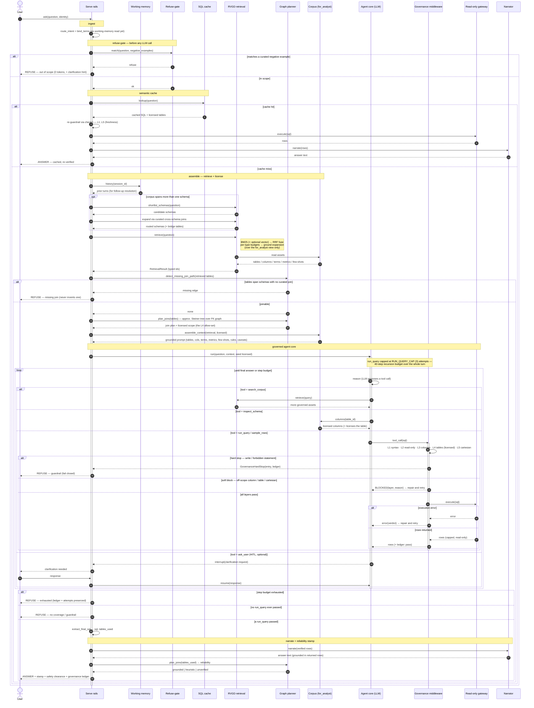

# Analyst — agentic sequence

The serve-time path a natural-language question travels to become a grounded,
governed, auditable answer. Every branch fails **closed**; the curated corpus is
the only source of truth. Source: [`analyst/agent.py`](../src/governed_bi/analyst/agent.py)
(the `build_serve_rails` outer graph) and [`gateway/guardrails.py`](../src/governed_bi/gateway/guardrails.py)
(the `check` stack).

**Participants → code**

| Lifeline | Where |
|---|---|
| Serve rails | `analyst/agent.py` · `build_serve_rails` StateGraph (`ingest → refuse_gate → prepare → cache → assemble → agent_core → narrate`) |
| Working memory | `memory/store.py` · `WorkingMemory` |
| Refuse-gate | `analyst/agent.py` · `refuse_gate` (curated `NegativeExampleAsset`s) |
| SQL cache | `analyst/governance.py` · `_try_cache_hit` |
| RVGD retrieval | `retrieval/rvgd.py` · `retrieve`; `retrieval/schema_router.py` |
| Graph planner | `graph/planner.py` · `detect_missing_join_path`, `plan_joins` |
| Corpus | `corpus/…` · `Corpus.for_analyst()` view |
| Agent core | `analyst/agent.py` · `build_agent_core` (LLM + tools) |
| Governance middleware | `analyst/middleware.py` · `GovernanceMiddleware` → `check` (L1–L5) |
| Read-only gateway | `gateway/…` · `Gateway` + connector (`PRAGMA query_only` / read-only role) |
| Narrator | `analyst/narrate.py` · `AnswerNarrator` (assurance enum in `analyst/answer.py`) |

## Notes

- **Fail-closed everywhere.** Refuse-gate, missing-join, a guardrail hard-stop,
  budget/attempt exhaustion, and no-coverage all end in a `REFUSE` — never a
  best-guess answer. A gateway execution error is returned to the agent as a tool
  message to repair (not a terminal); `refused_by="execution"` is only a defensive
  guard for an already-passing query that can no longer be replayed.
- **The repair loop is the non-linear core.** A *soft* guardrail block (an
  off-scope column/table or an accidental cartesian) is returned to the agent as
  a tool message so it can re-plan and retry within the step budget; a *hard*
  block (a write or forbidden statement) stops the turn immediately.
- **The middleware is the boundary the agent cannot self-authorize past.** Every
  data-touching tool call is re-parsed and re-checked (L1–L5) against the licensed
  scope and the read-only gateway — the LLM never talks to the database directly.
- **Auditability.** Each governed query appends one ledger entry (pass or block);
  the final answer carries the full ledger, a reliability stamp, and an explicit
  safety clearance.

Companion: [curator-sequence.md](curator-sequence.md) — how the corpus this path
reads is built.
