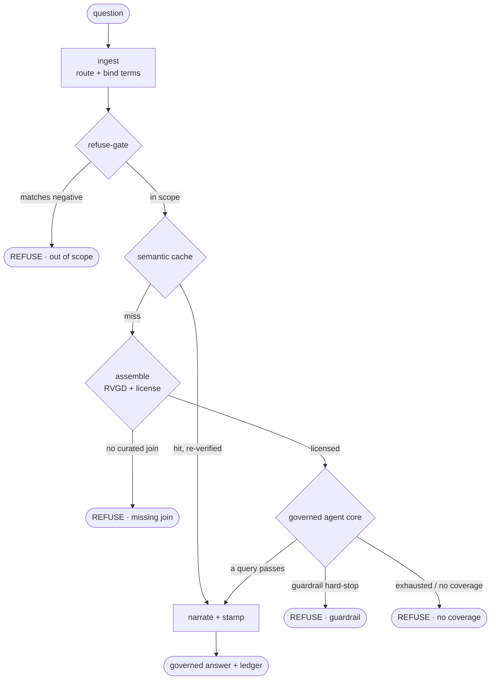
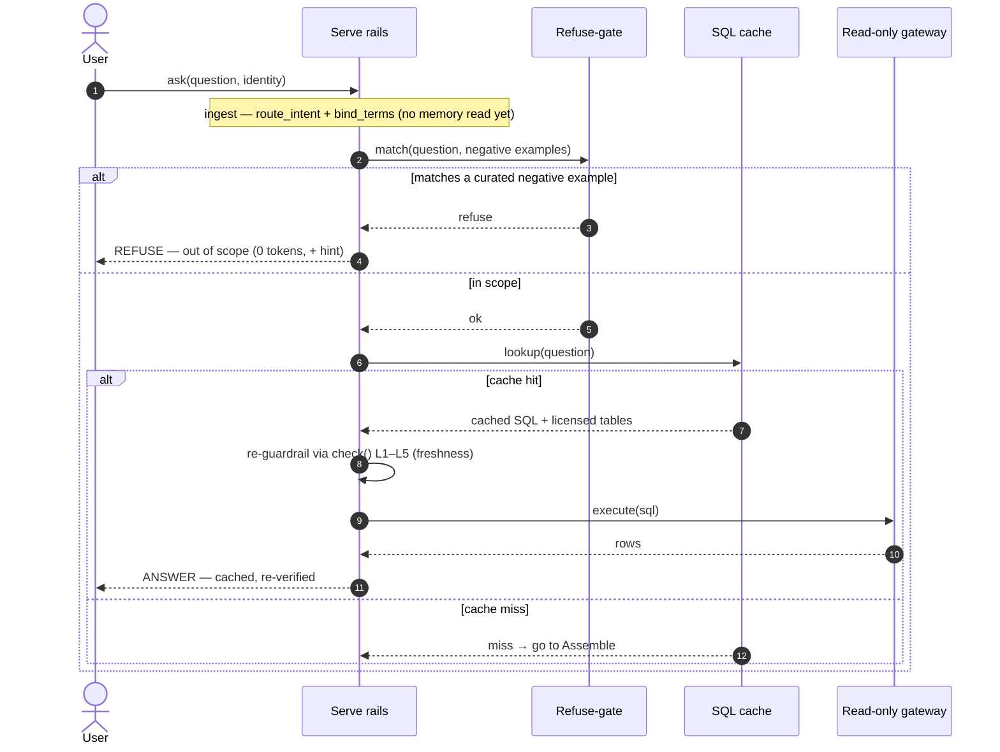
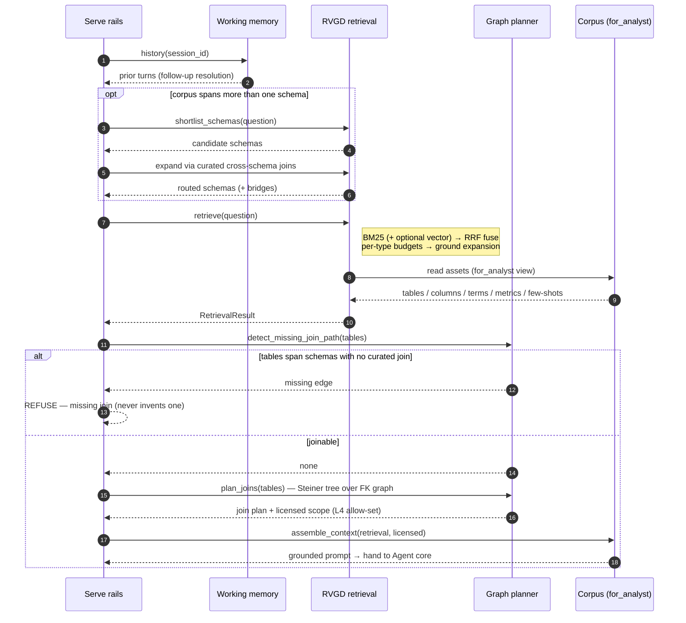
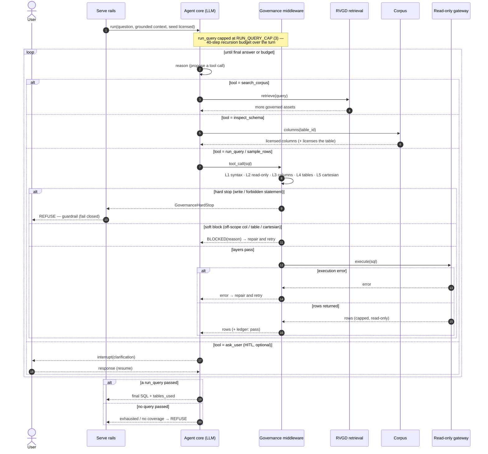
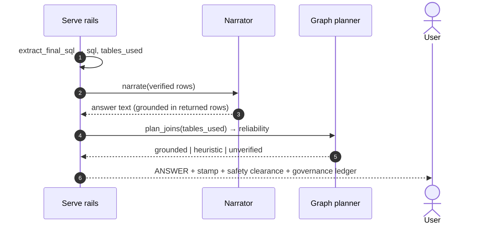

# Analyst — agentic sequence

The serve-time path a natural-language question travels to become a grounded,
governed, auditable answer. Every branch fails **closed**; the curated corpus is
the only source of truth. Broken into an overview plus one small diagram per
stage. Source: [`analyst/agent.py`](../src/governed_bi/analyst/agent.py)
(`build_serve_rails`) and [`gateway/guardrails.py`](../src/governed_bi/gateway/guardrails.py)
(`check`).

**Participants → code**

| Lifeline | Where |
|---|---|
| Serve rails | `analyst/agent.py` · `build_serve_rails` StateGraph |
| Working memory | `memory/store.py` · `WorkingMemory` |
| Refuse-gate | `analyst/agent.py` · `refuse_gate` (curated `NegativeExampleAsset`s) |
| SQL cache | `analyst/governance.py` · `_try_cache_hit` |
| RVGD retrieval | `retrieval/rvgd.py` · `retrieve`; `retrieval/schema_router.py` |
| Graph planner | `graph/planner.py` · `detect_missing_join_path`, `plan_joins` |
| Corpus | `corpus/loader.py` · `Corpus.for_analyst()` view |
| Agent core | `analyst/agent.py` · `build_agent_core` (LLM + tools) |
| Governance middleware | `analyst/middleware.py` · `GovernanceMiddleware` → `check` (L1–L5) |
| Read-only gateway | `gateway/…` · `Gateway` + connector (read-only) |
| Narrator | `analyst/narrate.py` · `AnswerNarrator` (assurance enum in `answer.py`) |

---

## Overview

The outer rails as a map — nodes and the branch each can take.

Each stage below zooms into one of these nodes.

---

## 1 · Gating — ingest → refuse-gate → cache

Two ways to answer (or refuse) before any retrieval or generation.

---

## 2 · Assemble — retrieve + license

Entered only on a cache miss. Pulls the governed assets and computes the scope
the query is allowed to touch.

---

## 3 · Governed agent core — the guarded tool loop

The non-linear heart: the LLM proposes tool calls; the middleware re-checks every
data-touching one (L1–L5); a **soft** block is repaired-and-retried, a **hard**
block stops the turn.

---

## 4 · Finalize — narrate + reliability stamp

Only on a passing query. The answer is grounded in the rows that query returned.

---

## Refuse terminals (all fail-closed)

| Terminal | Raised where | Trigger |
|---|---|---|
| out of scope | gating | question matches a curated negative example (before any LLM) |
| missing join | assemble | retrieved tables span schemas with no curated join |
| guardrail | agent core | a hard stop — a write / forbidden statement (`GovernanceHardStop`) |
| exhausted / no coverage | agent core | step/attempt budget hit, or no `run_query` ever passed |

A **soft** guardrail block (off-scope column/table, accidental cartesian) and a
gateway **execution error** are *not* terminals — they return to the agent as a
tool message to repair and retry. (`refused_by="execution"` is only a defensive
guard for an already-passing query that can no longer be replayed.)

Companion: [curator-sequence.md](curator-sequence.md) — how the corpus this path
reads is built.
