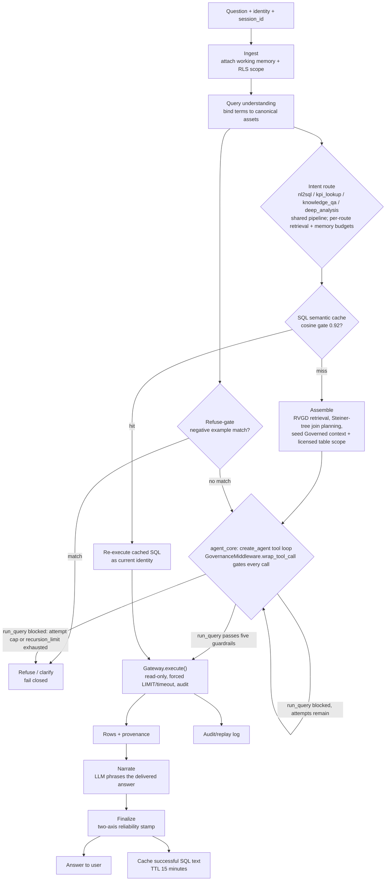

# Agentic BI Analyst

_[English](analyst.md) · [简体中文](analyst.zh.md)_

The serve-side agent (the **Analyst**) for the [Agentic BI System](system-overview.md).
It is the online governed agent that *consumes* the corpus to answer,
**fail-closed and auditable** (two-harness split; `LangGraph` + middleware).
Counterpart to the [Curator](curator.md); consumes the assets in
[Asset schemas](asset-schemas.md).

> Implementation: [`src/governed_bi/analyst/`](../src/governed_bi/analyst/),
> with guardrails/gateway in [`gateway/`](../src/governed_bi/gateway/), join
> planning in [`graph/`](../src/governed_bi/graph/), and RVGD in
> [`retrieval/`](../src/governed_bi/retrieval/).

## Shape

The serve runtime runs as **a governed agentic core** ([ADR 0002](adr/0002-governed-agentic-serve-runtime.md)). The organizing principle is **authority is deterministic; reasoning may be agentic**. ADR 0002 reverses the old design-spine #2 invariant ("never an autonomous ReAct loop"). Autonomy is granted for *how to find the answer*, never for *what may execute* or *what is trusted*: the agent reasons freely, but every tool call passes through middleware that runs the guardrails and records the audit, and the answer is stamped by deterministic code the agent cannot influence.

The outer rails and the agent's `GovernanceMiddleware` **share one governance core** (`check` / column-allowlist / licensed-table / refuse-gate / stamp helpers), so the guardrails cannot drift between them.

> *Built (today's reality):* the agentic core is the **only** serve path: the P2 cutover has landed, and the deterministic flow node plus the `agent_serve` flag are both gone. `analyst.agent` compiles an outer deterministic `StateGraph` (`ingest → refuse_gate → prepare → cache → assemble → agent_core → narrate`) that wraps an inner LangChain `create_agent` reasoning loop; the public entry point is `answer_question_agent`. Governance rides on `GovernanceMiddleware` (`analyst.middleware`); the four governed tools live in `analyst.tools`; `llm.fake` supplies a `FakeListChatModel` harness for CI determinism.
>
> Answering a question now requires a live model: `build_stack()` still builds without one (the read-only audit API keeps running), but the LangGraph serve process (`make_graph`) fails closed at startup, and REST `/chat` returns 503, until a model is configured. See ADR 0002; current eval numbers in [`eval-ladder-results.md`](plans/eval-ladder-results.md).

## The flow

1. **Ingest**: question + identity (D7, as-user) + working memory (D8, session-scoped).
2. **Query understanding + term binding**: resolve business language via `term` assets. Synonyms and `term_relationship` map varied phrasings → the canonical asset (strong-routing, not an LLM guess).
3. **Intent routing**: hard-wired route (`nl2sql | kpi_lookup | knowledge_qa | deep_analysis`), each with its own retrieval and memory budget.
4. **SQL semantic-cache fast path**: question embedding → cosine ≥0.92 vs cached SQL → hit skips retrieval/plan/gen but **always re-executes** (SQL-text-only, as-user, D7). TTL 15 min; write back on success. *Built:* `analyst.cache.SqlCache` (off by default, injected). A hit is additionally **re-guardrailed** against the licensed tables it was stored with, then re-executed; a stale/now-blocked hit falls through to the full pipeline (fail-closed). Admission gates on the **semantic** axis, never on safety alone: only `grounded` answers (clean run, no uncertainty flag) are written back.
5. **RVGD retrieval**: R exact / V semantic / G graph / D dictionary. Four-stage rerank, token-budgeted, Corrective-RAG fallback. **Facts + Inference tiers only** (loader contract); Audit and `excluded` assets never retrieved. *Built:* the pure-Python **BM25** lexical channel plus deterministic grounding (a bound term pulls in its target, a metric its base table, a table its columns), and the **V (vector) channel** (`retrieval.embedding`): an injected `Embedder` (OpenAI `text-embedding-3-small`, or the deterministic offline `HashingEmbedder`) ranks by cosine and is fused with BM25 via Reciprocal Rank Fusion. Off unless an embedder is passed, so the default is pure BM25. The graph channel (G) and Corrective-RAG rerank remain later slices.
   - **Context assembly** (`analyst.context.assemble_context`): retrieval returns ids; this resolves the L4-licensed table scope into a `PromptContext` (physical schema, join paths with confidence, terms, metrics, suspect-column caveats, gold exemplars, notes). The guardrail's `allowed_tables` is derived from it, so **what the generator can see is exactly what L4 permits**.
6. **Steiner-tree join planning** over the inferred FK graph.
7. **SQL generation happens inside the agent's tool loop**, not a separate pluggable seam: the agent itself writes a system-prompted SELECT over **physical (obfuscated) identifiers**, guided by the `## Governed context` block (see [The agentic path](#the-agentic-path-adr-0002) below), and hands it to the governed `run_query` tool. There is no template / no-model serve mode; the agentic path requires a live model, and CI determinism comes from the `FakeListChatModel` harness instead. `analyst.sqlgen` keeps only the flow-independent value objects (`GeneratedSql`, `_tables_used`, `_extract_sql`) the agent core and the reliability stamp still need.
8. **Five guardrails** (`wrap_tool_call`, fail-closed on any, all five enforced): syntax → policy blacklist → AST column allowlist → term-semantics → cost. **L3 is scope-aware** (sqlglot `traverse_scope`): it resolves each column against its own query scope, checks every column node (including bare `HAVING` refs and `USING` / `NATURAL` join keys), and blocks star projections (`SELECT *` / `t.*`) the allowlist cannot vouch for. **L4 (term-semantics)** licenses the retrieved tables plus their FK join-neighborhood (one hop, tunable) and the Steiner points the join plan bridges through - not the exact retrieved set, so it is decoupled from lexical-retrieval recall - and spans schemas: a cross-schema table name is licensed only via a **curated** join (memory-sourced, never FK-discovered), and with none the engine **refuses** rather than guesses. Qualification is uniform (**D15**; the `multi_schema` mode flag was superseded 2026-07-17): every path emits fully schema-qualified `schema.table` names (SQLite `ATTACH`es its file under the `corpus_pin` alias so a qualified name executes natively), and a bare reference resolves to the serving schema or fails closed; L3 still guards every column, so widening the table scope never leaks an excluded or `suspect` column (a neighbor table exposes only its already-allowed columns). **L5** is a structural cross-join / cartesian guard; numeric EXPLAIN-based cost (Postgres / Redshift) is future per-dialect work. Refuse-gate runs **concurrently** (D5).
9. **Execute as-user**: gateway RLS, forced LIMIT/timeout, audit/replay.
10. **Answer + reliability stamp**: a **two-axis** stamp — `safety_clearance` (guardrails + authorization passed, a gate) and `semantic_assurance` (`grounded` → `heuristic` → `unverified`, how well-grounded). The single-axis tier (governed → lineage → fenced-raw) is their compact **display-only** projection, never a parallel concept. High-stakes → sign-off / SQL-only.

**Self-repair (steps 7-9 as a bounded loop).** Generation, guardrails, and execution run as the agent's own **tool-reflection loop**: a failed `run_query` (a blocked guardrail verdict or an execution error) returns as a `ToolMessage` the agent can read and retry, each attempt re-guardrailed so un-vetted SQL never runs. A `run_query` **attempt cap** (3) is enforced in `wrap_tool_call`, and the outer graph's `recursion_limit` bounds the whole turn; exhaustion falls through to graded delivery or refuse. A repaired answer has `heuristic` semantic assurance (tier `lineage`), never `grounded`/`governed`. **Not every failure is repairable:** a hard policy/DDL block (L2 `policy_blacklist`) is a hard stop, never coached back, because feeding it back to the agent is only pressure to evade the policy. Scope failures (L3/L4) stay retryable by decision (the FK-neighborhood + retry is deliberate false-refusal reduction; [D11](design-decisions.md#d11-external-review-2026-07-09)). This recovers malformed SQL without ever emitting an unchecked query; it cannot catch *plausible-but-wrong* SQL (valid, in-allowlist, but the wrong computation), which is exactly why the two-axis stamp and the refuse / SQL-only paths exist. The guardrails are a safety/governance gate, not a correctness oracle.

The runtime answer path at a glance:

## The agentic path (ADR 0002)

The SQL-gen-and-execute middle (steps 6-9 above) is a bounded `create_agent` reasoning loop. The deterministic **rails** wrap it: `ingest → refuse_gate → prepare → cache → assemble → agent_core → narrate`, then a deterministic `finalize` (two-axis stamp + cache write) or graded-delivery / refuse. The refuse-gate still runs **before** the agent, and the stamp is still computed by deterministic code the agent cannot influence.

**Narration is a dedicated `narrate` node.** Both a cache hit (`cache → narrate`) and the agent path (`agent_core → narrate`) flow through it before `finalize`, so cached and freshly-generated answers get phrased identically. `narrate` calls `narrate_answer` (`analyst.governance`) to re-phrase the delivered answer's text into grounded English via the LLM narrator; the finalizers themselves emit only the deterministic fallback text. Making it a node rather than a side-call buried in the finalizers means the narrator's model call is a first-class, individually-traced graph step. It is a no-op for refusals (no result grid to phrase) and when no narrator is configured; a narrator failure keeps the deterministic text.

**One tracing handler per turn.** External tracing (Langfuse, via `obs.tracing_callbacks()`) is attached once, at the outer `graph.invoke` in `answer_question_agent`, and inherited everywhere below it (the inner `agent.stream`, and `LangChainChatClient.complete()` calls made from graph nodes such as `narrate` and the multi-schema schema router) via the ambient LangChain run context. A turn is therefore one Langfuse trace with no doubled model-call cost/tokens; a handler is attached fresh only for standalone `.complete()` calls outside a graph run (eval baseline, curator). LangSmith is unaffected; it self-instruments from the environment.

**Governed tools (read-only ONLY, `analyst.tools`).** The agent can act *only* through four tools:

- `search_corpus(query)`: retrieve tables / terms / joins / metrics / few-shots; each hit **expands the per-turn `licensed` set** (post-Amendment 1 it returns curated *content*, not just ids).
- `inspect_schema(table_id)`: columns, types, sample values for a licensed table (fixes "the model never sees table structure"); licenses tables beyond the seed.
- `sample_rows(table_id, n)`: row preview, runs **as identity** (RLS).
- `run_query(sql)`: **the only path to data**; the agent never calls `gateway.execute` directly.

**`GovernanceMiddleware` (`analyst.middleware`).** Governance is a mandatory interception layer, not the agent's discretion:

- `wrap_tool_call` normalizes each call (`sqlglot identify=True`), runs the **L1-L5 guardrail** over the current `licensed` set, enforces the `run_query` attempt cap, and writes a **governance ledger** entry, an append-only audit record of every governed action (refuse-gate result, tools offered, each exploration's surfaced / `excluded`-filtered assets and licensing deltas, each `run_query`'s normalized SQL + per-layer verdict + `allowed_tables` + result meta). You can never execute (or refuse) *without* a record.
- `wrap_model_call` scopes which tools the model is offered (identity tool-scoping).

**The invariant that survives:** the **guardrails still run in middleware BEFORE any execution**: the same five layers, fail-closed, now enforced at the *tool boundary* (`wrap_tool_call`) instead of a graph node. Licensing derives from **governed exploration, not agent claims**: `allowed_tables` is the set of tables surfaced through governed tools this turn (FK-expanded), so a rogue agent cannot self-authorize an `excluded` table; L3 still guards every column.

**Amendment 1: seed the semantic layer.** A first live A/B showed the tools-only agent *regressing* vs. the (since-removed) deterministic flow, because the P1 tools surfaced only names and none of the curated semantic layer (few-shots, join `ON` clauses, metric expressions, terms, rules). The fix: a deterministic **`assemble` node runs before `agent_core`** and seeds the agent with that same semantic-layer context (`PromptContext.render()`) as a `## Governed context` block, and pre-populates the `licensed` channel with the base (retrieved + FK-neighborhood + Steiner) table scope. Tools become **refinement, not discovery**. This is the *deterministic* L4 floor the guardrails enforce (not agent-claimed), so the seeded scope is strictly ≥ that floor and never self-authorized. See ADR 0002 Amendment 1.

**Live governance-event stream (Amendment 2).** The governance ledger is streamed live, not just attached to the finished answer. `agent_core` runs `agent.stream(...)` (not `invoke`) and re-emits each governed action through the existing `on_event` callback as a typed event: `rail` for each outer step (`route` / `refuse_gate` / `cache` / `assemble`), `tool` for each `search_corpus` / `inspect_schema` / `sample_rows` / `run_query` (a `start` then an `ok` / `blocked` / `error` / `cap` / `miss` resolve, paired by tool-call id), and one `final` carrying the two-axis stamp. Each event is `{seq, kind, step, status, id?, detail, serve_path?}`; the `run_query` / `sample_rows` `detail` is the **ledger entry itself**, so the live view and the final `governance_ledger` never drift. `GovEventStream` (`analyst.governance`) is the per-turn emitter for this contract. This is the audit surface the UI renders as a live step timeline — contract and frontend plan in [`docs/plans/agent-step-visualization.md`](plans/agent-step-visualization.md).

## Three points where curator inference drives serve behavior

The Inference tier *steers*, it doesn't decorate. This is what separates the Analyst from a generic text-to-SQL pipeline.

1. **Reliability caveats → decoy avoidance.** A `suspect` column's caveat is injected into SQL-gen ("DO NOT USE …") and checkable at guardrail L3 (AST). This is where **decoy-touch rate** is won or lost.
   - **Enforcement env-toggle:** dev/BIRD **hard-blocks** any SQL referencing a `suspect` column (decoys are never needed → drives decoy-touch → 0); prod/enterprise **soft-warns + drops the reliability tier** (a false-positive flag must never silently block a real answer).
2. **Join `confidence` → planning + uncertainty.** Low-confidence inferred joins get a **cost penalty** in the Steiner plan; a below-threshold join in the chosen path **propagates to the reliability stamp**.
3. **Notes → SQL-gen shaping** (routing / gotchas). This is the lever that lets the **`curated`** arm beat the **recoverable `ceiling`**.

**Uncertainty aggregation → `semantic_assurance`:** low-confidence join used · fenced-raw fallback · Corrective-RAG triggered · suspect column in scope · SQL repaired → drops `grounded` to `heuristic` (or `unverified`) → differential handling (D5, give the stamp teeth). This is the *semantic* axis only; `safety_clearance` is a separate pass/fail gate that says nothing about how right the number is. The levels are **uncalibrated governance/uncertainty heuristics**, to be tuned on the eval: `grounded` means safe, in-scope, and no uncertainty flag fired, **not** verified-correct. Because fail-closed carries a false-refusal cost, the eval's `false_refusal_rate` ([Architecture](architecture.md) §8) is its counterweight.

## Governance exclusion (hard, human-set)

Distinct from the curator's AI-inferred `reliability.suspect`: a human owner sets `governance.excluded: true` on a column/table after review → the asset is **removed entirely** from everything the Analyst sees (retrieval, presented schema, graph), in **all environments, no toggle, permanently**. It still appears in the viz/audit surface (marked, with reason) so the exclusion is auditable, and guardrail L3 hard-blocks it as defense-in-depth. Escalation path: curator flags `suspect` → human reviews (D6) → leaves it, or escalates to `excluded`. This stays **out of the autonomous eval ladder** (so the `curated` arm stays pure-curator); it is the human-in-the-loop governance capability for enterprise deployments. Spec in [Asset schemas](asset-schemas.md).

## Refuse / best-effort decision tree (fail-closed, D5)

Refusal is driven by a **curated signal (`negative_example` assets), not a coverage heuristic**: a semantic-similarity match run concurrently with the hard guardrails.

- refuse-gate match (negative example) **or** hard-guardrail veto → **refuse** (canned escalation)
- else governed coverage → **answer: governed** (high stamp)
- else lineage-derivable → **answer: lineage** (medium stamp)
- else fenced-raw possible → **answer: fenced-raw** (low stamp)
- else no path above the confidence floor → **refuse / clarify** (fail-closed)
- high-stakes (leadership / PII) → sign-off or SQL-only, regardless

Never a confident wrong number.

Links: [Design decisions](design-decisions.md) (D5 refusal · D6 ownership · D7 identity · D8 memory · D10 curator) · [Asset schemas](asset-schemas.md) · [Curator](curator.md) · [Architecture](architecture.md) §6.
