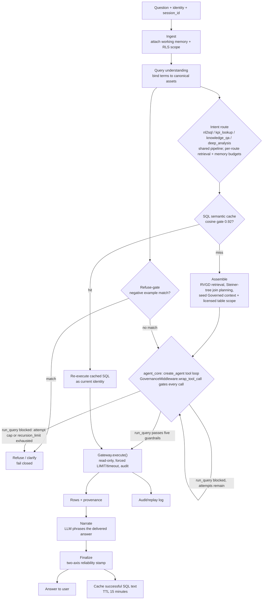

# Agentic BI Analyst

_[English](analyst.md) · [简体中文](analyst.zh.md)_

[Agentic BI System](system-overview.zh.md) 的服务侧代理（serve-side agent，即 **Analyst**）。它是在线运行的受治理代理，*消费* corpus（语料库）以生成答案，做到**失败即拒（fail-closed）且可审计**（两套 harness 拆分；`LangGraph` + 中间件（middleware））。是 [Curator](curator.zh.md) 的对应方，消费 [Asset schemas](asset-schemas.zh.md) 中定义的资产。

> 实现：[`src/governed_bi/analyst/`](../src/governed_bi/analyst/)，护栏（guardrail）/gateway 位于 [`gateway/`](../src/governed_bi/gateway/)，连接规划（join planning）位于 [`graph/`](../src/governed_bi/graph/)，RVGD 位于 [`retrieval/`](../src/governed_bi/retrieval/)。

## 形态

服务运行时现在就是**一个受治理的 agentic 内核**（[ADR 0002](adr/0002-governed-agentic-serve-runtime.md)）。其组织原则是**权限（authority）是确定性的；推理（reasoning）则可以是 agentic 的**。ADR 0002 推翻了旧的 design-spine #2 不变式（「绝不是自主式 ReAct 循环」）。自主性只授予*如何找到答案*，绝不授予*什么可以执行*或*什么被信任*：agent 自由推理，但每一次工具调用都要经过中间件（middleware），由它运行护栏并记录审计，且答案由 agent 无法影响的确定性代码打上标记。

外层轨道（rails）与 agent 的 `GovernanceMiddleware` **共享同一个治理内核**（`check` / 列许可清单 / licensed-table / refuse-gate / stamp 等辅助函数），因此护栏不会在二者之间发生漂移。

> *已实现（当前现状）：* agentic 内核是**唯一**的服务路径：P2 切换已经落地，确定性流程节点与 `agent_serve` 开关都已被移除。`analyst.agent` 会编译一个外层的确定性 `StateGraph`（`ingest → refuse_gate → prepare → cache → assemble → agent_core → narrate`），它包裹起一个内层的 LangChain `create_agent` 推理循环；公开的入口函数是 `answer_question_agent`。治理由 `GovernanceMiddleware`（`analyst.middleware`）承载；四个受治理工具位于 `analyst.tools`；`llm.fake` 提供一个 `FakeListChatModel` harness 用于 CI 的确定性。
>
> 回答问题现在必须有真实（live）模型：`build_stack()` 在没有模型时仍可构建（只读的审计 API 仍可运行），但 LangGraph 服务进程（`make_graph`）会在启动时失败即拒（fail closed），`/chat` 在模型配置完成之前始终返回 503。参见 ADR 0002；当前评测数字见 [`eval-ladder-results.md`](plans/eval-ladder-results.md)。

## 流程

1. **摄入（Ingest）**：问题 + 身份（identity）（D7、以用户身份（as-user）） + 工作记忆（D8、会话级（session-scoped））。
2. **查询理解与术语绑定（term binding）**：通过 `term` 资产解析业务语言。同义词与 `term_relationship` 把各种措辞映射到规范资产（强路由（strong-routing），而非 LLM 猜测）。
3. **意图路由（intent routing）**：硬编码路由（`nl2sql | kpi_lookup | knowledge_qa | deep_analysis`），每条路由各自拥有检索与记忆预算。
4. **SQL 语义缓存快速路径**：问题嵌入 → 与缓存 SQL 的余弦相似度 ≥0.92 → 命中则跳过检索（retrieval）/规划/生成，但**始终重新执行**（仅 SQL 文本、以用户身份、D7）。TTL 15 分钟；成功后写回。*已实现：* `analyst.cache.SqlCache`（默认关闭，以注入方式提供）。命中的缓存条目还会针对其存入时所持有的已授权表**重新过护栏**，然后再执行；已过期或现已被拦截的命中会回落到完整流水线（失败即拒）。缓存准入以**语义**轴为门槛，绝不只凭安全：只有 `grounded`（干净运行、未触发任何不确定性标志）的答案才会被写回。
5. **RVGD 检索**：R 精确匹配 / V 语义 / G 图 / D 词典。四阶段重排，受 token 预算约束，并有 Corrective-RAG 回退。**仅限 Facts 层与 Inference 层**（加载器契约（loader contract））；Audit 层与 `excluded` 资产永不被检索。*已实现：* 纯 Python 的 **BM25** 词法通道，加上确定性接地（grounding）（一个已绑定的 term 会带出它的目标对象，一个 metric 会带出它的基表，一张 table 会带出它的列），以及 **V（向量）通道**（`retrieval.embedding`）：注入的 `Embedder`（OpenAI `text-embedding-3-small`，或确定性的离线 `HashingEmbedder`）按余弦相似度排序，并通过 Reciprocal Rank Fusion 与 BM25 融合。除非传入了 embedder，否则该通道关闭，因此默认是纯 BM25。图通道（G）与 Corrective-RAG 重排仍是后续切片。
   - **上下文组装（context assembly）**（`analyst.context.assemble_context`）：检索返回的是 id；该步骤将 L4 授权的表范围解析为一个 `PromptContext`（物理 schema、带置信度的连接路径、terms、metrics、suspect 列告诫、gold 标准样例、skills）。护栏的 `allowed_tables` 由此派生，因此**生成器能看到的，正是 L4 所允许的**。
6. **Steiner 树连接规划**：在推断出的 FK 图上进行。
7. **SQL 生成发生在 agent 自身的工具循环内部**，不再是一个独立的可插拔扩展点：agent 自己在系统提示的引导下写出一条 SELECT，字段用的是**经过混淆的物理标识符**（参考下文的 `## Governed context` 区块，见[Agentic 路径](#agentic-路径adr-0002)），再交给受治理的 `run_query` 工具。不再存在模板式 / 无模型的服务模式：agentic 路径需要真实模型，CI 的确定性改由 `FakeListChatModel` harness 提供。`analyst.sqlgen` 现在只保留 agent 内核与可靠性标记仍需要的、与 flow 无关的值对象（`GeneratedSql`、`_tables_used`、`_extract_sql`）。
8. **五层护栏**（`wrap_tool_call`，任一环节失败即拒，五层全部强制执行）：语法 → 策略黑名单 → AST 列许可清单 → term 语义 → 成本。**L3 具备 scope 感知能力**（sqlglot `traverse_scope`）：它针对每个列自身所在的查询 scope 进行解析，检查每一个列节点（包括裸的 `HAVING` 引用以及 `USING` / `NATURAL` 连接键），并拦截许可清单无法背书的星号投影（`SELECT *` / `t.*`）。**L4（term 语义）**授权的范围是检索到的表，加上它们的 FK 连接邻域（一跳，可调），以及连接规划所桥接经过的 Steiner 点，而不是精确的检索命中集合，因此它与词法检索的召回率相解耦；在**多 schema 模式**下，它的授权范围跨越多个 schema：只有当一条**经过策展**的连接桥接过去时，跨 schema 的表名才会被授权（源自 memory，绝不靠 FK 发现），否则引擎会**拒答**而非猜测。限定（qualification）是按模式区分的（**D15**）：单 schema / SQLite / BIRD 路径保持**裸的、未限定的** SQL，只有多 schema 的 Postgres / Redshift 路径才做限定。L3 仍然守卫每一个列，因此扩大表范围绝不会泄漏 `excluded` 或 `suspect` 列（邻居表只会暴露它自身已被允许的列）。**L5** 是一道结构性的交叉连接 / 笛卡尔积防护；基于数值化 EXPLAIN 的成本（Postgres / Redshift）是未来按方言展开的工作。refuse-gate 与其**并发**运行（D5）。
9. **以用户身份执行**：gateway 的 RLS、强制 LIMIT/超时、审计/重放。
10. **应答与可靠性标记（reliability stamp）**：一个**双轴**标记——`safety_clearance`（护栏 + 授权已通过，一个闸门）与 `semantic_assurance`（`grounded` → `heuristic` → `unverified`，接地程度如何）。单轴档位（governed → lineage → fenced-raw）只是二者的紧凑**展示专用（display-only）**投影，绝非一套平行的概念。高风险（high-stakes）→ 签核（sign-off）/ 仅 SQL（SQL-only）。

**自修复（第 7-9 步构成一个有界循环）。** 生成、护栏与执行以 **agent 自身的工具反思循环（tool-reflection loop）**方式运行：一次失败的 `run_query`（被护栏拦截的裁决或一次执行报错）会作为 `ToolMessage` 返回，供 agent 读取并重试，每次尝试都会重新过护栏，因此未经审查的 SQL 永远不会被执行。`run_query` 的**尝试次数上限**（3）在 `wrap_tool_call` 中强制执行，外层图的 `recursion_limit` 则限界整轮对话；一旦耗尽，则回落到分级交付（graded delivery）或拒答。经过修复的答案的 `semantic_assurance` 为 `heuristic`（档位 `lineage`），绝不会是 `grounded`/`governed`。**并非所有失败都可修复：** 一个硬性策略/DDL 阻断（L2 `policy_blacklist`）是硬性停止，绝不回传劝导，因为把它回传给 agent 只是施压让它规避策略；范围失败（L3/L4）按决定保持可重试（FK 邻域 + 重试是刻意的降低误拒机制；[D11](design-decisions.zh.md#d11开放决策外部评审2026-07-09)）。这能够从畸形的 SQL 中恢复，且从不放行未经检查的查询；但它无法捕捉*看似合理却错误*的 SQL（语法有效、在许可清单内，但计算逻辑是错的），这正是双轴标记以及拒答 / 仅 SQL 路径存在的原因。护栏是安全/治理层面的关卡，不是正确性的判定者（oracle）。

运行时应答路径概览:

## Agentic 路径（ADR 0002）

SQL 生成与执行的中段（上文第 6-9 步）就是一个有界的 `create_agent` 推理循环。确定性的**轨道（rails）**包裹着它：`ingest → refuse_gate → prepare → cache → assemble → agent_core → narrate`，随后是一个确定性的 `finalize`（双轴标记 + 缓存写回），或者分级交付 / 拒答。refuse-gate 仍然在 agent **之前**运行，标记仍然由 agent 无法影响的确定性代码计算。

**叙述（narration）现在是一个专门的 `narrate` 节点。** 无论是缓存命中路径（`cache → narrate`）还是 agent 路径（`agent_core → narrate`），都会在进入 `finalize` 之前流经这个节点，因此缓存命中与新生成的答案会被同样地措辞。`narrate` 调用 `narrate_answer`（`analyst.governance`），借助 LLM narrator 把已交付答案的文本重新表述为有依据的英文；finalizer 本身现在只产出确定性的兜底文本。把它做成一个节点、而不是深藏在 finalizer 内部的一次旁路调用，意味着 narrator 的模型调用成为一个一等的、可单独追踪的图步骤。对于拒答（没有结果表可供措辞）以及未配置 narrator 的情形，它是空操作；narrator 失败时会保留确定性文本。

**每轮只有一个追踪（tracing）handler。** 外部追踪（Langfuse，经由 `obs.tracing_callbacks()`）现在只在 `answer_question_agent` 的外层 `graph.invoke` 处附加一次，并通过 LangChain 的运行上下文（ambient run context）被其下的一切继承（内层的 `agent.stream`，以及从图节点——例如 `narrate` 与多 schema 的 schema 路由器——内部发起的 `LangChainChatClient.complete()` 调用）。因此一轮问答就是一条 Langfuse trace，模型调用的成本/token 不会被重复计入；只有在图运行之外的独立 `.complete()` 调用（评测基线、curator）才会重新附加一个 handler。LangSmith 不受影响；它总是从环境自我埋点（self-instrument）。

**受治理工具（仅只读，`analyst.tools`）。** agent *只能*通过四个工具行动：

- `search_corpus(query)`：检索 tables / terms / joins / metrics / few-shots；每一次命中都会**扩展本轮的 `licensed` 集合**（在 Amendment 1 之后，它返回的是经策展的*内容*，而不只是 id）。
- `inspect_schema(table_id)`：某个已授权表的列、类型、示例值（修复「模型从来看不到表结构」的问题）；会授权种子（seed）之外的表。
- `sample_rows(table_id, n)`：行预览，**以身份（identity）运行**（RLS）。
- `run_query(sql)`：**通往数据的唯一路径**；agent 从不直接调用 `gateway.execute`。

**`GovernanceMiddleware`（`analyst.middleware`）。** 治理是强制的拦截层，而非 agent 的自由裁量：

- `wrap_tool_call` 会规范化每一次调用（`sqlglot identify=True`），针对当前的 `licensed` 集合运行 **L1-L5 护栏**，强制执行 `run_query` 的尝试次数上限，并写入一条**治理账本（governance ledger）**记录，这是一份对每一个受治理动作的追加式（append-only）审计记录（refuse-gate 结果、所提供的工具、每次探索所暴露 / 被 `excluded` 过滤的资产及授权增量、每次 `run_query` 的规范化 SQL + 逐层裁决 + `allowed_tables` + 结果元信息）。没有记录，就永远无法执行（或拒答）。
- `wrap_model_call` 划定模型被提供哪些工具的范围（按身份的工具划范围（tool-scoping））。

**存续下来的不变式：** **护栏仍然在任何执行之前于中间件中运行**：同样的五层，失败即拒，只是现在在*工具边界*（`wrap_tool_call`）而不是某个图节点上强制执行。授权来自**受治理的探索，而非 agent 的声称**：`allowed_tables` 是本轮通过受治理工具所暴露的表集合（经 FK 扩展），因此一个失控的 agent 无法自行授权一个 `excluded` 表；L3 仍然守卫每一个列。

**Amendment 1：为语义层播种（seed）。** 首次线上 A/B 显示，纯工具（tools-only）的 agent 相较于（已被移除的）确定性 flow *发生了退化*，因为 P1 的工具只暴露了名称，而没有暴露任何经策展的语义层（few-shots、连接的 `ON` 子句、metric 表达式、terms、rules）。修复办法：一个确定性的 **`assemble` 节点在 `agent_core` 之前运行**，用同一份语义层上下文（`PromptContext.render()`）作为一个 `## Governed context` 区块为 agent 播种，并用基础的（检索到的 + FK 邻域 + Steiner）表范围预填充 `licensed` 通道。工具由此变成**精炼（refinement），而非发现（discovery）**。这正是护栏所执行的那道*确定性* L4 下限（而非 agent 声称的），因此播种得到的范围严格 ≥ 该下限，且绝不会是自行授权的。参见 ADR 0002 Amendment 1。

**实时治理事件流（Amendment 2）。** 治理账本会实时流式输出，而不只是附在最终答案上。`agent_core` 运行的是 `agent.stream(...)`（而非 `invoke`），并通过既有的 `on_event` 回调把每一个受治理动作重新发出为一条有类型的事件：`rail` 对应每个外层步骤（`route` / `refuse_gate` / `cache` / `assemble`），`tool` 对应每次 `search_corpus` / `inspect_schema` / `sample_rows` / `run_query`（先发 `start`，再发 `ok` / `blocked` / `error` / `cap` / `miss` 的结果事件，按 tool-call id 配对），以及一条携带双轴标记的 `final`。每条事件的形状是 `{seq, kind, step, status, id?, detail, serve_path?}`；`run_query` / `sample_rows` 的 `detail` 就是**账本条目本身**，因此实时视图与最终的 `governance_ledger` 不会发生漂移。`GovEventStream`（`analyst.governance`）是这套契约每轮的发射器。这就是 UI 渲染为实时步骤时间线的那层审计面，契约与前端方案见 [`docs/plans/agent-step-visualization.md`](plans/agent-step-visualization.md)。

## curator 推断驱动 Analyst 行为的三个关键点

Inference 层起的是*引导*作用，不是装饰。这正是 Analyst 区别于通用 text-to-SQL 流水线的地方。

1. **可靠性告诫 → 规避诱饵（decoy avoidance）。** `suspect` 列的告诫会被注入 SQL 生成环节（例如「DO NOT USE …」），并可在护栏 L3（AST）处被检查。**诱饵触碰率（decoy-touch rate）**的胜负正是在这里决定的。
   - **执行方式的环境开关：** dev/BIRD 环境会**硬性拦截**任何引用 `suspect` 列的 SQL（诱饵本就用不上 → 把诱饵触碰率推向 0）；prod/企业环境则**软性警告，并丢弃可靠性档位（reliability tier）**（误报标记绝不能悄悄拦掉一个本应给出的真实答案）。
2. **连接 `confidence` → 规划与不确定性。** 置信度较低的推断连接，在 Steiner 规划中会受到**成本惩罚**；若最终选定路径中含有低于阈值的连接，就会**传播到可靠性标记上**。
3. **Skills → 塑形 SQL 生成**（路由 / 坑点）。这正是让 **`curated`** 分支超越**可恢复上限 `ceiling`** 的关键杠杆。

**不确定性汇聚 → `semantic_assurance`：** 使用了低置信度连接 · fenced-raw 回退 · 触发了 Corrective-RAG · suspect 列在范围内 · SQL 经过修复 → 把 `grounded` 下调为 `heuristic`（或 `unverified`）→ 差异化处理（D5，让标记真正具有约束力）。这只是*语义*轴；`safety_clearance` 是另一个独立的通过/失败闸门，它并不表示数字有多正确。这些档位是**未经校准的治理/不确定性启发式**，需要在评测中调优：`grounded` 意味着安全、在范围内，且没有触发任何不确定性标记，**不**意味着已验证正确。由于失败即拒本身带有误拒代价，评测中的 `false_refusal_rate`（见 [Architecture](architecture.zh.md) 第 8 节）正是用来制衡它的指标。

## 治理性排除（硬性、人工设定）

区别于 curator 通过 AI 推断出的 `reliability.suspect`：由人工负责人在审阅之后，在某个列/表上设置 `governance.excluded: true` → 该资产会从 Analyst 所能看到的一切（检索、呈现的 schema、图）中**彻底移除**，在**所有环境中生效、没有开关、永久有效**。它仍会出现在 viz / 审计界面上（带标记与原因），因此这次排除是可审计的；护栏 L3 也会对它进行硬性拦截，作为纵深防御（defense-in-depth）。升级路径：curator 标记 `suspect` → 人工审阅（D6） → 维持原样，或升级为 `excluded`。这一机制**不计入自主评测阶梯（eval ladder）**（这样可以让 `curated` 分支保持纯粹依赖 curator 的状态）；它是面向企业部署的人机协同治理能力（human-in-the-loop）。规范见 [Asset schemas](asset-schemas.zh.md)。

## 拒答 / 尽力而为决策树（fail-closed，D5）

拒答由一个经过整理的信号驱动（`negative_example` 资产），而不是靠覆盖率启发式：一次与硬性护栏并发运行的语义相似度匹配。

- refuse-gate 命中（negative example），**或**硬性护栏否决 → **拒答**（预设升级（canned escalation））
- 否则，若有 governed 覆盖 → **应答：governed**（高档位标记）
- 否则，若可通过 lineage 推导 → **应答：lineage**（中档位标记）
- 否则，若可给出 fenced-raw → **应答：fenced-raw**（低档位标记）
- 否则，若没有任何路径高于置信度下限（confidence floor） → **拒答 / 请求澄清**（失败即拒）
- 高风险（leadership / PII）场景 → 无论如何都需要签核或仅 SQL

绝不给出一个自信满满却错误的数字。

延伸阅读：[Design decisions](design-decisions.zh.md)（D5 拒答 · D6 归属 · D7 身份 · D8 记忆 · D10 curator） · [Asset schemas](asset-schemas.zh.md) · [Curator](curator.zh.md) · [Architecture](architecture.zh.md) 第 6 节。
