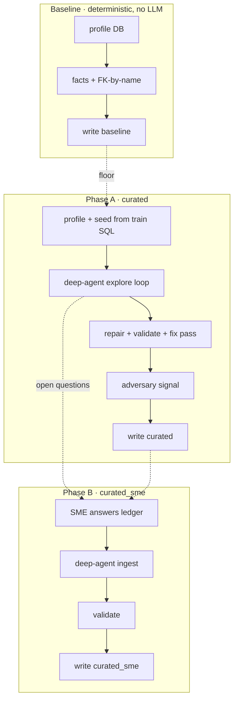
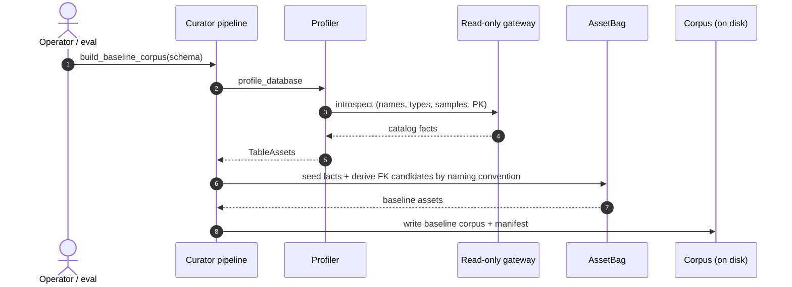
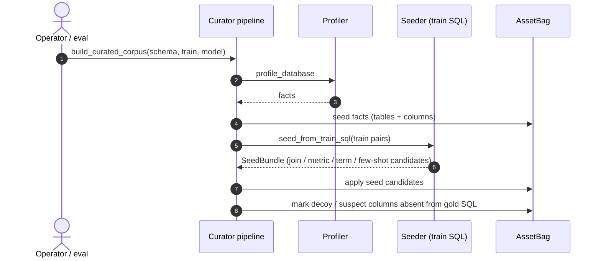
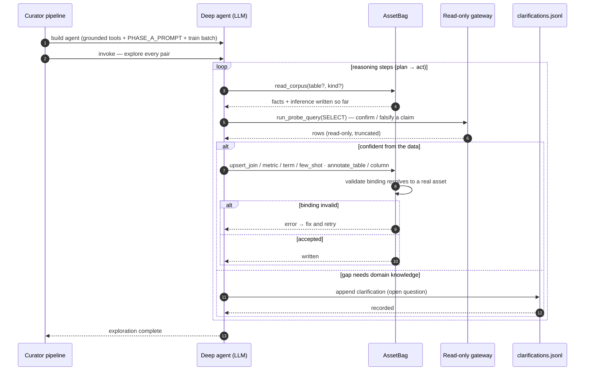
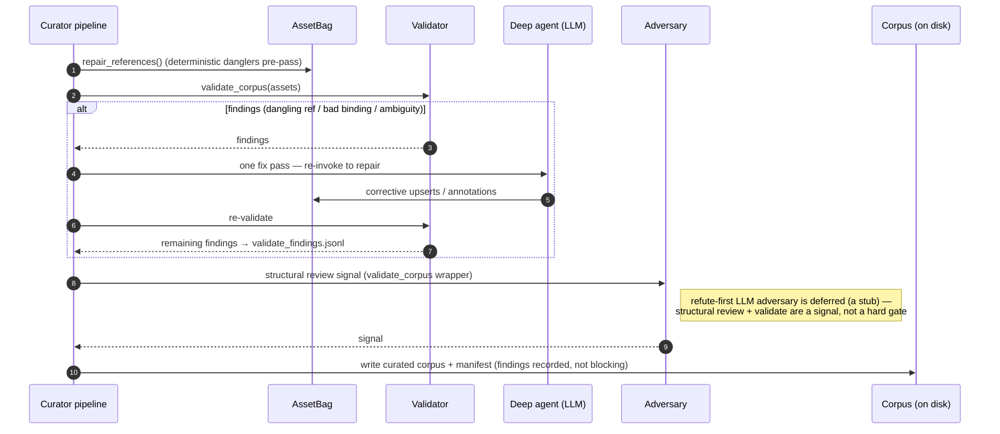
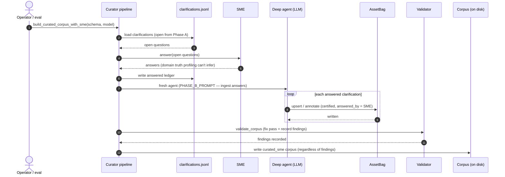

# Curator — agentic sequence

The offline path that turns a raw (possibly obfuscated) database into a governed
corpus — the source of truth the Analyst reads. It runs as an **eval ladder**:
a deterministic `baseline`, an agentic `curated` (Phase A), and a human-enriched
`curated_sme` (Phase B). Broken into an overview plus one small diagram per stage.
Source: [`curator/pipeline.py`](../src/governed_bi/curator/pipeline.py) and
[`curator/deep_agent.py`](../src/governed_bi/curator/deep_agent.py).

**Participants → code**

| Lifeline | Where |
|---|---|
| Curator pipeline | `curator/pipeline.py` · `build_baseline_corpus` / `build_curated_corpus` / `build_curated_corpus_with_sme` |
| Profiler | `curator/profile.py` · `profile_database` |
| Seeder | `curator/seed.py` · `seed_from_train_sql` |
| AssetBag | `curator/asset_bag.py` · typed assets + validated writes |
| Deep agent | `curator/deep_agent.py` · `create_deep_agent` (max-autonomy LLM) |
| Read-only gateway | `gateway/…` · `Gateway` (probes run read-only) |
| clarifications.jsonl | `deepagents` `FilesystemBackend` · the open-question ledger |
| Validator | `corpus/validate.py` · `validate_corpus` |
| Adversary | `curator/adversary.py` · structural `review` (refute-first LLM adversary deferred) |
| SME | `curator/clarifications.py` · `Responder` (human / stand-in) |
| Corpus (on disk) | `corpus/<schema>/…` typed YAML + run manifest |

---

## Overview

Three arms, increasing trust; Phase A's open questions feed Phase B.

---

## 1 · Baseline — deterministic, no LLM

The eval floor: everything a script can derive from the database, no agent.

---

## 2 · Phase A — profile + seed

Deterministic groundwork before the agent runs: facts, plus candidates mined from
the training question→SQL pairs.

---

## 3 · Phase A — deep-agent explore loop

The max-autonomy agent works pair by pair: it reads the live corpus, probes the
database **read-only**, and persists typed assets through validated write tools.
Genuine unknowns become questions rather than guesses.

---

## 4 · Phase A — validate + write

Not a hard gate: references are repaired, validation runs with one agent fix pass,
remaining findings are **recorded**, and the corpus is written regardless.

---

## 5 · Phase B — fold in SME answers

The subject-matter expert answers Phase A's open questions; the agent ingests them
with certified provenance.

---

## Notes

- **Three arms, increasing trust.** `baseline` = DB-derivable facts only (no LLM);
  `curated` adds the agent's inference grounded in train SQL + live probes;
  `curated_sme` folds in human answers to what the agent couldn't resolve.
- **The agent is grounded, not free.** It reads the live corpus, probes the DB
  **read-only**, and every write goes through a validated `upsert_*` / `annotate_*`
  tool that rejects a binding which does not resolve — it cannot author a dangler.
- **Uncertainty becomes a question, not a guess** — appended to `clarifications.jsonl`
  and answered by Phase B's SME.
- **Validation is a fix pass + recorded signal, not a hard gate.** `validate_corpus`
  runs, triggers one agent fix pass, and writes remaining findings to
  `validate_findings.jsonl`; `repair_references()` fixes danglers first. The corpus
  is written **regardless** — in this greenfield harness the findings are a signal
  in the run manifest, not a write-blocking gate.

Companion: [analyst-sequence.md](analyst-sequence.md) — how this corpus is read at
serve time.
