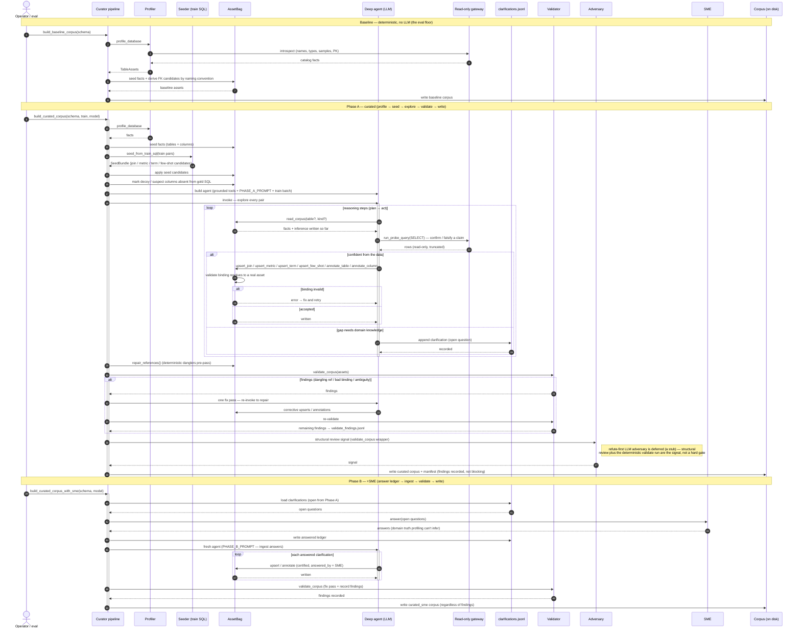

# Curator — agentic sequence

The offline path that turns a raw (possibly obfuscated) database into a governed,
auditable corpus — the source of truth the Analyst later reads. It runs as an
**eval ladder**: a deterministic `baseline`, then an agentic `curated` (Phase A),
then a human-enriched `curated_sme` (Phase B). Source:
[`curator/pipeline.py`](../src/governed_bi/curator/pipeline.py) and the deep-agent
harness [`curator/deep_agent.py`](../src/governed_bi/curator/deep_agent.py).

**Participants → code**

| Lifeline | Where |
|---|---|
| Curator pipeline | `curator/pipeline.py` · `build_baseline_corpus` / `build_curated_corpus` / `build_curated_corpus_with_sme` |
| Profiler | `curator/profile.py` · `profile_database` |
| Seeder | `curator/seed.py` · `seed_from_train_sql` |
| AssetBag | `curator/asset_bag.py` · in-memory typed assets + validated writes |
| Deep agent | `curator/deep_agent.py` · `create_deep_agent` (max-autonomy LLM) |
| Read-only gateway | `gateway/…` · `Gateway` (probes run read-only) |
| clarifications.jsonl | `deepagents` `FilesystemBackend` · the open-question ledger |
| Validator | `corpus/validate.py` · `validate_corpus` (deterministic gate) |
| Adversary | `curator/adversary.py` · structural `review` (refute-first LLM adversary deferred) |
| SME | `curator/clarifications.py` · `Responder` (human / stand-in) |
| Corpus (on disk) | `corpus/<schema>/…` typed YAML + run manifest |

## Notes

- **Three arms, increasing trust.** `baseline` is DB-derivable facts only (no LLM);
  `curated` adds the agent's inference grounded in train SQL + live probes;
  `curated_sme` folds in human answers to the questions the agent couldn't resolve.
- **The agent is grounded, not free.** It reads the live corpus, probes the
  database **read-only**, and every write goes through a validated `upsert_*` /
  `annotate_*` tool that rejects a binding which does not resolve — the agent
  cannot author a dangling reference.
- **Uncertainty becomes a question, not a guess.** A gap the data can't settle is
  appended to `clarifications.jsonl` rather than invented, and is what Phase B's SME
  answers.
- **Validation is a fix pass + recorded signal, not a hard gate.** `validate_corpus`
  (references, bindings, `(schema, physical_name)` ambiguity) runs, triggers one
  agent fix pass, and writes any remaining findings to `validate_findings.jsonl`;
  `bag.repair_references()` also deterministically fixes danglers first. The corpus
  is then written **regardless** of remaining findings — in this greenfield harness
  they are a signal to act on, surfaced in the run manifest, not a write-blocking gate.

Companion: [analyst-sequence.md](analyst-sequence.md) — how this corpus is read at
serve time.
