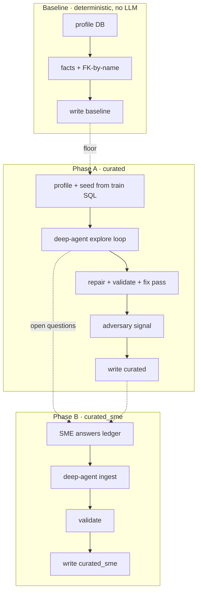
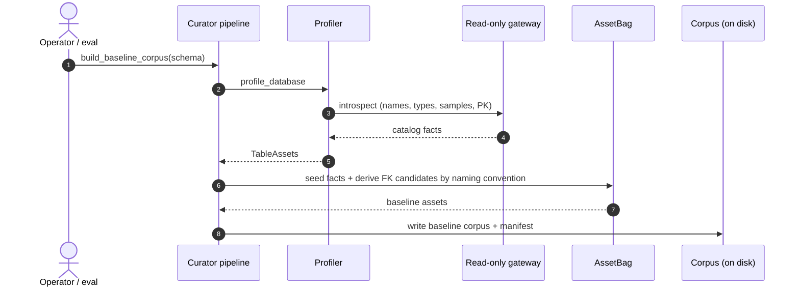
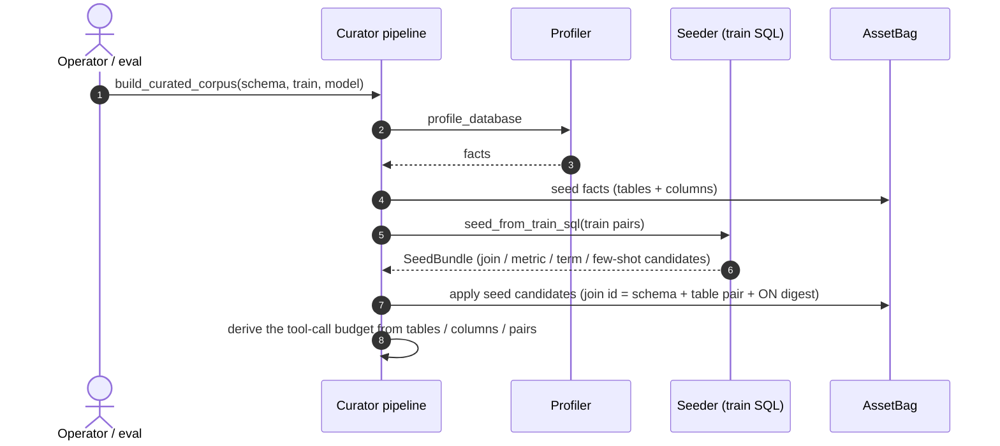
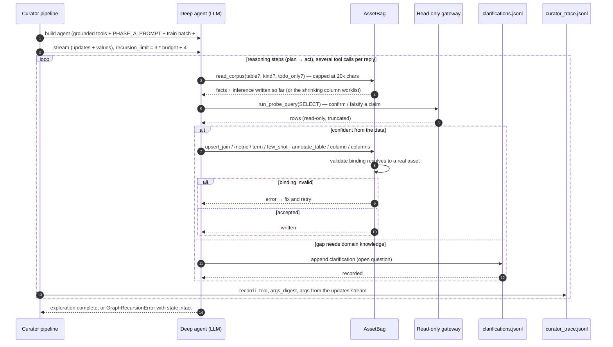
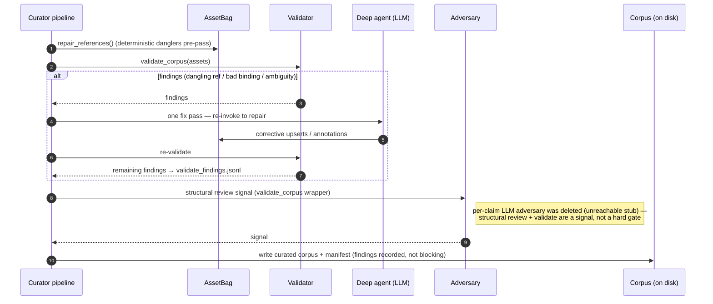
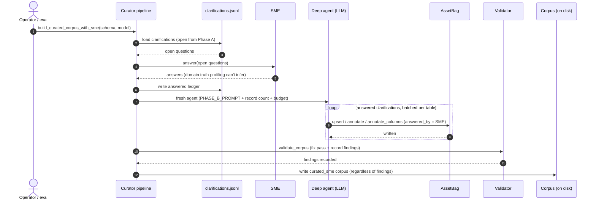

# Curator — agentic sequence

The offline path that turns a raw (possibly obfuscated) database into a governed
corpus — the source of truth the Analyst reads. It runs as an **eval ladder**:
a deterministic `baseline`, an agentic `curated` (Phase A), and a human-enriched
`curated_sme` (Phase B). Broken into an overview plus one small diagram per stage.
Source: [`curator/pipeline.py`](../src/governed_bi/curator/pipeline.py) and
[`curator/deep_agent.py`](../src/governed_bi/curator/deep_agent.py).

**Participants → code**

| Lifeline | Where |
|---|---|
| Curator pipeline | `curator/pipeline.py` · `build_baseline_corpus` / `build_curated_corpus` / `build_curated_corpus_with_sme` |
| Profiler | `curator/profile.py` · `profile_database` |
| Seeder | `curator/seed.py` · `seed_from_train_sql` |
| AssetBag | `curator/asset_bag.py` · typed assets + validated writes |
| Deep agent | `curator/deep_agent.py` · `create_deep_agent`, no checkpointer, streamed under a derived tool-call budget |
| Read-only gateway | `gateway/…` · `Gateway` (probes run read-only) |
| clarifications.jsonl | `deepagents` `FilesystemBackend` · the open-question ledger |
| Validator | `corpus/validate.py` · `validate_corpus` |
| Adversary | `curator/adversary.py` · structural `review` (per-claim LLM adversary designed but deleted, never reached a caller) |
| SME | `curator/clarifications.py` · `Responder` (human / stand-in) |
| Corpus (on disk) | `corpus/<schema>/…` typed YAML + run manifest |
| Tool-call trace | `curator_trace.jsonl` / `curator_sme_trace.jsonl` · one line per call, verbatim args |

---

## Overview

Three arms, increasing trust; Phase A's open questions feed Phase B.

```mermaid
flowchart TD
    subgraph BASE [Baseline · deterministic, no LLM]
        B1[profile DB] --> B2[facts + FK-by-name] --> B3[write baseline]
    end
    subgraph PA [Phase A · curated]
        A1[profile + seed from train SQL] --> A2[deep-agent explore loop] --> A3[repair + validate + fix pass] --> A4[adversary signal] --> A5[write curated]
    end
    subgraph PB [Phase B · curated_sme]
        C1[SME answers ledger] --> C2[deep-agent ingest] --> C3[validate] --> C4[write curated_sme]
    end
    B3 -. floor .-> A1
    A2 -. open questions .-> C1
    A5 -.-> C1
```

---

## 1 · Baseline — deterministic, no LLM

The eval floor: everything a script can derive from the database, no agent.

```mermaid
sequenceDiagram
    autonumber
    actor OP as Operator / eval
    participant P as Curator pipeline
    participant PR as Profiler
    participant DB as Read-only gateway
    participant BAG as AssetBag
    participant DISK as Corpus (on disk)

    OP->>P: build_baseline_corpus(schema)
    P->>PR: profile_database
    PR->>DB: introspect (names, types, samples, PK)
    DB-->>PR: catalog facts
    PR-->>P: TableAssets
    P->>BAG: seed facts + derive FK candidates by naming convention
    BAG-->>P: baseline assets
    P->>DISK: write baseline corpus + manifest
```

---

## 2 · Phase A — profile + seed

Deterministic groundwork before the agent runs: facts, plus candidates mined from
the training question→SQL pairs.

```mermaid
sequenceDiagram
    autonumber
    actor OP as Operator / eval
    participant P as Curator pipeline
    participant PR as Profiler
    participant SD as Seeder (train SQL)
    participant BAG as AssetBag

    OP->>P: build_curated_corpus(schema, train, model)
    P->>PR: profile_database
    PR-->>P: facts
    P->>BAG: seed facts (tables + columns)
    P->>SD: seed_from_train_sql(train pairs)
    SD-->>P: SeedBundle (join / metric / term / few-shot candidates)
    P->>BAG: apply seed candidates (join id = schema + table pair + ON digest)
    P->>P: derive the tool-call budget from tables / columns / pairs
```

No deterministic suspect marking happens here. `_mark_columns_absent_from_gold` used to
run at this point and was deleted on 2026-07-29 (see [Curator](curator.md)), so the
corpus carries zero suspect columns when the agent starts.

`_apply_seed` reports both `joins_ok`/`metrics_ok` (calls that succeeded) and
`joins_written`/`metrics_written` (assets that exist afterwards). The gap between them
is upsert collisions, and the build prints a line when it is non-zero. Reporting one
number is what let a phantom "the agent deleted 21 joins" diagnosis stand, since the
only way to see coverage was to difference a call count against a YAML count.

---

## 3 · Phase A — deep-agent explore loop

The agent works the pairs in batches: it reads the live corpus, probes the
database **read-only**, and persists typed assets through validated write tools.
Genuine unknowns become questions rather than guesses. The loop is bounded, the bound
is stated to the agent, and every call is traced.

```mermaid
sequenceDiagram
    autonumber
    participant P as Curator pipeline
    participant AG as Deep agent (LLM)
    participant BAG as AssetBag
    participant DB as Read-only gateway
    participant FS as clarifications.jsonl
    participant TR as curator_trace.jsonl

    P->>AG: build agent (grounded tools + PHASE_A_PROMPT + train batch + ## Budget)
    P->>AG: stream (updates + values), recursion_limit = 3 * budget + 4
    loop reasoning steps (plan → act), several tool calls per reply
        AG->>BAG: read_corpus(table?, kind?, todo_only?) — capped at 20k chars
        BAG-->>AG: facts + inference written so far (or the shrinking column worklist)
        AG->>DB: run_probe_query(SELECT) — confirm / falsify a claim
        DB-->>AG: rows (read-only, truncated)
        alt confident from the data
            AG->>BAG: upsert_join / metric / term / few_shot · annotate_table / column / columns
            BAG->>BAG: validate binding resolves to a real asset
            alt binding invalid
                BAG-->>AG: error → fix and retry
            else accepted
                BAG-->>AG: written
            end
        else gap needs domain knowledge
            AG->>FS: append clarification (open question)
            FS-->>AG: recorded
        end
        P->>TR: record i, tool, args_digest, args from the updates stream
    end
    AG-->>P: exploration complete, or GraphRecursionError with state intact
```

Three things about this loop are load-bearing and easy to miss.

- **It streams, it does not invoke.** `.invoke()` returns accumulated state only on
  success, so a crash used to forfeit the tool counts exactly when they were needed.
  Keeping the last `values` chunk means an exhausted run still reports what it did.
- **Batching is the difference between finishing and not.** Several tool calls in one
  assistant message cost one `tools` super-step; the same calls across N replies cost
  3N. `annotate_columns` and `read_corpus(todo_only=true)` exist to make the reliability
  sweep cost one call per table with a worklist that shrinks. See
  [the step budget](curator.md#the-step-budget).
- **`read_corpus` is capped at 20,000 characters.** It was unbounded, and the widest
  benchmark schema renders 664 KB, past the point where the deepagents filesystem
  middleware evicts a tool result to a file and charges extra turns to read it back.
  Truncation names what was cut and how to narrow the call.

---

## 4 · Phase A — validate + write

Not a hard gate: references are repaired, validation runs with one agent fix pass,
remaining findings are **recorded**, and the corpus is written regardless.

```mermaid
sequenceDiagram
    autonumber
    participant P as Curator pipeline
    participant BAG as AssetBag
    participant VAL as Validator
    participant AG as Deep agent (LLM)
    participant ADV as Adversary
    participant DISK as Corpus (on disk)

    P->>BAG: repair_references() (deterministic danglers pre-pass)
    P->>VAL: validate_corpus(assets)
    alt findings (dangling ref / bad binding / ambiguity)
        VAL-->>P: findings
        P->>AG: one fix pass — re-invoke to repair
        AG->>BAG: corrective upserts / annotations
        P->>VAL: re-validate
        VAL-->>P: remaining findings → validate_findings.jsonl
    end
    P->>ADV: structural review signal (validate_corpus wrapper)
    Note right of ADV: per-claim LLM adversary was deleted (unreachable stub) —<br/>structural review + validate are a signal, not a hard gate
    ADV-->>P: signal
    P->>DISK: write curated corpus + manifest (findings recorded, not blocking)
```

---

## 5 · Phase B — fold in SME answers

The subject-matter expert answers Phase A's open questions and the agent folds each
answer into the corpus. It does **not** stamp certification: `certified_writes` is
accepted by `curator_tools` for API compatibility and every write tool passes
`certified=False`, because human sign-off is a non-agent path (D6/C6). Phase B's
budget is `30 + 3 * n_answered`, since its work scales with the ledger rather than the
schema.

```mermaid
sequenceDiagram
    autonumber
    actor OP as Operator / eval
    participant P as Curator pipeline
    participant FS as clarifications.jsonl
    participant SME as SME
    participant AG as Deep agent (LLM)
    participant BAG as AssetBag
    participant VAL as Validator
    participant DISK as Corpus (on disk)

    OP->>P: build_curated_corpus_with_sme(schema, model)
    P->>FS: load clarifications (open from Phase A)
    FS-->>P: open questions
    P->>SME: answer(open questions)
    SME-->>P: answers (domain truth profiling can't infer)
    P->>FS: write answered ledger
    P->>AG: fresh agent (PHASE_B_PROMPT + record count + budget)
    loop answered clarifications, batched per table
        AG->>BAG: upsert / annotate / annotate_columns (answered_by = SME)
        BAG-->>AG: written
    end
    P->>VAL: validate_corpus (fix pass + record findings)
    VAL-->>P: findings recorded
    P->>DISK: write curated_sme corpus (regardless of findings)
```

---

## Notes

- **Three arms, increasing trust.** `baseline` = DB-derivable facts only (no LLM);
  `curated` adds the agent's inference grounded in train SQL + live probes;
  `curated_sme` folds in human answers to what the agent couldn't resolve.
- **The agent is grounded, not free.** It reads the live corpus, probes the DB
  **read-only**, and every write goes through a validated `upsert_*` / `annotate_*`
  tool that rejects a binding which does not resolve — it cannot author a dangler.
- **Uncertainty becomes a question, not a guess** — appended to `clarifications.jsonl`
  and answered by Phase B's SME.
- **Validation is a fix pass + recorded signal, not a hard gate.** `validate_corpus`
  runs, triggers one agent fix pass, and writes remaining findings to
  `validate_findings.jsonl`; `repair_references()` fixes danglers first. The corpus
  is written **regardless** — in this greenfield harness the findings are a signal
  in the run manifest, not a write-blocking gate.
- **The invoke is bounded, and the manifest says by how much.** Each phase derives a
  tool-call budget (Phase A from tables/columns/pairs, Phase B from the number of
  answered records) unless an operator passes `--max-agent-steps`. `run_manifest.json`
  records `tool_call_budget` plus `tool_calls.n_super_steps`, `.recursion_limit`,
  `.exhausted` and a `.repeats` block, and an `assets` block counting what is actually
  in the corpus. `exhausted: true` means the agent ran out of steps, and the triage
  order in the prompt's `## Budget` section says which stages it lost.
  [The step budget](curator.md#the-step-budget) has the derivation and the run that
  motivated it.

Companion: [analyst-sequence.md](analyst-sequence.md) — how this corpus is read at
serve time.
