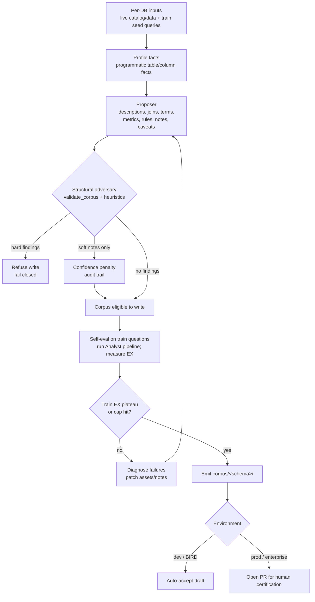

# Agentic BI Curator

The build-side agent for the [Agentic BI System](architecture.md). It is the
offline agent that *produces* the corpus (two-harness split; `deepagents`). Runs
**per-DB, independently**. Writes the corpus defined in
[Asset schemas](asset-schemas.md); the serve-side counterpart is the
[Analyst](analyst.md). It is not a one-shot bootstrapper but a **permanent
maintainer**: cold-start plus ongoing drift-repair. Untended corpora rot
~95%→65%/month.

> **Multi-schema (D15).** "Per-DB" means one database per run — but that database now holds **many schemas**, and the **schema** (not the database) is the modeled corpus namespace (`schema -> table`). A run curates every schema in the DB plus any curated cross-schema relationships; the emitted corpus tree is `corpus/<schema>/` (the `db`→`schema` rename shipped, D15 increment 7; asset IDs unchanged). The per-DB framing below — Inputs, the loop — is unchanged in scope.

> Implementation: [`src/governed_bi/curator/`](../src/governed_bi/curator/).

> **Build status (scaffold vs seam).** A deterministic **scaffold** runs with no
> model and no network: programmatic Facts profiling (`profile`), naming-convention
> FK candidates, and an adversary `review` that wraps the CI validator with cheap
> self-consistency checks (hard findings **gate write**). The **LLM-authored
> Inference tier** is built by the deepagents harness (`curator/deep_agent.py`):
> `build_curator_agent` wires a deep agent over grounded tools — `profile_facts`
> (the Facts tier) and `run_probe_query` (a read-only SQL probe) — and Phase A
> authors descriptions, joins, terms, metrics and notes through `AssetBag`, while
> Phase B folds SME-answered clarifications back in. Still seams: the **per-asset
> adversary `refute`** (probe queries — it currently raises `NotImplementedError`,
> so the `curated` rung's only reviewer is the structural gate) and the
> **self-eval train-EX loop**. A step marked *(seam)* is not yet run.

## Inputs / outputs

- **Inputs (per DB):** the live DB (catalog + data); that DB's seed queries (`train_final.jsonl`: question + gold SQL + BIRD `evidence`). **Train only, never test (the leakage wall).**
- **Output:** the `corpus/<schema>/` tree of YAML typed assets, each carrying provenance.

## Proposer + adversary (D10)

The curator is **two roles, not one agent:**

- **Proposer:** hypothesizes Inference-tier assets (descriptions, joins, reliability caveats, terms/metrics/rules, routing/gotcha notes), probing the DB to ground each claim.
- **Adversary (structural gate, built):** wraps `validate_corpus` plus cheap self-consistency checks. Hard findings (dangling refs, bad / duplicate ids, missing physical tables, join-on failures, note-budget / excluded-identifier violations, …) **block corpus write** — fail closed. Soft heuristic notes (`missing-provenance`, `fk-missing-ref`) only discount confidence and are recorded on the asset audit trail. The designed accept / revise / reject loop with an LLM that re-derives claims and runs falsifying probes is still a **seam** (`adversary.refute` for non-note assets raises `NotImplementedError`; the deep-agent author is told to self-review in the meantime).

**The adversary boundary = the Facts/Inference boundary.** Facts (dtypes, nullability, uniqueness, samples, row counts) are generated **programmatically** as the deterministic foundation. They are never proposed and never checked. Everything the *model asserts* must clear the structural gate before emit; per-claim LLM refutation is the remaining seam.

Status lifecycle in each asset's `provenance.status`:

`proposed` (proposer) → `draft` (adversary-passed) → `certified` (human sign-off, **prod only**, D6)

- **Dev (BIRD):** the structural gate is the automated reviewer that ships today; a green pass is required before write. The Phase A/B pipeline gates write and leaves status as authored unless the deterministic non-agent fold stamps certification.
- **Prod (enterprise):** the structural gate is the **automated first-line reviewer**. Human certification (D6) is a separate non-agent path — never a model-callable tool parameter.

Both the proposer's claim/evidence **and** the adversary's findings land in the asset's `audit` block → rendered in the viz/audit surface. This is the auditability payoff of an owner-less, AI-built layer.

## The loop (per DB)

1. **Profile (Facts, programmatic).** *(built)* Read catalog + sample data → emit the Facts tier for every table/column. Deterministic; no LLM; correct in every arm.
2. **Propose (Inference + notes).** *(built: the Phase A deep agent)* The proposer hypothesizes descriptions, joins (value-overlap + seed-SQL join patterns — **within a schema**; cross-schema joins are never FK/overlap-discovered, only curated from SME / example SQL / usage per D15, else the Analyst refuses), reliability caveats (execute-and-observe against the traps), terms/synonyms, metrics/rules (from `evidence` + recurring computations), and authors **routing/gotcha/pattern notes**. Free exploration is confined to this pocket. Roles, confidence and provenance come from Facts; the Phase A deep agent authors the descriptions, `suspect` caveats and derived assets (joins/terms/metrics/notes) through `AssetBag`.
3. **Adversary pass.** *(structural gate built; per-asset LLM `refute` seam)* Hard structural findings refuse the write. Soft heuristic notes discount confidence only. The built `review` is the deterministic structural gate (CI validator + self-consistency); the per-claim refutation with probe queries is the LLM seam.
4. **Self-eval & repair (inner loop, capped).** *(seam)* Assemble the draft layer → run the Analyst pipeline on the DB's **train** questions → measure EX → diagnose failures → proposer patches (a failed question often *becomes* the gotcha note that fixes it) → adversary re-checks the patch → repeat until train-EX plateaus or the iteration/budget cap hits. **Train-only.**
5. **Propose corpus.** *(emit downstream)* Structural gate green ∧ train-EX plateaued → emit (dev auto-accepts; prod opens a PR to the owner, D6).

**Done-enough criterion:** `CI green ∧ (train-EX plateaued ∨ cap)`. The built structural gate enforces the machine-checkable half (`CI green`) before write. The train-EX half arrives with the self-eval seam (step 4).

The build loop at a glance:

## Reliability inference (Phase 2 detail)

**Who may author what.** `reliability.status = suspect` is **AI-authorable**: the Phase A agent marks a column with `annotate_column(suspect=True, note=...)`, and an SME answer that disowns a column folds into the same mark (`AssetBag.mark_unrecognised_columns`). `governance.excluded` is **human-only**, and it is enforced by absence — the curator's tool list has no exclusion tool and nothing under `src/governed_bi/curator/` references `excluded`. Do not add either. The distinction is what each does: `suspect` argues against a column and the analyst still sees it, while `excluded` removes it from the corpus, which is a decision a person signs for.

No deterministic path marks reliability any more. `_mark_columns_absent_from_gold` used to stamp every column that train gold SQL never referenced, and it is deleted: "BIRD never queried this column" is not evidence the column is unreliable, and where the gold SQL was defective the mask banned columns the generator needed. The curated arm's decoy defence is now exactly what the Phase A prompt's reliability sweep elicits plus what the SME round-trip returns, so a build's `run_manifest.json` reports `suspect_columns` and a zero there means the arm went out undefended.

*(Built: the Phase A agent sweeps every table and column and flags `suspect` from the table's Facts and probe results. The structured-signal scoring below is the fuller design the prompt approximates.)* The curator flags an unreliable column via **general data-quality anomalies, not BIRD-trap-specific detectors** (P2, so it transfers to an enterprise deployment; BIRD's traps merely validate that the signals fire). Each signal contributes to a confidence score. A column is marked `suspect` only above a threshold. Per-claim LLM adversary refutation of each caveat is still a seam; today only the structural gate runs before write.

| Signal | Generic form | Catches (BIRD trap) |
|---|---|---|
| **Referential-integrity break** | claims to be a key, doesn't join cleanly | permuted join keys |
| **Sibling inconsistency** | near-synonym column disagrees with its twin | sparse-perturb / cat-remap / date-offset |
| **Orphan duplicate table** | duplicates another table, no inbound FK, unused | clone tables |
| **Distributional implausibility** | values wrong for the apparent meaning | sparse-perturb / null |
| **Usage corroboration** (weak, never standalone) | unused while a near-synonym twin is used | (strengthens the above) |

**False-positive guards:** a confidence threshold; the designed LLM adversary would refute ("unreliable, or just rare / legitimately different?"); flag only when a clear real alternative (the used twin) exists; in the enterprise setting a false positive only degrades the stamp, it never blocks (Analyst env-toggle). **Usage (#5) is corroborating-only.** Never flag on "unused" alone (rare ≠ fake, and it wouldn't transfer). **Grading (BIRD):** `decoy_touch_rate` from the run's metrics, against the trap manifest; the corpus side of it is the build manifest's `suspect_columns`.

**One granularity limit to know about.** An SME answer folds onto a column only when the clarification's scope names one (`table:<Table>.<column>`). A question scoped `table:<Table>` or `pair:<id>` has nowhere to put a column-level mark, so the answer reaches the corpus as a note instead; the Phase A prompt asks for column-scoped questions when the doubt is about one column, and Phase B's `unrecognised_column_marks.no_column_in_scope` counts the ones that still arrive too coarse.

## Distillation discipline (curation beats accumulation)

The curator *selects and distills*; it never dumps. That is the memory doc's central law (raw grep <1pt; Spotify accepted 12.5%; more memory can hurt).

- **Few-shots:** a **per-pattern cap**. Cover query-pattern classes and the complexity spread, dedup near-identical examples, and keep the clearest exemplar per pattern. Not the whole train split.
- **Notes:** the highest-value output and the hardest. Distilled routing/gotchas, not transcripts. Maintained continuously.

## Maintenance (permanent maintainer)

Cold-start is the first job; drift-repair is ongoing. Serve-side signals (corrections, failures) are harvested back into proposer input. A correction ≈ a PR to a note/reference doc, so the memory/corpus distinction collapses (D8).

Links: [Design decisions](design-decisions.md) · [Asset schemas](asset-schemas.md) · [Architecture](architecture.md) §2 · *Data Agent Memory Design Overview*.
