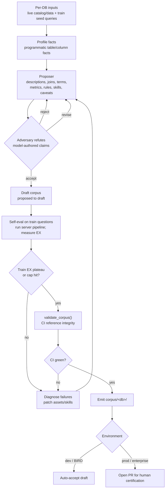

# Agentic BI Curator

_[English](curator.md) · [简体中文](curator.zh.md)_

[Agentic BI 系统](system-overview.zh.md)的构建侧（build-side）智能体。它是*生成*
corpus 的离线智能体（两套 harness 的分工；`deepagents`）。**逐库（per-DB）独立**
运行。写入[资产模式（Asset schemas）](asset-schemas.zh.md)中定义的 corpus；服务侧
（serve-side）对应的部分是[Server](server.zh.md)。它不是一次性的启动脚本
（bootstrapper），而是**永久性的维护者**：先冷启动（cold-start），再持续进行漂移
修复（drift-repair）。疏于维护的 corpus 会以约 95%→65%/月的速度腐化。

> **多 schema（D15）。** “逐库（per-DB）”指每次运行对应一个数据库——但该数据库如今持有**多个 schema**，而作为 corpus 建模命名空间（namespace）的是 **schema**（而非数据库）（`schema -> table`）。一次运行会策展该库中的每个 schema，外加任何经过策展的跨 schema 关系；发出的 corpus 目录树为 `corpus/<schema>/`（`db`→`schema` 改名已落地，D15 增量 7；资产 ID 不变）。下文的逐库框架——输入、循环——在范围上保持不变。

> 实现代码：[`src/governed_bi/curator/`](../src/governed_bi/curator/)。

> **构建状态（scaffold vs seam）。** 一个确定性的 scaffold 在没有模型、没有网络的
> 情况下运行：程序化的 Facts 画像分析（`profile`）、一个 `HeuristicProposer`
> （从 Facts 中填充列角色、置信度、溯源（provenance），并把散文式的 `description`
> 留给 LLM 撰写）、一个用低成本自一致性检查包装 CI 校验器的 adversary `review`，
> 以及一个 `curate` 的 propose -> review -> promote 循环（`proposed -> draft`）。
> **LLM 撰写的 Inference 层**现已以 `LlmProposer`（`curator/llm_proposer.py`）的
> 形式构建完成：它在启发式方法（heuristic，决定角色/溯源的部分）之上进行组合，并
> 通过一个注入的 `ChatClient`（OpenAI `gpt-5.5` low）叠加模型撰写的**描述 + 可靠性
> 警示（reliability caveats）**（`suspect` 加一条“DO NOT USE”提示），从不触及
> Facts，并在响应格式不合规时退化为基础提案。正是这些警示构成了让 curator 分支
> （Arm 2）胜过无该层分支（Arm 1）的关键杠杆。仍是 seam 的有：**连接（joins）/术语
> （terms）/指标（metrics）/规则（rules）/skills** 的 LLM 撰写、**逐资产（per-asset）
> 的 adversary `refute`**（探测查询），以及**自评估（self-eval）train-EX 循环**。
> **deepagents harness** 本身已构建完成（`curator/deep_agent.py`）：
> `build_curator_agent` 在接地（grounded）工具之上装配了一个 deep agent，这些
> 工具包括 `profile_facts`（Facts 层）和 `run_probe_query`（一个只读 SQL 探测，
> 即在线 refute 的基础操作），并搭配一个 LangChain 模型（`agents` extra）。构建
> 过程已完成离线验证；运行自主循环则需要一个在线模型。以下各节描述完整设计；
> 标记为 *(seam)* 的步骤由模型支撑，尚未运行。

## 输入 / 输出

- **输入（逐库）：** 实时数据库（catalog + data）；该数据库的种子查询（seed
  queries）（`train_final.jsonl`：question + gold SQL + BIRD 的 `evidence`）。
  **只用 train，绝不用 test（防泄漏墙（the leakage wall））。**
- **输出：** `corpus/<schema>/` 目录树，包含 YAML 类型化资产与 Markdown skills，
  每一项都带有溯源信息。

## Proposer + adversary (D10)

curator 是**两个角色，而非一个智能体：**

- **Proposer：** 假设 Inference 层的资产与 skills（描述、连接、可靠性警示、
  术语/指标/规则、路由（routing）/坑点（gotcha）/模式（pattern） skills），对数据库
  进行探测以为每条论断提供依据。
- **Adversary：** 一个独立的智能体，会在每条被提议的 Inference/skill 资产提交
  之前尝试**反驳（refute）** 它。它会重新推导或攻击该论断，运行可证伪的探测查询，
  并检查一致性与证据。裁定结果：接受（accept） / 修订（revise） / 拒绝（reject）。

**adversary 的边界 = Facts/Inference 的边界。** Facts（数据类型、可空性
（nullability）、唯一性、样本、行数）是**程序化**生成的确定性基础。它们从不被
提议，也从不被检查。凡是*模型主张（assert）* 的内容，都要经过 adversary。

每个资产 `provenance.status` 中的状态生命周期：

`proposed`（proposer 提议） → `draft`（adversary 审核通过） → `certified`（人工
签核（sign-off），**仅限生产环境（prod only）**，D6）

- **开发环境（dev，BIRD）：** adversary 是**唯一的**审核者；一旦通过就自动接受
  为 `draft`。
- **生产环境（prod，enterprise）：** adversary 是**自动化的第一线审核者**。它
  会拦下明显的错误，因此人工负责人只需对 adversary 已通过的草稿（draft）进行
  签核认证（certify）。

Proposer 的论断/证据**以及** adversary 的裁定/理由，都会落入该资产的 `audit`
块中，并渲染到 viz/audit 界面上（“提议了 X；adversary 用 Y 提出质疑；最终结论
为 Z”）。这正是一个无固定负责人、由 AI 构建的层所带来的可审计性收益。

## 循环（逐库）

1. **画像（Facts，程序化）。** *(built)* 读取 catalog 与样本数据 → 为每张表、
   每一列生成 Facts 层。确定性；无 LLM；在每个分支（arm）中都正确。
2. **提议（Inference + skills）。** *(heuristic 与描述/警示撰写已构建；连接/
   术语/指标/skills 仍是 seam)* Proposer 假设描述、连接（值重叠（value-overlap）
   + 种子 SQL 的连接模式——**限于同一 schema 内**；跨 schema 连接从不由 FK/重叠发现，只从 SME / 示例 SQL / 使用情况中策展而来（D15），否则 server 拒绝）、可靠性警示（对照陷阱执行并观察（execute-and-observe））、
   术语/同义词、指标/规则（来自 `evidence` 与反复出现的计算），并撰写**路由/
   坑点/模式 skills**。自由探索被限定在这一小块空间内。`HeuristicProposer`
   从 Facts 中填充角色/置信度/溯源；`LlmProposer` 在其之上叠加模型撰写的描述 +
   `suspect` 警示；撰写衍生资产（连接/术语/指标/规则/skills）是剩余的 LLM
   proposer 工作。
3. **Adversary 审核。** *(结构性 `review` 已构建；逐条 `refute` 是 seam)*
   每个被提议的 Inference/skill 资产都会被质疑，结果为接受 / 修订 / 拒绝。
   存活下来的进入 `draft`。已构建的 `review` 是确定性的结构性关卡（CI 校验器 +
   自一致性检查）；带探测查询的逐条反驳（per-claim refutation）是 LLM 的 seam。
4. **自评估与修复（内层循环，有上限）。** *(seam)* 组装草稿层 → 在该数据库的
   **train** 问题上运行 server 流水线（pipeline） → 度量 EX → 诊断失败 →
   proposer 打补丁（一个失败的问题往往会*变成*修复它的坑点 skill） → adversary
   重新检查该补丁 → 重复，直到 train-EX 趋于平稳或触及迭代/预算上限。**仅限
   train。**
5. **提议 corpus。** *(向下游发出)* CI 引用完整性（reference-integrity）通过
   ∧ train-EX 已趋于平稳 → 发出（dev 自动接受；prod 向负责人发起一个 PR，D6）。

**足够完成的判定标准：** `CI green ∧ (train-EX 已趋于平稳 ∨ 触及上限)`。已
构建的 `curate` 循环强制执行了可机器检查的那一半（`CI green`、有上限的轮次）；
train-EX 的那一半则要靠 self-eval 这个 seam（第 4 步）才能实现。

构建循环概览:

## 可靠性推断（Phase 2 细节）

*(已构建：`LlmProposer` 从该表的 Facts 出发标记 `suspect` 并附一条“DO NOT
USE”警示。下方的结构化信号打分是该提示词（prompt）所近似实现的更完整设计。)*
curator 通过**通用的数据质量异常，而非针对 BIRD 陷阱专门设计的检测器**来
标记不可靠的列（P2，因此可迁移到企业级部署场景；BIRD 的陷阱只是用来验证这些
信号确实会触发）。每个信号都为置信度打分做出贡献。只有分数高于阈值的列才会被
标记为 `suspect`，并且 adversary 会独立尝试反驳每一条警示，然后才会提交。

| 信号 | 通用形式 | 捕获的 BIRD 陷阱 |
|---|---|---|
| **引用完整性断裂**（referential-integrity break） | 声称是键（key），却连接不干净 | 置换过的连接键 |
| **同类不一致**（sibling inconsistency） | 近义列与其“孪生列”矛盾 | sparse-perturb / cat-remap / date-offset |
| **孤立重复表**（orphan duplicate table） | 与另一张表重复，无入向外键（FK），未被使用 | 克隆表 |
| **分布不合理**（distributional implausibility） | 数值与其表面含义不符 | sparse-perturb / null |
| **使用情况印证**（usage corroboration，弱信号，不单独成立） | 未被使用，而近义的孪生列却被使用 | （强化以上信号） |

**误报防护：** 一个置信度阈值；adversary 会反驳（“是真的不可靠，还是只是罕见/
合理地有所不同？”）；只有当存在一个明确的真实替代项（被使用的孪生列）时才标记。
在企业级场景下，一次误报只会降低标记等级，从不会造成阻断（server 的环境开关
（env-toggle））。**使用情况（#5）仅作印证。** 永远不要仅凭“未被使用”就标记（罕见
不等于虚假，而且这样做也无法迁移）。**评分方式（BIRD）：** 诱饵召回率
（decoy-recall） + 误报率，均来自 manifest。

## 蒸馏纪律（策展胜于堆积）

curator 只*挑选与蒸馏*，绝不倾倒堆放。这正是记忆文档的核心法则（原始 grep
检索得分 <1 分；Spotify 的接受率为 12.5%；更多记忆反而可能有害）。

- **Few-shot 示例：** 设**逐模式（per-pattern）上限**。覆盖各类查询模式
  （query-pattern classes）与复杂度分布，去重几乎相同的示例，每种模式只保留
  最清晰的那个范例。而不是整个 train 切分（split）。
- **Skills：** 最具价值、也最难产出的输出。要蒸馏出路由/坑点，而不是原始
  对话记录（transcripts）。需要持续维护。

## 维护（永久性维护者）

冷启动是第一项工作；漂移修复则是持续性的。服务侧的信号（纠正、失败）会被
回收（harvest）进 proposer 的输入。一次纠正大致等同于对某个 skill/参考文档
的一次 PR，因此记忆与 corpus 的区分也就随之消解（D8）。

链接：[设计决策（Design decisions）](design-decisions.zh.md) · [资产模式](asset-schemas.zh.md) ·
[架构（Architecture）](architecture.zh.md) §2 · *Data Agent Memory Design Overview*。
