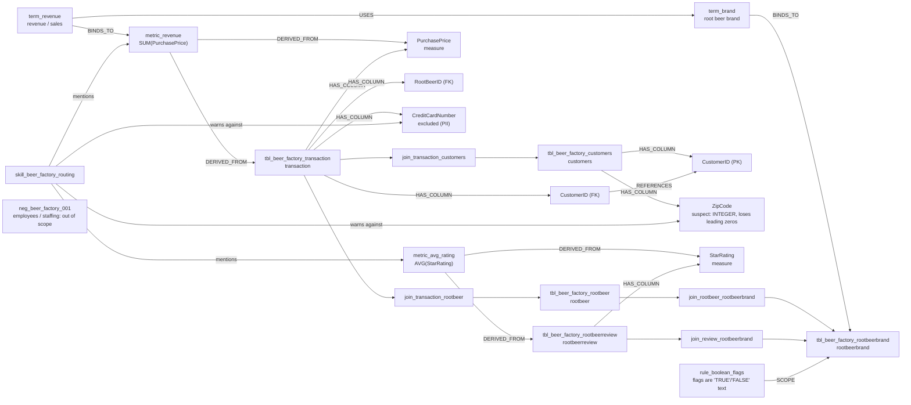
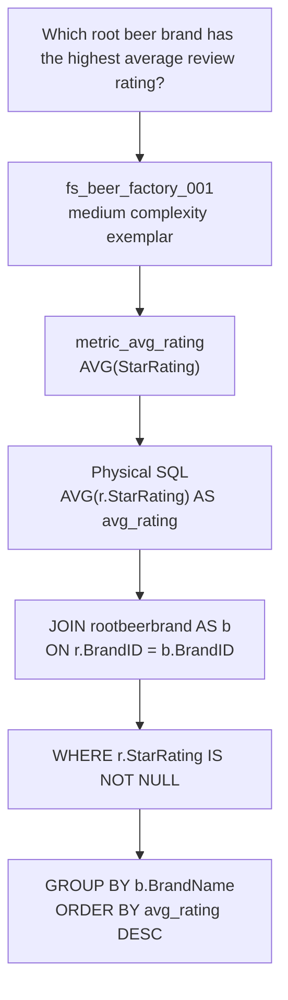

# Beer Factory Example Diagrams

These diagrams ground the architecture in the worked example under
`corpus/beer_factory/`, which is authored over the real BIRD `beer_factory`
database in `data/bird/beer_factory.sqlite`.

## Semantic mini-graph



## Top-rated-brand question sequence

```mermaid
sequenceDiagram
    autonumber
    actor User
    participant Server
    participant Corpus as Beer factory corpus
    participant Retrieval as RVGD / skills
    participant Graph as Join planner
    participant Guardrails
    participant Gateway

    User->>Server: Which root beer brand has the highest average review rating?
    Server->>Corpus: Bind term_brand; recognize "average rating"
    Corpus-->>Server: metric_avg_rating + tbl_beer_factory_rootbeerbrand
    Server->>Retrieval: Retrieve routing skill and few-shot fs_beer_factory_001
    Retrieval-->>Server: Use rootbeerreview + rootbeerbrand; exclude null ratings
    Server->>Graph: Need reviews joined to brands
    Graph-->>Server: join_review_rootbeerbrand on rootbeerreview.BrandID = rootbeerbrand.BrandID
    Server->>Server: Generate SQL using physical identifiers
    Server->>Guardrails: syntax, read-only policy, column allowlist, semantics, cost
    alt SQL touches an excluded/suspect column (CreditCardNumber, ZipCode)
        Guardrails-->>Server: veto in dev or lower stamp in prod
        Server-->>User: Refuse, clarify, or low-stamp result depending on environment
    else governed columns only
        Guardrails-->>Server: pass
        Server->>Gateway: Execute guarded SQL as user
        Gateway-->>Server: QueryResult
        Server-->>User: Ranked brands + reliability stamp
    end
```

## Example refusal path

```mermaid
sequenceDiagram
    autonumber
    actor User
    participant Server
    participant Corpus as negative_example asset
    participant RefuseGate

    User->>Server: How many employees work at the factory?
    Server->>Corpus: Retrieve neg_beer_factory_001
    Corpus-->>Server: pattern employees / staffing / headcount
    Server->>RefuseGate: Compare question to negative pattern
    RefuseGate-->>Server: match; no table covers employees or payroll
    Server-->>User: not answerable from this data - contact owner
```

## Few-shot to SQL mapping


