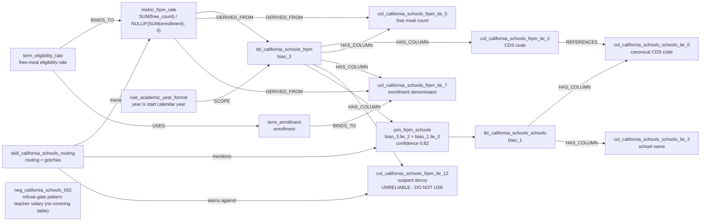
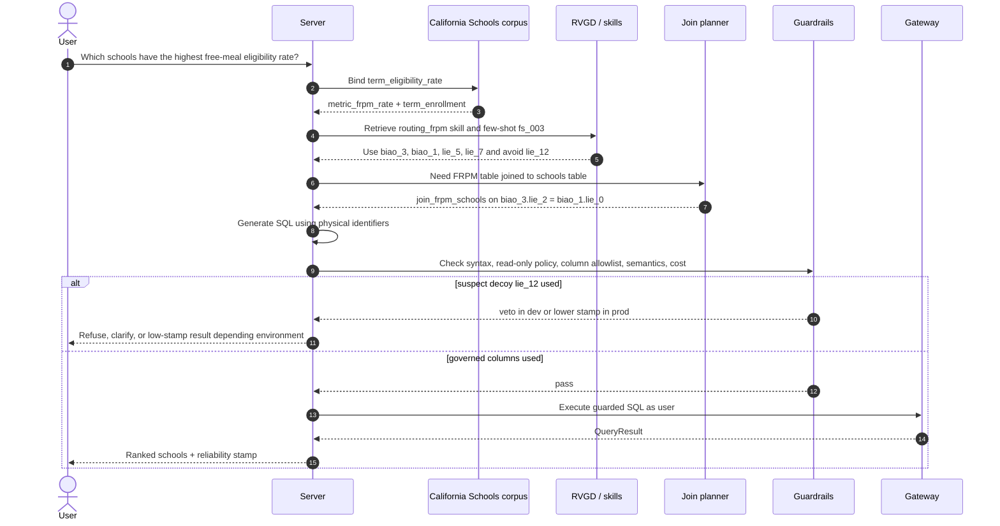
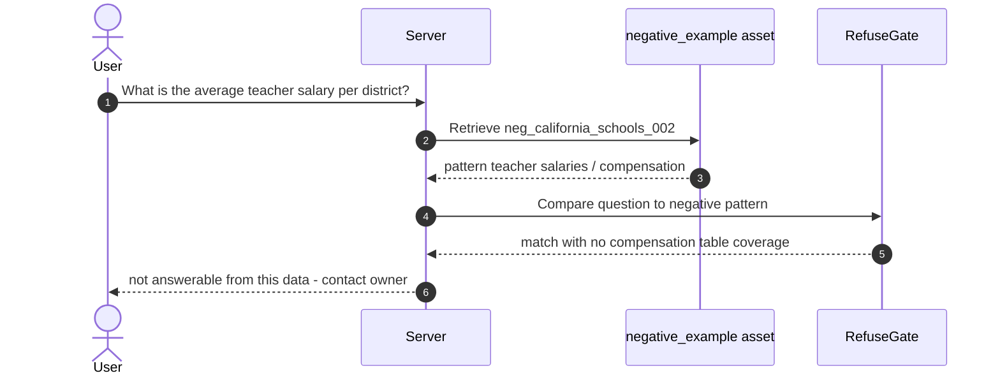
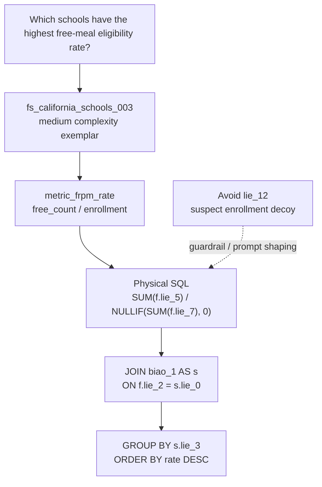

# California Schools Example Diagrams

These diagrams ground the architecture in the worked example under
`corpus/california_schools/`.

## Semantic mini-graph

## Eligibility-rate question sequence

## Example refusal path

## Few-shot to SQL mapping

