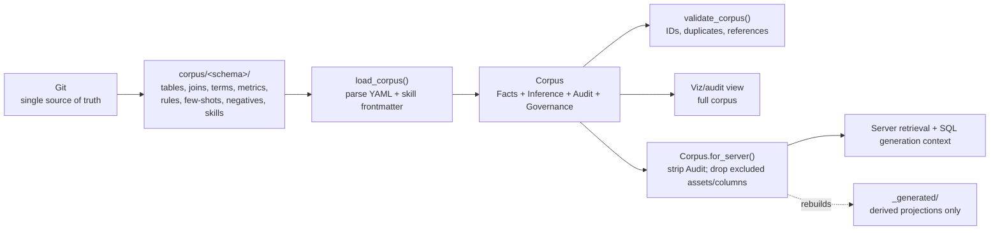
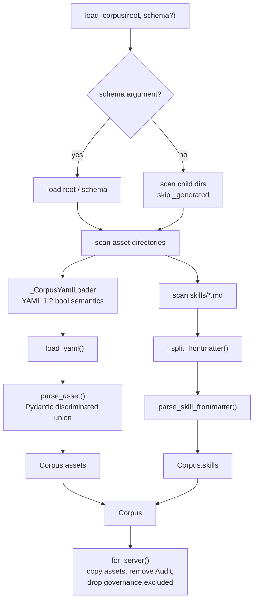
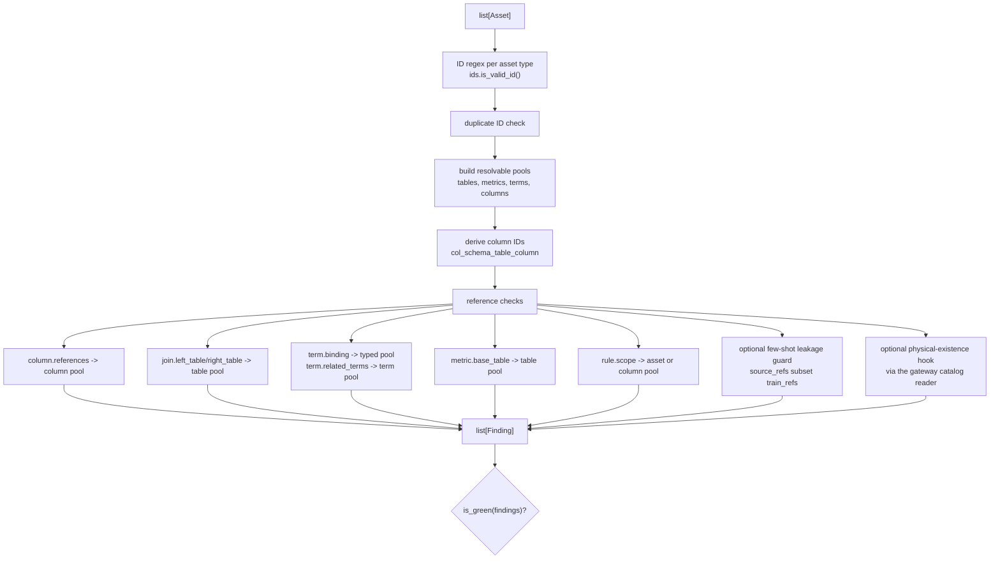
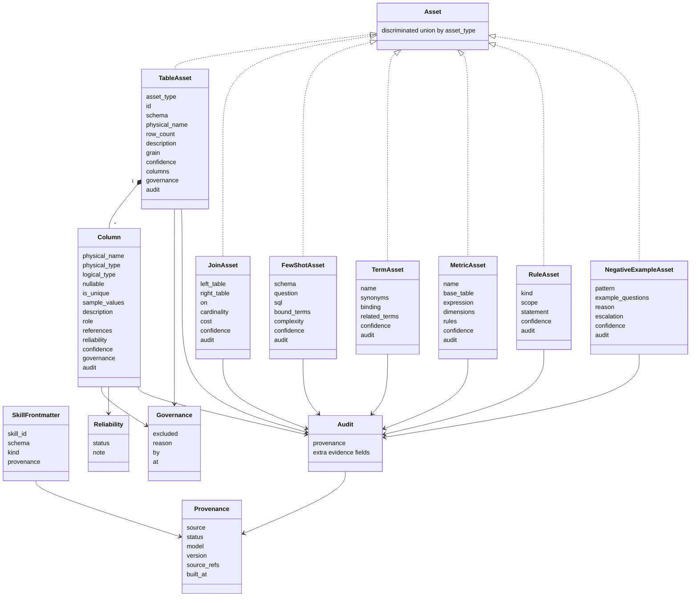
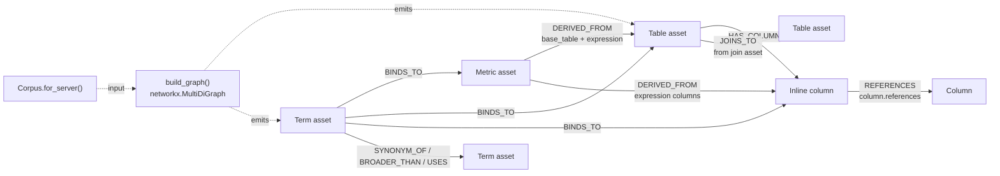
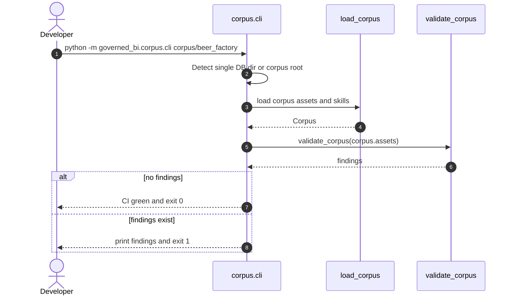

# Corpus Diagrams

_[English](corpus.md) · [简体中文](corpus.zh.md)_

The corpus package is the implemented center of the repo. It loads Git-tracked
YAML assets and Markdown skills, validates them, and exposes different views for
server runtime and human audit.

D15 renames the corpus namespace field/dir historically named `db` to `schema`
(`corpus/<schema>/`, `col_<schema>_<table>_<column>`). **API/presenter wire and
on-disk YAML** both use `schema` (`TableAsset.schema`, skill frontmatter). Asset
IDs are unchanged. Diagram folder labels below use `<schema>/`.

## Corpus consumption contract

## Loader internals

## Validation internals

## Pydantic asset model

## Graph projection edge taxonomy

## Corpus CLI sequence

