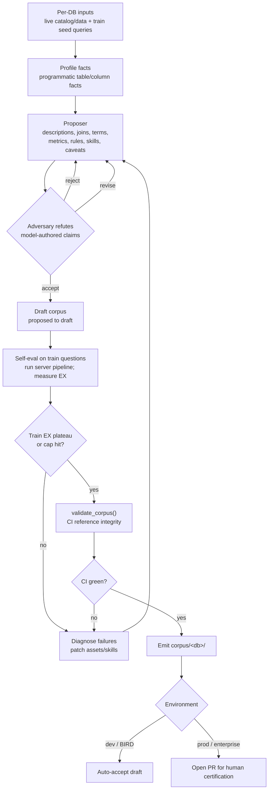
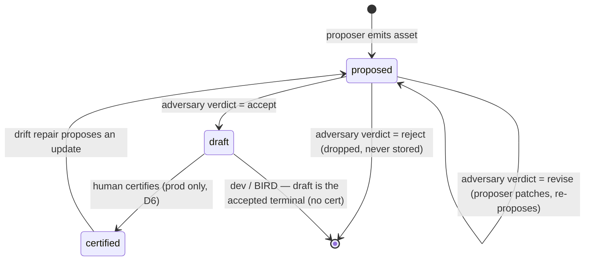
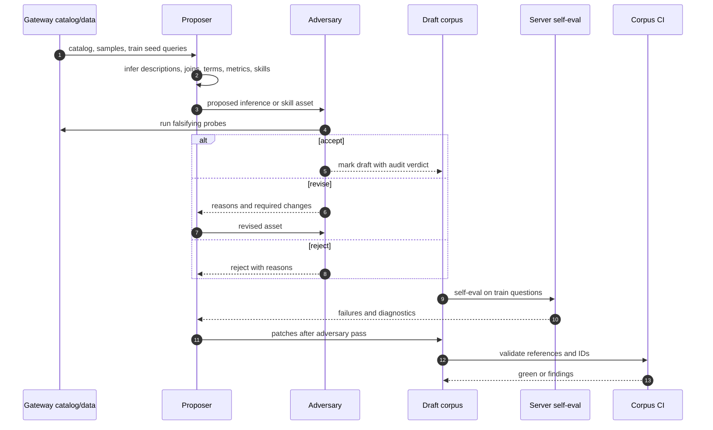
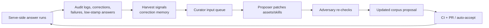

# Curator Diagrams

The curator package is currently a design scaffold. It is the offline build-side
harness that writes the corpus.

## Curator build-loop data flow

## Asset lifecycle state machine

The three boxes are the persisted `provenance.status` values. The adversary's
verdict (accept / revise / reject) drives the transitions out of `proposed`; it
is not itself a stored status.

## Proposer and adversary sequence

## Drift-repair feedback loop

