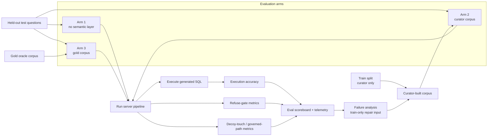
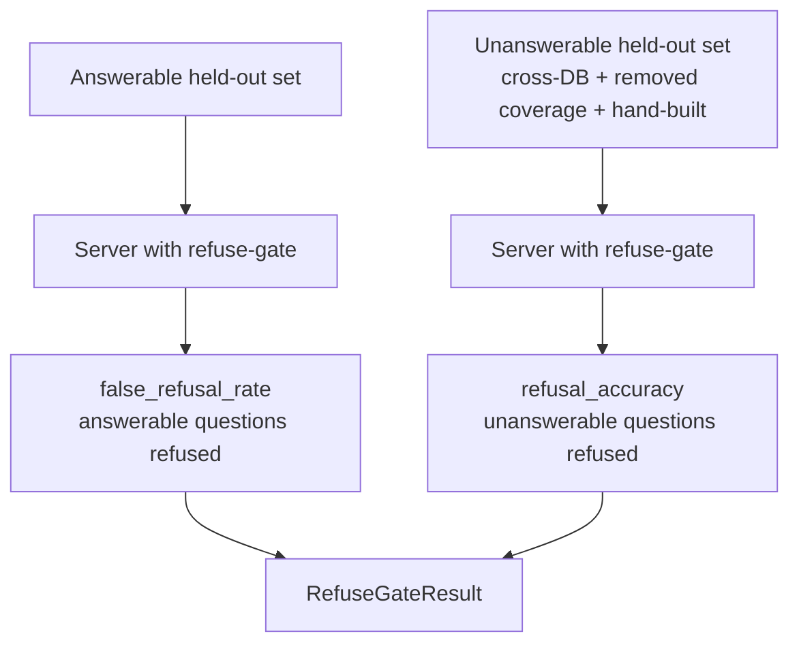
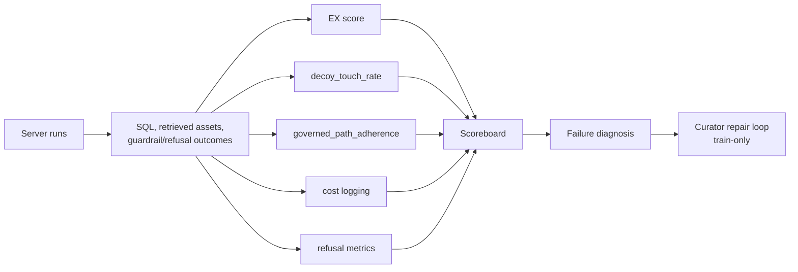

# Evaluation Diagrams

The eval package is currently a scaffold. The intended harness proves whether
the curator-built semantic layer improves execution accuracy and safety signals.

## Three-arm evaluation

## Refuse-gate evaluation

## Metrics and feedback

