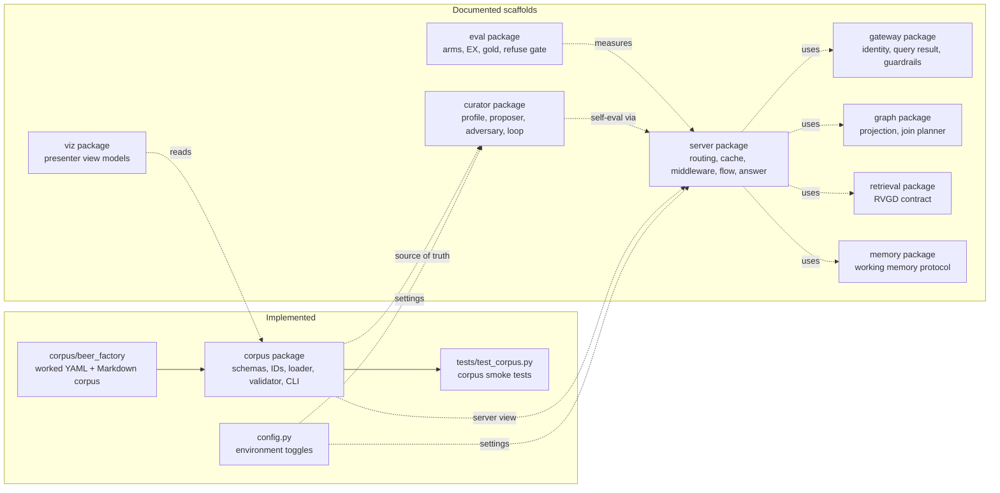
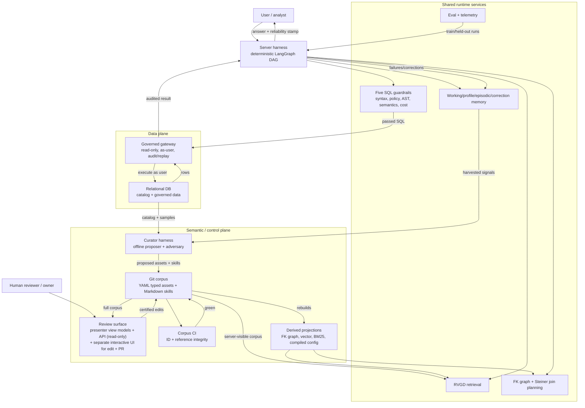
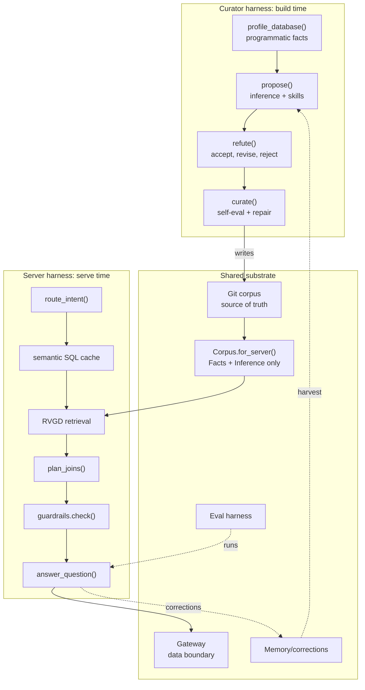
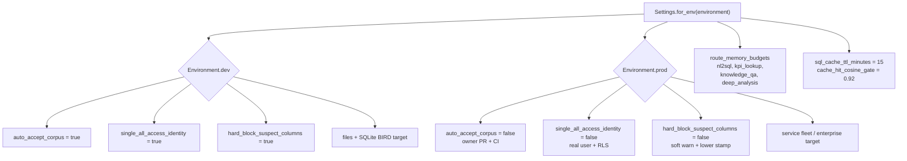

# 总览图

_[English](overview.md) · [简体中文](overview.zh.md)_

这些是复杂度最低的图。它们在深入各子系统之前，先展示仓库现状与目标架构。

## 当前代码状态

```mermaid
flowchart LR
    subgraph Implemented
        Config["config.py<br/>environment toggles"]
        CorpusPkg["corpus package<br/>schemas, IDs, loader, validator, CLI"]
        ExampleCorpus["corpus/beer_factory<br/>worked YAML + Markdown corpus"]
        Tests["tests/test_corpus.py<br/>corpus smoke tests"]
    end

    subgraph "Documented scaffolds"
        CuratorPkg["curator package<br/>profile, proposer, adversary, loop"]
        ServerPkg["server package<br/>routing, cache, middleware, flow, answer"]
        GatewayPkg["gateway package<br/>identity, query result, guardrails"]
        GraphPkg["graph package<br/>projection, join planner"]
        RetrievalPkg["retrieval package<br/>RVGD contract"]
        MemoryPkg["memory package<br/>working memory protocol"]
        EvalPkg["eval package<br/>arms, EX, gold, refuse gate"]
        VizPkg["viz package<br/>presenter view models"]
    end

    ExampleCorpus --> CorpusPkg
    CorpusPkg --> Tests
    Config -. settings .-> CuratorPkg
    Config -. settings .-> ServerPkg
    CorpusPkg -. source of truth .-> CuratorPkg
    CorpusPkg -. server view .-> ServerPkg
    ServerPkg -. uses .-> GatewayPkg
    ServerPkg -. uses .-> GraphPkg
    ServerPkg -. uses .-> RetrievalPkg
    ServerPkg -. uses .-> MemoryPkg
    CuratorPkg -. self-eval via .-> ServerPkg
    EvalPkg -. measures .-> ServerPkg
    VizPkg -. reads .-> CorpusPkg
```

## 目标系统架构

```mermaid
flowchart TB
    Analyst["User / analyst"] --> Server["Server harness<br/>deterministic LangGraph DAG"]
    Reviewer["Human reviewer / owner"] --> Viz["Review surface<br/>presenter view models + API (read-only)<br/>+ separate interactive UI for edit + PR"]

    subgraph ControlPlane["Semantic / control plane"]
        Curator["Curator harness<br/>offline proposer + adversary"]
        GitCorpus["Git corpus<br/>YAML typed assets + Markdown skills"]
        CorpusCI["Corpus CI<br/>ID + reference integrity"]
        Projections["Derived projections<br/>FK graph, vector, BM25, compiled config"]
        Viz
    end

    subgraph DataPlane["Data plane"]
        Gateway["Governed gateway<br/>read-only, as-user, audit/replay"]
        Database["Relational DB<br/>catalog + governed data"]
    end

    subgraph SharedServices["Shared runtime services"]
        Retrieval["RVGD retrieval"]
        GraphPlan["FK graph + Steiner join planning"]
        Memory["Working/profile/episodic/correction memory"]
        EvalTelemetry["Eval + telemetry"]
        Guardrails["Five SQL guardrails<br/>syntax, policy, AST, semantics, cost"]
    end

    Database -- catalog + samples --> Curator
    Curator -- proposed assets + skills --> GitCorpus
    GitCorpus --> CorpusCI
    CorpusCI -- green --> GitCorpus
    GitCorpus -- rebuilds --> Projections
    GitCorpus -- full corpus --> Viz
    Viz -- certified edits --> GitCorpus

    GitCorpus -- server-visible corpus --> Retrieval
    Projections --> Retrieval
    Projections --> GraphPlan
    Server --> Retrieval
    Server --> GraphPlan
    Server --> Memory
    Server --> Guardrails
    Guardrails -- passed SQL --> Gateway
    Gateway -- execute as user --> Database
    Database -- rows --> Gateway
    Gateway -- audited result --> Server
    Server -- answer + reliability stamp --> Analyst
    Server -- failures/corrections --> Memory
    Memory -- harvested signals --> Curator
    EvalTelemetry -- train/held-out runs --> Server
```

## 同一基座上的两套 harness

```mermaid
flowchart TB
    subgraph BuildHarness["Curator harness: build time"]
        Profile["profile_database()<br/>programmatic facts"]
        Proposer["propose()<br/>inference + skills"]
        Adversary["refute()<br/>accept, revise, reject"]
        CurateLoop["curate()<br/>self-eval + repair"]
    end

    subgraph ServeHarness["Server harness: serve time"]
        Route["route_intent()"]
        Cache["semantic SQL cache"]
        Retrieve["RVGD retrieval"]
        Plan["plan_joins()"]
        Guard["guardrails.check()"]
        Answer["answer_question()"]
    end

    subgraph SharedSubstrate["Shared substrate"]
        Corpus["Git corpus<br/>source of truth"]
        ServerCorpus["Corpus.for_server()<br/>Facts + Inference only"]
        Gateway["Gateway<br/>data boundary"]
        Eval["Eval harness"]
        Memory["Memory/corrections"]
    end

    Profile --> Proposer --> Adversary --> CurateLoop
    CurateLoop -- writes --> Corpus
    Corpus --> ServerCorpus
    ServerCorpus --> Retrieve
    Route --> Cache --> Retrieve --> Plan --> Guard --> Answer
    Answer --> Gateway
    Eval -. runs .-> Answer
    Answer -. corrections .-> Memory
    Memory -. harvest .-> Proposer
```

## 环境开关

```mermaid
flowchart TD
    Settings["Settings.for_env(environment)"] --> Dev{"Environment.dev"}
    Settings --> Prod{"Environment.prod"}

    Dev --> DevGate["auto_accept_corpus = true"]
    Dev --> DevIdentity["single_all_access_identity = true"]
    Dev --> DevSuspect["hard_block_suspect_columns = true"]
    Dev --> DevStore["files + SQLite BIRD target"]

    Prod --> ProdGate["auto_accept_corpus = false<br/>owner PR + CI"]
    Prod --> ProdIdentity["single_all_access_identity = false<br/>real user + RLS"]
    Prod --> ProdSuspect["hard_block_suspect_columns = false<br/>soft warn + lower stamp"]
    Prod --> ProdStore["service fleet / enterprise target"]

    Settings --> MemoryBudgets["route_memory_budgets<br/>nl2sql, kpi_lookup,<br/>knowledge_qa, deep_analysis"]
    Settings --> CacheNumbers["sql_cache_ttl_minutes = 15<br/>cache_hit_cosine_gate = 0.92"]
```
