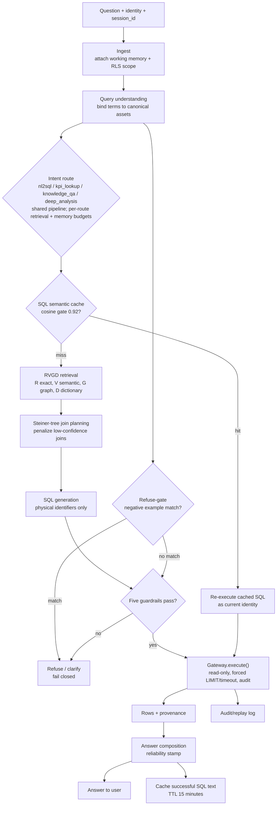
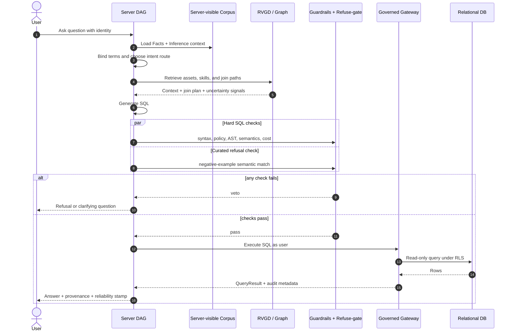
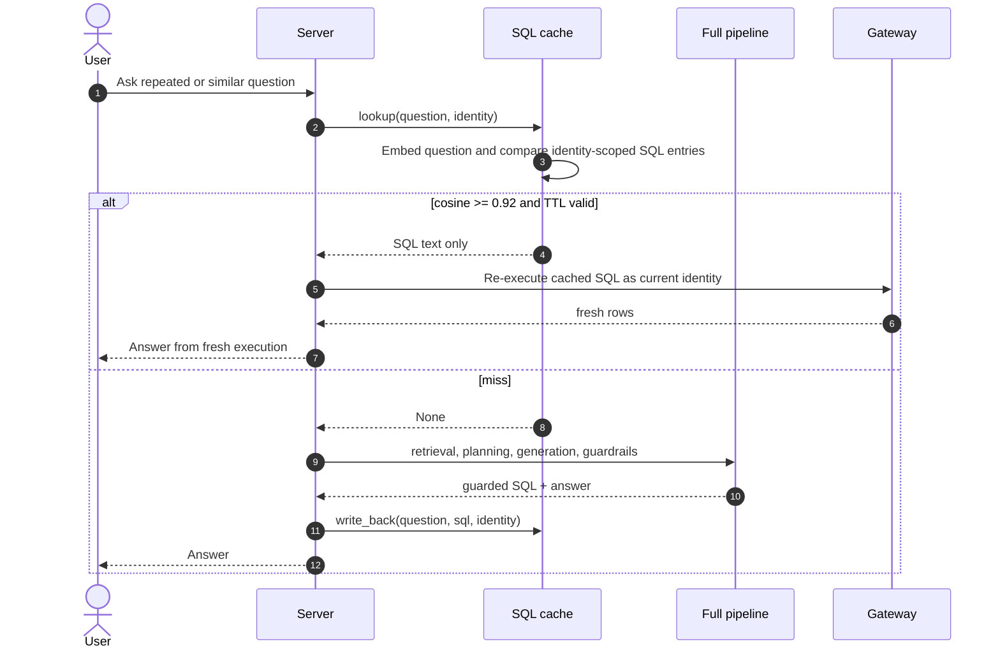
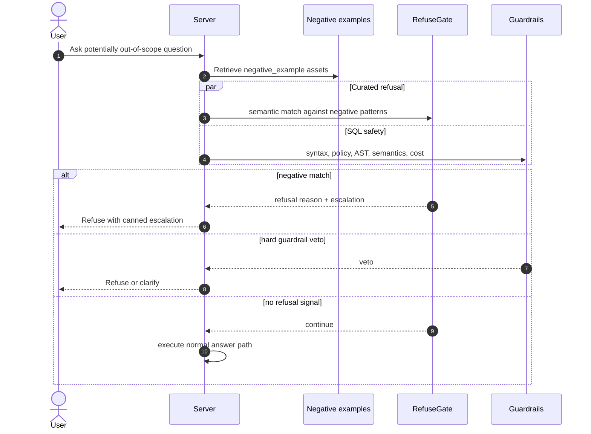
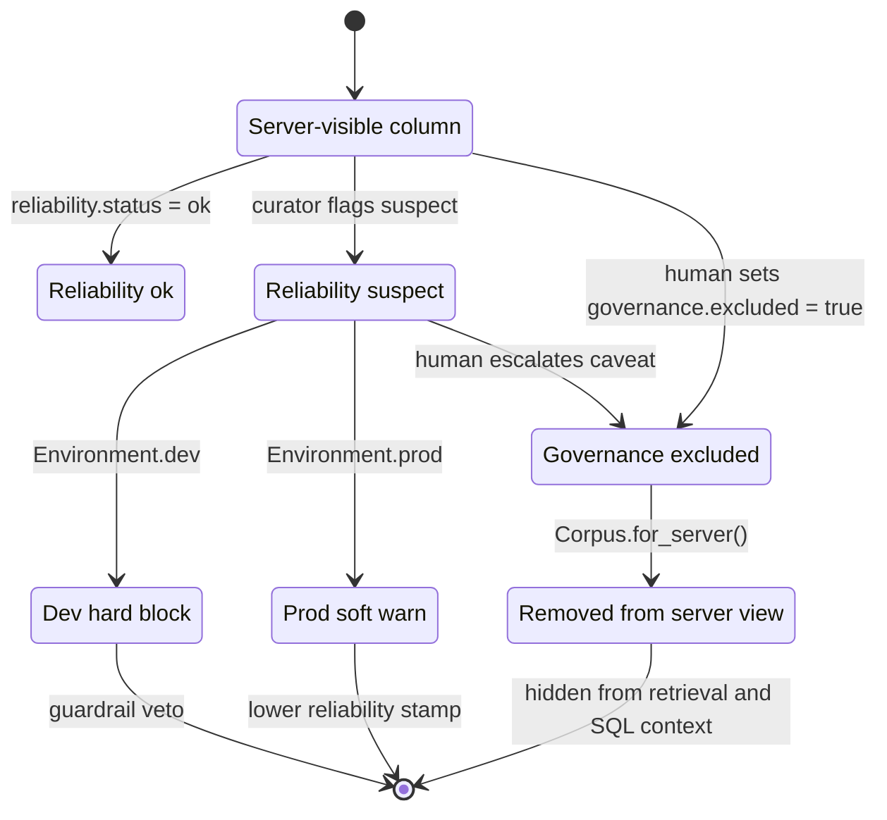
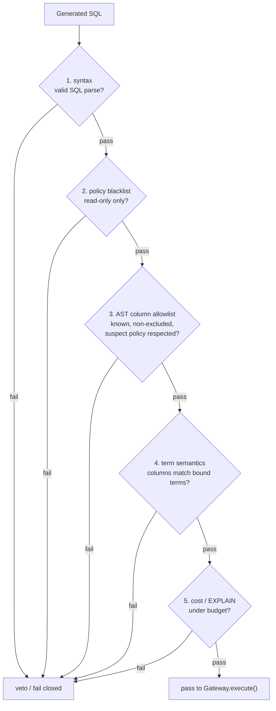

# Server Diagrams

The serve-time DAG is implemented. These diagrams reflect `docs/server.md` and
the built modules in `src/governed_bi/server/` (including the LangGraph harness
in `server/graph.py`), `gateway/`, `retrieval/`, and `graph/`.

## Answer pipeline

## Ask-question sequence

## SQL semantic-cache sequence

## Refuse-gate sequence

## Reliability and governance enforcement

## Guardrail stack

