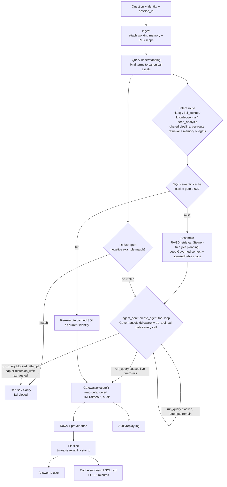
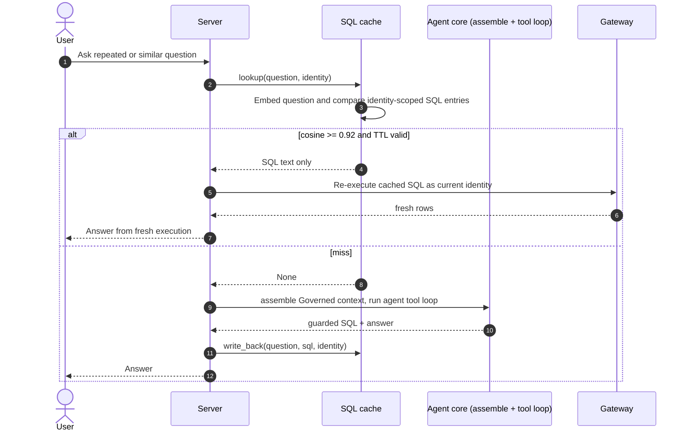
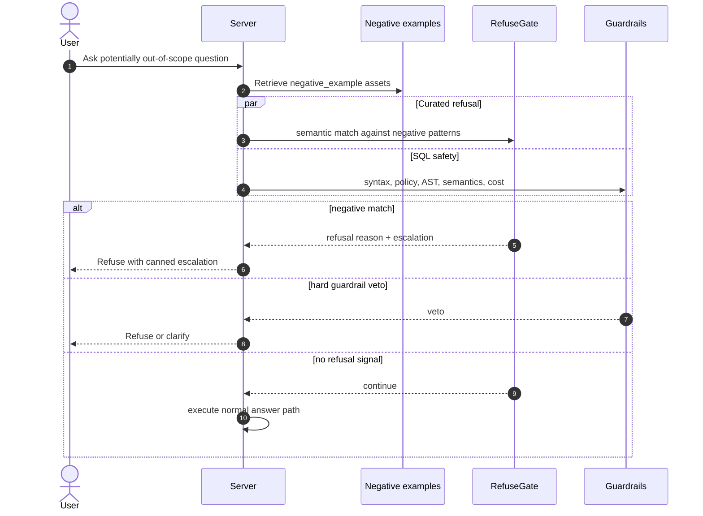
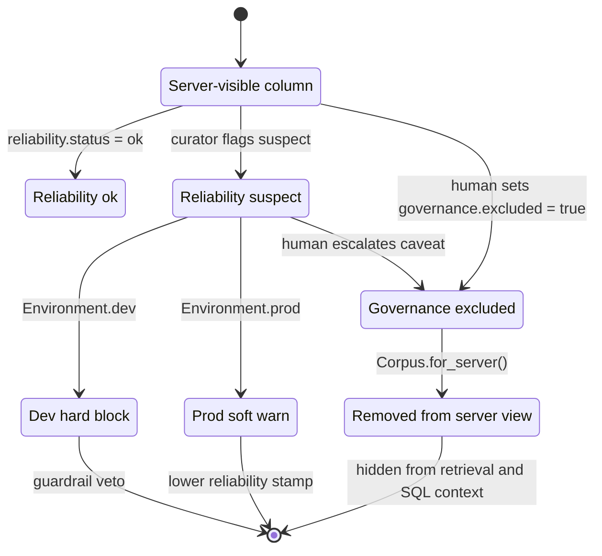
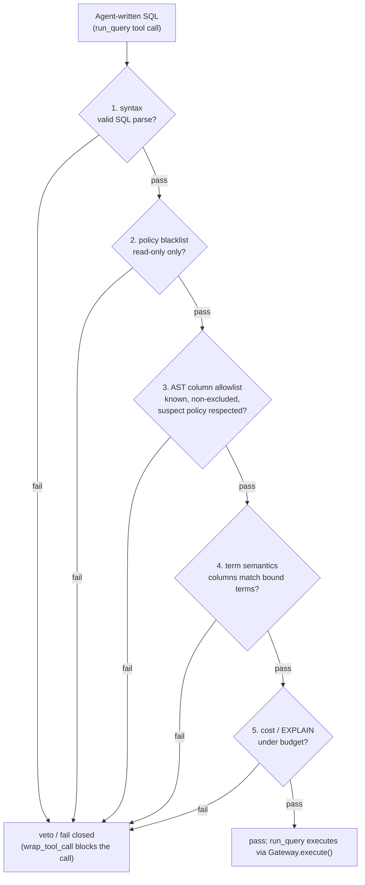

# Server Diagrams

_[English](server.md) · [简体中文](server.zh.md)_

The serve-time StateGraph is implemented. These diagrams reflect `docs/server.md`
and the built modules in `src/governed_bi/server/` (the agentic rails +
`GovernanceMiddleware` in `server/agent.py` and `server/middleware.py`),
`gateway/`, `retrieval/`, and `graph/`.

## Answer pipeline



## Ask-question sequence

```mermaid
sequenceDiagram
    autonumber
    actor User
    participant Rails as Server rails (StateGraph)
    participant Corpus as Server-visible Corpus
    participant Agent as create_agent (agent_core)
    participant MW as GovernanceMiddleware
    participant Gateway as Governed Gateway
    participant DB as Relational DB

    User->>Rails: Ask question with identity
    Rails->>Corpus: Load Facts + Inference context; match negative examples
    alt refuse-gate match
        Rails-->>User: Refusal or clarifying question
    else no match
        Rails->>Rails: Assemble: RVGD retrieval, Steiner join plan,<br/>seed Governed context + licensed table scope
        Rails->>Agent: agent_core(Governed context, licensed scope)
        loop bounded by recursion_limit
            Agent->>MW: call a governed tool
            MW->>MW: normalize call, run L1-L5 guardrails<br/>over current licensed set, write ledger entry
            alt search_corpus / inspect_schema / sample_rows
                MW-->>Agent: expand licensed set + result
            else run_query blocked (guardrail veto or attempt cap)
                MW-->>Agent: ToolMessage: blocked, retry or stop
            else run_query passes guardrails
                MW->>Gateway: execute SQL as user
                Gateway->>DB: Read-only query under RLS
                DB-->>Gateway: Rows
                Gateway-->>MW: QueryResult + audit metadata
                MW-->>Agent: rows + ledger entry
            end
        end
        Agent-->>Rails: final rows + governance ledger, or budget exhausted
        Rails-->>User: Answer + provenance + reliability stamp
    end
```

## SQL semantic-cache sequence



## Refuse-gate sequence



## Reliability and governance enforcement



## Guardrail stack



