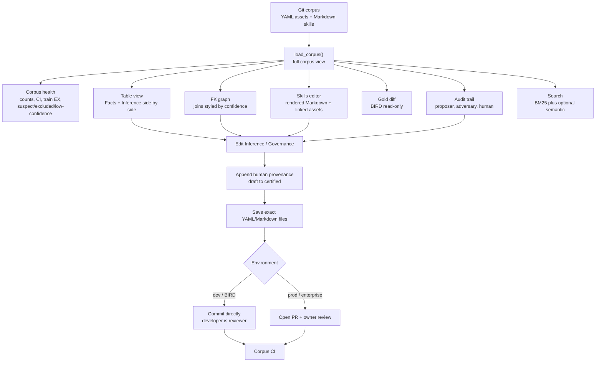
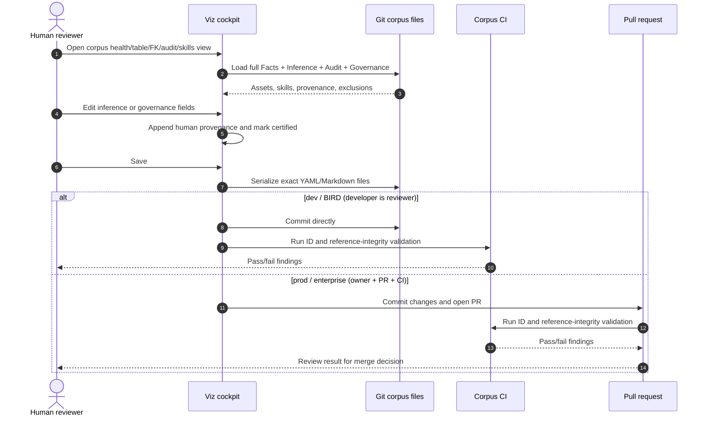
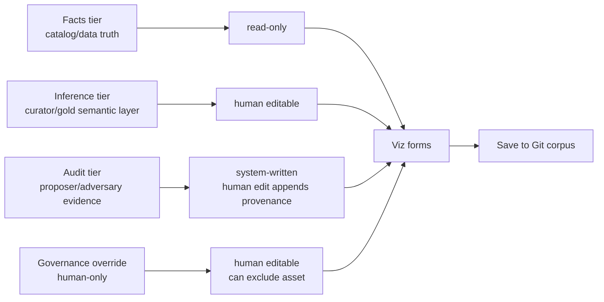

# Viz 图表

_[English](viz.md) · [简体中文](viz.zh.md)_

viz 包目前是一个脚手架，用于在 Git corpus 之上构建一个交互式本地审计与编辑驾驶舱（cockpit）。

## 驾驶舱子系统

```mermaid
flowchart TB
    Corpus["Git corpus<br/>YAML assets + Markdown skills"] --> Loader["load_corpus()<br/>full corpus view"]
    Loader --> Home["Corpus health<br/>counts, CI, train EX,<br/>suspect/excluded/low-confidence"]
    Loader --> TableView["Table view<br/>Facts + Inference side by side"]
    Loader --> FKGraph["FK graph<br/>joins styled by confidence"]
    Loader --> AuditTrail["Audit trail<br/>proposer, adversary, human"]
    Loader --> GoldDiff["Gold diff<br/>BIRD read-only"]
    Loader --> Skills["Skills editor<br/>rendered Markdown + linked assets"]
    Loader --> Search["Search<br/>BM25 plus optional semantic"]

    TableView --> Edit["Edit Inference / Governance"]
    FKGraph --> Edit
    Skills --> Edit
    AuditTrail --> Edit
    Edit --> Provenance["Append human provenance<br/>draft to certified"]
    Provenance --> Save["Save exact YAML/Markdown files"]
    Save --> Mode{"Environment"}
    Mode -->|dev / BIRD| DirectCommit["Commit directly<br/>developer is reviewer"]
    Mode -->|prod / enterprise| PullRequest["Open PR + owner review"]
    DirectCommit --> CI["Corpus CI"]
    PullRequest --> CI
```

## 审计与认证序列图

```mermaid
sequenceDiagram
    autonumber
    actor Reviewer as Human reviewer
    participant Viz as Viz cockpit
    participant Corpus as Git corpus files
    participant CI as Corpus CI
    participant PR as Pull request

    Reviewer->>Viz: Open corpus health/table/FK/audit/skills view
    Viz->>Corpus: Load full Facts + Inference + Audit + Governance
    Corpus-->>Viz: Assets, skills, provenance, exclusions
    Reviewer->>Viz: Edit inference or governance fields
    Viz->>Viz: Append human provenance and mark certified
    Reviewer->>Viz: Save
    Viz->>Corpus: Serialize exact YAML/Markdown files
    alt dev / BIRD (developer is reviewer)
        Viz->>Corpus: Commit directly
        Viz->>CI: Run ID and reference-integrity validation
        CI-->>Reviewer: Pass/fail findings
    else prod / enterprise (owner + PR + CI)
        Viz->>PR: Commit changes and open PR
        PR->>CI: Run ID and reference-integrity validation
        CI-->>PR: Pass/fail findings
        PR-->>Reviewer: Review result for merge decision
    end
```

## 分层可编辑性

```mermaid
flowchart LR
    Facts["Facts tier<br/>catalog/data truth"] --> FactsMode["read-only"]
    Inference["Inference tier<br/>curator/gold semantic layer"] --> InferenceMode["human editable"]
    Audit["Audit tier<br/>proposer/adversary evidence"] --> AuditMode["system-written<br/>human edit appends provenance"]
    Governance["Governance override<br/>human-only"] --> GovernanceMode["human editable<br/>can exclude asset"]

    FactsMode --> UI["Viz forms"]
    InferenceMode --> UI
    AuditMode --> UI
    GovernanceMode --> UI
    UI --> Save["Save to Git corpus"]
```
