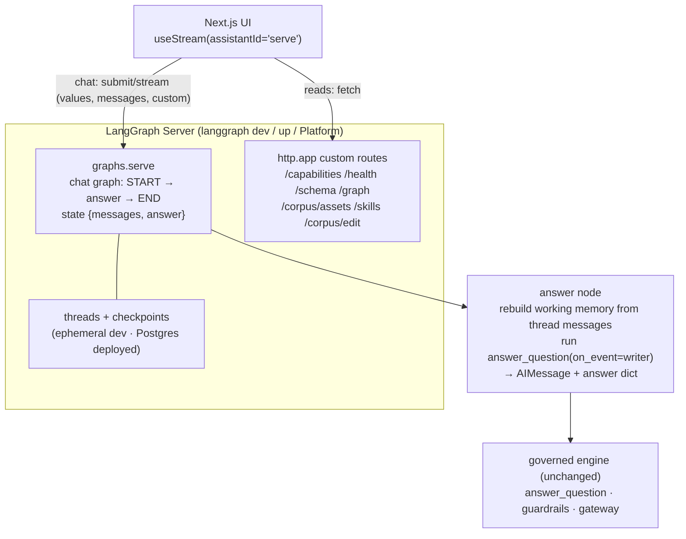

# Plan: move chat to the LangGraph / LangChain native runtime

_[English](langgraph-rework-plan.md) · [简体中文](langgraph-rework-plan.zh.md)_

The implementation plan for the runtime decision in
[ADR 0001](adr/0001-langgraph-server-chat-runtime.md). It turns the chat surface
into a **LangGraph Server** graph consumed by the LangChain **`useStream`** SDK,
with the existing corpus/schema/audit reads mounted as custom routes on the same
server. Pair with [ui-frontend-handoff.md](ui-frontend-handoff.md) (the frontend
contract) and [ui-frontend-design.md](ui-frontend-design.md) (rationale).

Status: not started. This document is the plan, grounded in the LangGraph 1.0
docs (verified 2026-07-10). Nothing here is built yet.

---

## 1. What changes, and the one idea that makes it small

ADR 0001 listed one scary consequence: "`ServeState` must become
checkpoint-serializable." The current serve graph (`server/graph.py`) threads a
`networkx` graph, the gateway allowlist, and several pydantic objects through its
state channels. Under a checkpointer those channels are serialized at every
super-step, and arbitrary Python objects (a `networkx.Graph`, a frozen dataclass)
raise at runtime the moment persistence is on. Rewriting that whole state to be
serializable, while keeping the graph equal to `answer_question`, is real work.

The docs point to a smaller path. The LangGraph-Server graph does not have to be
the existing multi-node pipeline. It can be a thin **chat** graph whose persisted
state is only `{messages, answer}`, both JSON-serializable, that runs the entire
governed pipeline inside **one** node. The heavy per-turn objects stay as locals
in that node and never touch a state channel, so there is nothing to serialize.
Live progress comes from `get_stream_writer()` inside the node, not from
per-node state deltas.

This keeps `server/flow.py:answer_question` and `server/graph.py:build_serve_graph`
untouched (the equivalence tests stay valid), and it supersedes the ADR 0001
consequence: we are not serializing `ServeState`, we are wrapping the flow in a
serializable chat shell. The rest of this plan is mostly wiring.

Verified facts this rests on (LangGraph 1.0, 2026-07-10):

- State channels serialize through `JsonPlusSerializer` (msgpack + an extended
  JSON fallback that natively handles LangChain message types, datetimes, enums,
  and JSON primitives). Pydantic models work; raw custom classes and
  `networkx.Graph` do not.
- On LangGraph Server you compile **without** a checkpointer; the server injects
  and manages persistence. A per-conversation thread is keyed by
  `config["configurable"]["thread_id"]`.
- Runtime dependencies that must stay out of the checkpoint go on the `context`
  channel (`context_schema` + `Runtime[Context]`) or are closed over by the graph
  factory. They are not written to state.
- `langgraph.json` mounts a custom Starlette/FastAPI app under `http.app`
  (`"./module.py:app_var"`); those routes are merged with the built-in
  `/assistants`, `/threads`, `/runs`. A `graphs` entry may be a compiled graph or
  a factory `callable(config: RunnableConfig) -> CompiledGraph`.
- `get_stream_writer()` (from `langgraph.config`) emits custom events;
  `stream_mode="custom"` carries them, and combined modes yield `(mode, data)`.
- `useStream` receives custom events through the `onCustomEvent(data, {namespace,
  mutate})` option (the run must be streamed with `custom` mode), reads arbitrary
  channels via `stream.values.<channel>`, the transcript via `stream.messages`,
  and manages threads via `threadId` + `onThreadId`.

---

## 2. Target architecture



The frontend has one base URL. Chat goes through the graph over the LangGraph
protocol; everything else is a plain `fetch` against the custom routes on the
same server.

---

## 3. State and dependency design

Chat state (persisted, must be JSON-serializable):

```python
class ChatState(TypedDict):
    messages: Annotated[list, add_messages]   # thread transcript; useStream reads stream.messages
    answer: dict | None                       # the governed answer, plain dict; useStream reads stream.values.answer
```

- `messages` holds `BaseMessage` objects, which the serializer handles. The
  assistant turn is an `AIMessage` whose text is the English answer (or the
  refusal escalation), with the structured payload on
  `additional_kwargs["governed_bi"]`.
- `answer` is the serialized `presenter.answer_view(...)` via
  `dataclasses.asdict(...)`, so it is the same shape the REST `AnswerResponse`
  already exposes (two-axis stamp, sql, result table, provenance). Plain dict, no
  custom classes, so it round-trips through the checkpointer.

Runtime dependencies (never persisted): the `ServeStack` (corpus views,
settings, generator, embedder, narrator, identity, sqlite path). The graph
factory builds the stack from env at server startup and closes it over the node,
exactly as `build_serve_graph` already closes over its deps. Per-run values
(`thread_id` used as the working-memory `session_id`) come from the node's
`config`. Nothing heavy enters a state channel.

Working memory (D8) is rebuilt from the thread: iterate `state["messages"]`
except the final human turn, replay them into an `InMemoryWorkingMemory` keyed by
`thread_id`. The durable thread is the history, so no separate history plumbing.

---

## 4. `langgraph.json`

```json
{
  "python_version": "3.11",
  "dependencies": ["."],
  "graphs": { "serve": "./src/governed_bi/api/graph_app.py:make_graph" },
  "env": ".env",
  "http": { "app": "./src/governed_bi/api/routes.py:app" }
}
```

- `serve` is the `assistantId` the frontend passes to `useStream`.
- `make_graph(config)` builds the stack from env and returns the compiled chat
  graph (compiled without a checkpointer).
- `http.app` mounts the existing read routes plus the dev edit route. The server
  merges them with its own `/threads` and `/runs`, so the UI has one origin.

---

## 5. Phased plan

Each phase is independently shippable, ends green, and (per the ultracode
workflow) is implemented then adversarially verified before the next starts.

### Phase 1: stage instrumentation (the backbone)

Add an optional stage callback to the flow so any harness can observe progress
without changing behavior.

- `server/flow.py`: add `on_event: Callable[[dict], None] | None = None` to
  `answer_question`, `_finalize_success`, and `_try_cache_hit`. Fire it at each
  stage boundary with a small stable vocabulary:
  `{"stage": "route"|"refuse_gate"|"cache_hit"|"retrieve"|"generate"|"guardrail"|"execute"|"compose", "attempt": int, "detail": ...}`.
  Guardrail events carry the failed layer; repair attempts re-fire `generate`
  and `guardrail` with an incremented `attempt`.
- Default `None` means no events and no behavior change, so REST `/chat` and the
  existing 321 tests are unaffected.
- Optionally thread the same callback through `server/graph.py` node functions so
  the two harnesses stay symmetric (not required for the server graph, which uses
  the writer directly).

Acceptance: existing suite still green; a new test captures `on_event` and
asserts the stage order for a governed answer, a cache hit, and a refusal
(including a repair loop firing `generate`/`guardrail` twice).

### Phase 2: the chat graph

New module `src/governed_bi/api/graph_app.py`.

```python
from typing import Annotated, TypedDict
from langchain_core.messages import AIMessage
from langchain_core.runnables import RunnableConfig
from langgraph.config import get_stream_writer
from langgraph.graph import END, START, StateGraph
from langgraph.graph.message import add_messages

class ChatState(TypedDict):
    messages: Annotated[list, add_messages]
    answer: dict | None

def build_chat_graph(stack):
    def answer(state: ChatState, config: RunnableConfig) -> dict:
        from dataclasses import asdict
        from ..gateway import Gateway, SqliteConnector
        from ..memory import InMemoryWorkingMemory
        from ..server import answer_question
        from ..viz import presenter

        thread_id = config.get("configurable", {}).get("thread_id", "default")
        question = _last_human_text(state["messages"])
        memory = _working_memory_from(state["messages"], thread_id)  # prior turns only
        writer = get_stream_writer()

        connector = SqliteConnector(stack.sqlite_path)
        try:
            result = answer_question(
                question, stack.identity,
                corpus=stack.corpus_server, gateway=Gateway(connector),
                settings=stack.settings, session_id=thread_id,
                sql_generator=stack.generator, embedder=stack.embedder,
                narrator=stack.narrator, working_memory=memory,
                on_event=writer,   # emits {"stage": ...} as custom events
            )
        finally:
            connector.close()

        view = asdict(presenter.answer_view(result))
        text = view["text"] or view["escalation"] or ""
        return {
            "messages": [AIMessage(content=text, additional_kwargs={"governed_bi": view})],
            "answer": view,
        }

    b = StateGraph(ChatState)
    b.add_node("answer", answer)
    b.add_edge(START, "answer")
    b.add_edge("answer", END)
    return b.compile()   # no checkpointer: the server injects persistence

def make_graph(config: RunnableConfig):
    from .stack import build_stack
    return build_chat_graph(build_stack())
```

Notes: the missing-database guard from REST `/chat` moves in here (raise a clean
error before running). `on_event=writer` works because the writer payload is
already `{"stage": ...}`; if the flow's event shape needs adapting, wrap it in a
one-line lambda.

Acceptance (tests gated on `importorskip("langgraph")`, offline template
generator): `build_chat_graph(build_stack()).invoke({"messages": [HumanMessage("total revenue")]}, config)`
returns `answer["tier"] == "governed"`; a refusal question returns a refusal
answer with no sql; streaming with `stream_mode=["updates", "custom"]` yields the
labeled stage events in order. One equivalence test asserts the graph's `answer`
dict equals `presenter.answer_view(answer_question(...))` for the same input.

### Phase 3: custom routes + edit endpoint

- Refactor `api/app.py` so the read endpoints live in a mountable app,
  `api/routes.py:app` (a FastAPI instance). The REST `POST /chat` stays there as
  the offline/no-`agents` fallback.
- Add `POST /corpus/edit` (dev only, gated on `capabilities.can_edit`): validate
  the submitted asset with `validate_corpus`, write the exact YAML via the corpus
  serializer, return the validation findings and a diff. Production PR mode is
  deferred; the route shape is the same.
- Extend `/graph` from the current tables+joins view to the **full knowledge
  graph** over all asset types (table/column/metric/term/join/rule/few_shot/
  negative) plus references, filterable by `node.kind`. This is a `presenter`
  addition (`knowledge_graph()` alongside `schema_graph()`), consumed by the
  React Flow view.
- Write `langgraph.json`. Set `capabilities.can_stream = True` when served via the
  graph; the REST fallback stays `False`.

Acceptance: `uv run --extra agents --extra api langgraph dev` boots; `/livez` and
the custom routes respond on the server port (2024); a `useStream` smoke client
connects to `serve` and receives an answer plus stage events;
`POST /corpus/edit` round-trips a validated edit in a temp corpus.

### Phase 4: observability

- LangSmith: native, via env (`LANGSMITH_API_KEY`, `LANGCHAIN_TRACING_V2=true`).
  No code beyond documenting the env.
- Langfuse: attach a `CallbackHandler` to the graph config, behind a new
  `tracing` extra. No-op when the keys are unset.

Acceptance: with keys set, a chat run appears in each tool; with keys unset the
suite and server behave identically.

### Phase 5: persistence and deploy

- Confirm ephemeral threads under `langgraph dev` (in-memory, lost on restart)
  and a durable path via `langgraph up` (Docker + Postgres + Redis) or managed
  Platform. Document both.
- Demo profile bundles the committed SQLite fixture. Deploy topology: UI on
  Vercel, LangGraph Server hosted where it can reach Postgres.

Acceptance: a multi-turn follow-up ("and just for 2019?") resolves against thread
state locally; a documented `langgraph up` brings the server up with durable
threads.

### Phase 6: frontend contract and doc sync

- Update [ui-frontend-handoff.md](ui-frontend-handoff.md): the `useStream` state
  generic becomes `{messages, answer}`; stages arrive via `onCustomEvent` (run
  with `streamMode` including `custom`); the answer card reads
  `stream.values.answer`; note the package boundary
  (`@langchain/langgraph-sdk/react` gives `onCustomEvent` + `stream.values`; the
  `@langchain/react` superset adds `useChannel`/`stream.respond`).
- Refine ADR 0001's "ServeState serializability" consequence to the thin-chat-
  graph approach, and update handoff §8 "built vs planned".
- Regenerate the custom-route OpenAPI snapshot.

Acceptance: handoff and ADR match the shipped runtime; OpenAPI regenerated;
bilingual `.zh.md` counterparts updated (humanizer + qu-ai-wei pass).

---

## 6. Stage streaming contract

The node emits one custom event per stage; the frontend maps them to a fixed
progress rail: Route, Retrieve, Generate SQL, Guardrails, Execute, Compose.
Repairs surface as `generate`/`guardrail` re-firing with a higher `attempt`, so
the UI shows the self-repair loop honestly rather than a spinner. Refusals emit
the terminating stage (`refuse_gate` or `guardrail`) and the answer card renders
the escalation with no number.

Frontend wiring (from the verified `useStream` API):

```tsx
const stream = useStream<{ messages: Message[]; answer: GovernedAnswer | null }>({
  apiUrl: process.env.NEXT_PUBLIC_LANGGRAPH_URL!,
  assistantId: "serve",
  threadId, onThreadId: setThreadId,
  onCustomEvent: (data, { mutate }) => mutate((p) => ({ ...p, stage: data })),
});
stream.submit({ messages: [{ type: "human", content: q }] },
  { streamMode: ["values", "messages", "custom"] });
// answer card: stream.values.answer ; transcript: stream.messages
```

---

## 7. What stays untouched

`server/flow.py` and `server/graph.py` gain only the optional `on_event`
callback. `viz/presenter.py`, the hardened REST reads, the two-axis stamp, and
the fail-closed guardrails are unchanged. The offline profile keeps a working
non-streaming `/chat`.

---

## 8. Risks and residual unknowns

- Custom events from nested subgraphs need `subgraphs=True` on the stream. Our
  chat graph is single-level and calls the flow as plain Python inside one node,
  so top-level `get_stream_writer()` is in scope. No subgraph hop.
- The exact SDK stream-chunk attribute names (`chunk.event`/`chunk.data`) vary
  slightly by `langgraph-sdk` version; the React hook abstracts this, so the risk
  is confined to any raw client we write for tests. Confirm against the installed
  version.
- Deploy weight: durable threads need Postgres. Fine locally with `langgraph
  dev`; a hosting decision for the public demo (managed Platform vs a container +
  Postgres) is still open and tracked in the design doc.
- Auth and the human-gate interrupt (D6) are out of scope here. `useStream`
  already exposes `stream.interrupt` + `submit(command.resume)`, so the gate is a
  later add on top of this runtime, not a rework of it.

---

## 9. Sequencing

Phases 1 to 3 deliver a working `useStream` chat: live stages, threads, and the
governed answer card, with the corpus/schema/audit routes on the same server.
That is the point where the frontend can build against live data. Phases 4 to 6
add observability, the durable deploy path, and the contract/doc sync. Phase 1 is
the dependency for everything else and is the smallest, so it goes first.
