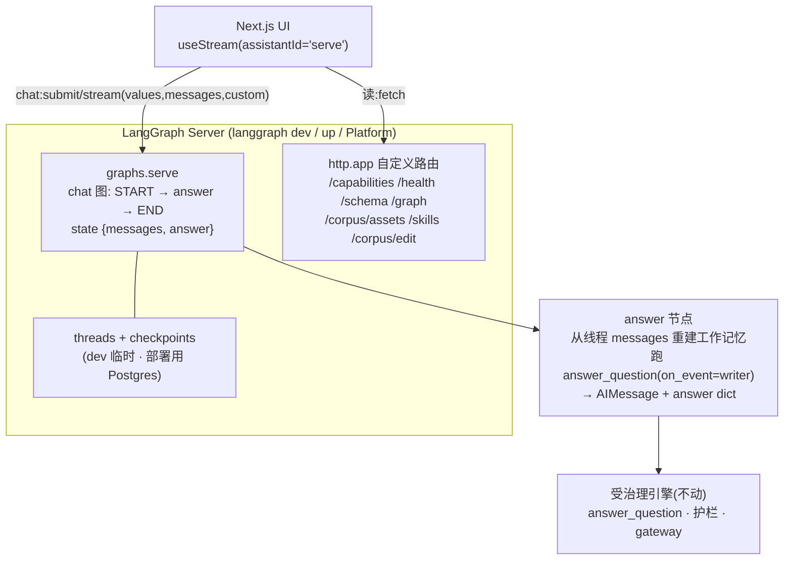

# 方案:把 Chat 迁到 LangGraph / LangChain 原生运行时

_[English](langgraph-rework-plan.md) · [简体中文](langgraph-rework-plan.zh.md)_

> **已被 [ADR 0002](adr/0002-governed-agentic-serve-runtime.md) 部分取代。**
> 本方案搭起的 LangGraph-Server 脚手架(server、threads / checkpoints、自定义只读路由(`api/routes.py`),以及自定义事件的流式通道)**原样复用**。被替换的是*封装方式*:那个包裹 `flow.py::answer_question` 的单一 `answer` 节点(即下文所述「一个节点跑完整条流水线」的设计)让位给 ADR 0002 的 **`assemble → agent_core`** 轨道(一个确定性的上下文装配节点,喂给一个受治理的 `create_agent` 循环)。因此 `server/flow.py` 与 `server/graph.py` **将在 P2 被删除**,而非 §1 与 §7 所说的「保持不动」。

这是 [ADR 0001](adr/0001-langgraph-server-chat-runtime.zh.md) 里那条运行时决策的落地方案。做法是把 Chat 这一层改成一张跑在 **LangGraph Server** 上的图,前端用 LangChain 的 **`useStream`** SDK 消费;现有的 corpus / schema / 审计这些只读接口,作为自定义路由挂在同一台 server 上。配合看 [ui-frontend-handoff.zh.md](ui-frontend-handoff.zh.md)(前端契约)和 [ui-frontend-design.zh.md](ui-frontend-design.zh.md)(设计取舍)。

状态:已实现(2026-07-10)。阶段 1 到 6 均已落地:阶段回调(`server/flow.py`)、chat 图(`api/graph_app.py`)、`langgraph.json` + 自定义路由(`api/routes.py`)+ dev 编辑接口 + 完整知识图、按需追踪(`obs.py`),以及本文档与契约的同步。已离线验证(350+ 测试、ruff 干净),并在 `langgraph dev` 下端到端跑通(自定义路由有响应、`serve` 图已注册)。下面的小节编号就是那份分阶段计划,如今可当作对已建成部分的描述来读。

---

## 1. 要改什么,以及让改动变小的那一个想法

ADR 0001 里列了一条最吓人的后果:「`ServeState` 必须能被 checkpoint 序列化」。现在的 serve 图(`server/graph.py`)在 state 通道里串了一个 `networkx` 图、gateway 的 allowlist,还有若干 pydantic 对象。一旦挂上 checkpointer,这些通道会在每个 super-step 被序列化,而任意 Python 对象(`networkx.Graph`、frozen dataclass)在持久化打开的那一刻就会在运行时报错。把整份 state 改成可序列化、同时还要保证这张图和 `answer_question` 等价,是真活儿。

文档指了一条更小的路。跑在 LangGraph Server 上的这张图,不必是现有那条多节点流水线。它可以是一张很薄的 **chat** 图:持久化的 state 只有 `{messages, answer}` 两项,都能 JSON 序列化;整条受治理流水线塞进 **一个** 节点里跑。每一轮那些重对象只当节点内的局部变量,压根不进 state 通道,也就没什么要序列化的。实时进度靠节点里的 `get_stream_writer()` 发出,而不是靠逐节点的 state 增量。

这样 `server/flow.py:answer_question` 和 `server/graph.py:build_serve_graph` 都不用动(等价性测试继续有效),也就顶掉了 ADR 0001 的那条后果:我们不是去序列化 `ServeState`,而是给这条流水线套一层可序列化的 chat 外壳。方案剩下的部分,基本就是接线。

本方案依赖的已核实事实(LangGraph 1.0,2026-07-10):

- state 通道通过 `JsonPlusSerializer` 序列化(msgpack 加一个扩展 JSON 兜底,原生支持 LangChain 消息类型、datetime、枚举和 JSON 基本类型)。pydantic 模型可以;裸的自定义类和 `networkx.Graph` 不行。
- 在 LangGraph Server 上编译时 **不要** 传 checkpointer;持久化由 server 注入并托管。单轮会话由 `config["configurable"]["thread_id"]` 作为键。
- 那些必须留在 checkpoint 之外的运行时依赖,放到 `context` 通道(`context_schema` + `Runtime[Context]`),或者由图工厂闭包持有。它们不写进 state。
- `langgraph.json` 通过 `http.app`(`"./module.py:app_var"`)挂一个自定义 Starlette/FastAPI 应用;这些路由会和内置的 `/assistants`、`/threads`、`/runs` 合并。`graphs` 里的一项可以是一张已编译的图,也可以是一个工厂 `callable(config: RunnableConfig) -> CompiledGraph`。
- `get_stream_writer()`(来自 `langgraph.config`)发自定义事件;`stream_mode="custom"` 承载它们,多个 mode 组合时产出 `(mode, data)`。
- `useStream` 通过 `onCustomEvent(data, {namespace, mutate})` 这个选项收自定义事件(该次 run 必须带 `custom` mode 流式),用 `stream.values.<channel>` 读任意通道,用 `stream.messages` 读会话记录,用 `threadId` + `onThreadId` 管理线程。

---

## 2. 目标架构



前端只有一个 base URL。Chat 走图、经 LangGraph 协议;其余一切都是对同一台 server 上的自定义路由发普通 `fetch`。

---

## 3. State 与依赖的设计

Chat state(要持久化,必须能 JSON 序列化):

```python
class ChatState(TypedDict):
    messages: Annotated[list, add_messages]   # 线程记录;useStream 读 stream.messages
    answer: dict | None                       # 受治理答案,纯 dict;useStream 读 stream.values.answer
```

- `messages` 装的是 `BaseMessage` 对象,序列化器能处理。助手那一轮是一条 `AIMessage`,正文是英文答案(拒答时是升级说明),结构化载荷挂在 `additional_kwargs["governed_bi"]`。
- `answer` 是 `presenter.answer_view(...)` 经 `dataclasses.asdict(...)` 序列化后的结果,形状和 REST 已经暴露的 `AnswerResponse` 一致(两轴印章、sql、结果表、来源)。纯 dict、没有自定义类,所以能在 checkpointer 里来回过。

运行时依赖(绝不持久化):`ServeStack`(corpus 各视图、settings、generator、embedder、narrator、identity、sqlite 路径)。图工厂在 server 启动时用 `load_settings()` / TOML 拼出这个 stack,闭包进节点,和 `build_serve_graph` 现在闭包它的依赖是同一套做法。每轮才定的值(`thread_id`,当作工作记忆的 `session_id`)从节点的 `config` 里取。没有任何重对象进 state 通道。

工作记忆(D8)从线程里重建:遍历 `state["messages"]`,去掉最后那条人类消息,把其余回放进一个以 `thread_id` 为键的 `InMemoryWorkingMemory`。持久化的线程本身就是历史,所以不用单独接一套 history。

---

## 4. `langgraph.json`

```json
{
  "python_version": "3.11",
  "dependencies": ["."],
  "graphs": { "serve": "./src/governed_bi/api/graph_app.py:make_graph" },
  "env": ".env",
  "http": { "app": "./src/governed_bi/api/routes.py:app" }
}
```

- `serve` 就是前端传给 `useStream` 的 `assistantId`。
- `make_graph(config)` 用 `load_settings()` / TOML 拼 stack,返回已编译的 chat 图(编译时不传 checkpointer)。
- `http.app` 挂上现有的只读路由加上 dev 版编辑路由。server 会把它们和自己的 `/threads`、`/runs` 合并,前端因此只面对一个 origin。

---

## 5. 分阶段方案

每个阶段都能独立交付、收尾时保持全绿,并且(按 ultracode 的 workflow)先实现、再对抗式验证,验过了才进下一阶段。

### 阶段 1:阶段埋点(骨架)

给流水线加一个可选的阶段回调,让任何 harness 都能观察进度,又不改行为。

- `server/flow.py`:给 `answer_question`、`_finalize_success`、`_try_cache_hit` 加一个 `on_event: Callable[[dict], None] | None = None`。在每个阶段边界用一套小而稳定的词表触发它:`{"stage": "route"|"refuse_gate"|"cache_hit"|"retrieve"|"generate"|"guardrail"|"execute"|"compose", "attempt": int, "detail": ...}`。护栏事件带上被挡的 layer;修复重试会带着递增的 `attempt` 再次触发 `generate` 和 `guardrail`。
- 默认 `None` 表示不发事件、不改行为,所以 REST `/chat` 和现有 321 个测试都不受影响。
- 可选:把同一个回调也穿过 `server/graph.py` 的节点函数,让两套 harness 保持对称(server 图不需要这个,它直接用 writer)。

验收:现有测试仍全绿;新增一个测试捕获 `on_event`,断言受治理答案、缓存命中、拒答三种情况下的阶段顺序(包含修复循环让 `generate`/`guardrail` 触发两次)。

### 阶段 2:chat 图

新模块 `src/governed_bi/api/graph_app.py`。

```python
from typing import Annotated, TypedDict
from langchain_core.messages import AIMessage
from langchain_core.runnables import RunnableConfig
from langgraph.config import get_stream_writer
from langgraph.graph import END, START, StateGraph
from langgraph.graph.message import add_messages

class ChatState(TypedDict):
    messages: Annotated[list, add_messages]
    answer: dict | None

def build_chat_graph(stack):
    def answer(state: ChatState, config: RunnableConfig) -> dict:
        from dataclasses import asdict
        from ..gateway import Gateway, SqliteConnector
        from ..memory import InMemoryWorkingMemory
        from ..server import answer_question
        from ..viz import presenter

        thread_id = config.get("configurable", {}).get("thread_id", "default")
        question = _last_human_text(state["messages"])
        memory = _working_memory_from(state["messages"], thread_id)  # 只回放此前的轮次
        writer = get_stream_writer()

        connector = SqliteConnector(stack.sqlite_path)
        try:
            result = answer_question(
                question, stack.identity,
                corpus=stack.corpus_server, gateway=Gateway(connector),
                settings=stack.settings, session_id=thread_id,
                sql_generator=stack.generator, embedder=stack.embedder,
                narrator=stack.narrator, working_memory=memory,
                on_event=writer,   # 把 {"stage": ...} 作为自定义事件发出
            )
        finally:
            connector.close()

        view = asdict(presenter.answer_view(result))
        text = view["text"] or view["escalation"] or ""
        return {
            "messages": [AIMessage(content=text, additional_kwargs={"governed_bi": view})],
            "answer": view,
        }

    b = StateGraph(ChatState)
    b.add_node("answer", answer)
    b.add_edge(START, "answer")
    b.add_edge("answer", END)
    return b.compile()   # 不传 checkpointer:持久化由 server 注入

def make_graph(config: RunnableConfig):
    from .stack import build_stack
    return build_chat_graph(build_stack())
```

说明:REST `/chat` 里那个「数据库缺失」的保护挪到这里(开跑前先抛一个干净的错)。`on_event=writer` 能直接用,是因为流水线发出的载荷本身就是 `{"stage": ...}`;如果事件形状要适配,用一行 lambda 包一下即可。

验收(测试用 `importorskip("langgraph")` 门控,离线模板 generator):`build_chat_graph(build_stack()).invoke({"messages": [HumanMessage("total revenue")]}, config)` 返回 `answer["tier"] == "governed"`;一个会被拒的问题返回没有 sql 的拒答;用 `stream_mode=["updates", "custom"]` 流式时,按顺序产出带标签的阶段事件。一个等价性测试断言:同样输入下,图的 `answer` dict 等于 `presenter.answer_view(answer_question(...))`。

### 阶段 3:自定义路由 + 编辑接口

- 重构 `api/app.py`,把只读接口挪进一个可挂载的应用 `api/routes.py:app`(一个 FastAPI 实例)。REST `POST /chat` 留在那里,作为离线/无 `agents` 的兜底。
- 加 `POST /corpus/edit`(仅 dev,按 `capabilities.can_edit` 门控):用 `validate_corpus` 校验提交的资产,用 corpus 序列化器写出原样 YAML,返回校验结果和一个 diff。生产环境的 PR 模式暂缓;路由形状不变。
- 把 `/graph` 从现在的「表+连接」视图,扩成覆盖所有资产类型(table/column/metric/term/join/rule/few_shot/negative)加引用关系的 **完整知识图**,可按 `node.kind` 过滤。这是 `presenter` 的一个新增(在 `schema_graph()` 旁边加 `knowledge_graph()`),给 React Flow 视图消费。
- 写 `langgraph.json`。LangGraph 挂载的 app（`api/routes.py`）会强制 `can_stream=True`；纯 REST 工厂沿用 TOML `[serve].can_stream` 默认值（`false`）。

验收:`uv run --extra agents --extra api langgraph dev` 能起来;`/livez` 和各自定义路由在 server 端口(2024)有响应;一个 `useStream` 冒烟客户端连到 `serve`,收到答案和阶段事件;`POST /corpus/edit` 在临时 corpus 里跑通一次校验过的编辑。

### 阶段 4:可观测性

- LangSmith:原生,走环境变量(`LANGSMITH_API_KEY`、`LANGSMITH_TRACING=true` 或旧名 `LANGCHAIN_TRACING_V2=true`)。见 `.env.example`。
- Langfuse:给模型客户端挂一个 `CallbackHandler`,放在 `tracing` extra 后面(`LANGFUSE_PUBLIC_KEY` + `LANGFUSE_SECRET_KEY`)。key 没设时是 no-op。

验收:设了 key,一次 chat run 在两个工具里都出现;没设 key,测试和 server 行为完全一致。

### 阶段 5:持久化与部署

- 确认 `langgraph dev` 下线程是临时的(内存态,重启即丢),以及一条可持久的路径:`langgraph up`(Docker + Postgres + Redis)或托管的 Platform。两条都写进文档。
- 演示档位捆绑已提交的 SQLite 夹具。部署拓扑:UI 上 Vercel,LangGraph Server 部署在能连到 Postgres 的地方。

验收:多轮追问(「那只看 2019 呢?」)在本地能靠线程 state 解析;文档里的 `langgraph up` 能把带持久线程的 server 拉起来。

### 阶段 6:前端契约与文档同步

- 更新 [ui-frontend-handoff.zh.md](ui-frontend-handoff.zh.md):`useStream` 的 state 泛型改成 `{messages, answer}`;阶段经 `onCustomEvent` 到达(run 时 `streamMode` 要带 `custom`);答案卡片读 `stream.values.answer`;标注包边界(`@langchain/langgraph-sdk/react` 提供 `onCustomEvent` + `stream.values`;`@langchain/react` 超集另加 `useChannel`/`stream.respond`)。
- 把 ADR 0001 里「ServeState 可序列化」那条后果,改写成薄 chat 图这套做法,并更新 handoff 第 8 节的「已建 vs 计划」。
- 重新导出自定义路由的 OpenAPI 快照。

验收:handoff 和 ADR 与上线的运行时对得上;OpenAPI 重新导出;对应的 `.zh.md` 也更新(过一遍 humanizer + qu-ai-wei)。

---

## 6. 阶段流式契约

节点每个阶段发一条自定义事件;前端把它们映射到一条固定的进度轨:Route、Retrieve、Generate SQL、Guardrails、Execute、Compose。修复表现为 `generate`/`guardrail` 带更高的 `attempt` 再次触发,所以 UI 是如实展示自修复循环,而不是转个圈。拒答发出终止阶段(`refuse_gate` 或 `guardrail`),答案卡片展示升级说明、不给数字。

前端接线(取自已核实的 `useStream` API):

```tsx
const stream = useStream<{ messages: Message[]; answer: GovernedAnswer | null }>({
  apiUrl: process.env.NEXT_PUBLIC_LANGGRAPH_URL!,
  assistantId: "serve",
  threadId, onThreadId: setThreadId,
  onCustomEvent: (data, { mutate }) => mutate((p) => ({ ...p, stage: data })),
});
stream.submit({ messages: [{ type: "human", content: q }] },
  { streamMode: ["values", "messages", "custom"] });
// 答案卡片:stream.values.answer;会话记录:stream.messages
```

---

## 7. 不动的部分

`server/flow.py` 和 `server/graph.py` 只多一个可选的 `on_event` 回调。`viz/presenter.py`、加固过的 REST 只读接口、两轴印章、fail-closed 护栏都不变。离线档位保留一个能用的、非流式的 `/chat`。

---

## 8. 风险与尚未落定的点

- 来自嵌套子图的自定义事件需要在 stream 上设 `subgraphs=True`。我们这张 chat 图是单层的,把流水线当普通 Python 在一个节点里调,所以顶层的 `get_stream_writer()` 在作用域内,没有子图跳转。
- SDK 流式 chunk 的确切属性名(`chunk.event`/`chunk.data`)会随 `langgraph-sdk` 版本略有差异;React hook 把这层抽掉了,所以风险只落在我们为测试自己写的裸客户端上。对着装好的版本核一下。
- 部署重量:持久线程需要 Postgres。本地 `langgraph dev` 没问题;公开演示怎么托管(托管 Platform 还是自建容器 + Postgres)仍未定,记在设计文档里。
- 鉴权和人审中断(D6)不在本次范围内。`useStream` 已经暴露了 `stream.interrupt` + `submit(command.resume)`,所以这道人审门是日后在这套运行时之上加的一层,不是对它的返工。

---

## 9. 顺序

阶段 1 到 3 交付一个能用的 `useStream` chat:实时阶段、线程、受治理答案卡片,corpus/schema/审计路由都在同一台 server 上。到这一步,前端就能对着实时数据开发了。阶段 4 到 6 补上可观测性、可持久的部署路径,以及契约和文档的同步。阶段 1 是其余一切的前置,又最小,所以排第一。
