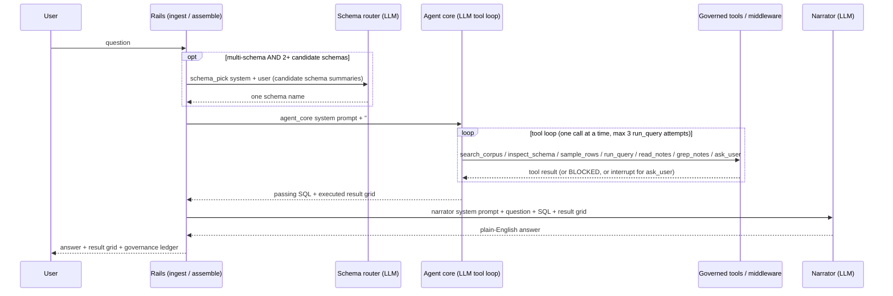

# Agentic BI Analyst: LLM Call Walkthrough

This traces one question through the serve path (`analyst.agent`) call by call: which
stage sends which prompt, what the user/human message looks like with the
placeholders where dynamic content is injected, and the deterministic guards around
each call. It complements [Analyst](analyst.md), which describes the surrounding
rails.

**Prompt text itself is not reproduced here.** Every system prompt this path sends is
a named, versioned entry in `governed_bi.prompts` — `src/governed_bi/prompts/registry.py`
is the single source, and quoting it here would drift out of sync with an edit or a
new variant the moment either happens (which is exactly what happened to the previous
version of this doc). Read the registry directly for the exact text of a stage, and
[Prompt-variant experiments](prompt-experiments.md) for what varies between `v1` and
the newer variants, how a run selects one, and how that selection gets stamped onto
every row it produces.

> Implementation: [`src/governed_bi/analyst/agent.py`](../src/governed_bi/analyst/agent.py),
> [`context.py`](../src/governed_bi/analyst/context.py),
> [`note_inject.py`](../src/governed_bi/analyst/note_inject.py),
> [`tools.py`](../src/governed_bi/analyst/tools.py),
> [`narrate.py`](../src/governed_bi/analyst/narrate.py),
> [`retrieval/schema_router.py`](../src/governed_bi/retrieval/schema_router.py),
> [`prompts/registry.py`](../src/governed_bi/prompts/registry.py).

## Overview: up to three model calls

One question makes **up to three** model calls, in this order:

- **(A) Schema routing** — registry stage `schema_pick`. Only on the multi-schema
  path, and only when retrieval shortlisted **2 or more** candidate schemas. Zero
  candidates route to `""`; exactly one candidate is picked with **no LLM call**.
  Single-schema deployments skip this entirely.
- **(B) The agent core** — registry stage `agent_core`. A LangChain `create_agent`
  tool loop. This is the main event: it may invoke the model many times as it calls
  tools, one at a time.
- **(C) The narrator** — registry stage `narrator`. One call that phrases the
  executed result grid into plain English. Skipped for refusals and when no narrator
  is configured.

(A) and (C) are single-shot calls that flow through the same seam:
`chat.complete(system, user)`. `LangChainChatClient.complete` (`llm/langchain_client.py`)
builds the message list `[("system", system), ("human", user)]` and invokes the model
once. (B) is different in shape: it is a `create_agent` built with `system_prompt=`
plus a `HumanMessage`, and the model is called repeatedly inside that agent's own loop.

## (A) Schema routing

`retrieval/schema_router.py`'s `pick_schema` picks one schema from the candidates
`shortlist_schemas` ranked (embedding similarity, BM25 fallback — see
[Data-lake run](plans/datalake-run.md)).

**System prompt:** `prompts.text("schema_pick", prompt_variants)`, resolved once when
the serve stack is built (`build_serve_rails`), not per turn. Two variants exist
today (`v1`, `v2` — see [Prompt-variant experiments](prompt-experiments.md#the-four-real-variants)
for what changes between them); both ask the model to decompose the question into
the concrete parts it needs (entities, filters, joins, the returned value or measure)
and check every candidate against them, because near-duplicate sibling schemas (two
schemas on the same topic, or a schema and its `_2` twin) read alike on topic and
table-description text and only really differ in column vocabulary.

**User message (assembled by `pick_schema`):**

```text
Question: [USER_QUESTION]

Candidate schemas (most relevant first):
[SCHEMA_SUMMARIES]

Answer with exactly one of: [CANDIDATE_1, CANDIDATE_2, ...]
```

`[SCHEMA_SUMMARIES]` is each candidate rendered by `_schema_pick_summary` as one block:

```text
schema: [SCHEMA_NAME]
  - [PHYSICAL_TABLE]: [SHORT_DESCRIPTION][  [cols: C1, C2, ...]]
  ... (up to 15 tables, then "… (N more tables)")
```

The `[cols: ...]` suffix appears per table only when `schema_pick_max_columns > 0`
(the data-lake driver defaults it to 12; `0` restores the names-only summary) — that
column vocabulary is what actually separates two sibling schemas whose table
descriptions read the same.

**Deterministic guards around the call, precisely** (`pick_schema` / `_parse_schema_reply`):

- 0 candidates → `SchemaPick("")`, no LLM call.
- 1 candidate → `SchemaPick(candidates[0])`, no LLM call.
- 2+ candidates → the call above, then the reply is resolved against the fixed
  candidate list, never trusted as free text, in this order: (1) a bare candidate
  name alone on the reply's final line (what both prompt variants ask for) is a
  clean pick; (2) failing that, a *labelled* answer ("Final answer: x" / "chosen: x"),
  scanned bottom-up; (3) an exact bare name found on a non-final line, or (4) a line
  naming exactly one candidate by word-boundary-matched substring — both (3) and (4)
  return a pick but flag it `fallback="parsed_nonfinal_line"`, since the model did not
  put its answer where it was told to; (5) an unparseable reply or a raised exception
  degrades to `SchemaPick(candidates[0], "unparseable_reply"/"call_failed")` — the top
  retrieval rank, never an invented out-of-list name.
- Every one of those `fallback` reasons is carried on the returned `SchemaPick` and
  surfaced in provenance (`schema_pick_fallback`), so a degraded row is never scored
  as a genuine model decision.

## (B) The agent core

Registry stage `agent_core`. `build_serve_rails` resolves the prompt text once per
stack build (`agent_core_prompt = prompts.text("agent_core", prompt_variants)`), and
`agent_core_node` appends the assembled context and the current time to it every turn:

```python
system_prompt = agent_core_prompt
if context_block:
    system_prompt = f"{agent_core_prompt}\n\n## Governed context\n{context_block}"
system_prompt = f"{system_prompt}\n\n## Current time\n{now_local:%Y-%m-%d %H:%M:%S %Z (UTC%z)} ..."
```

Three variants exist today (`v1`/`v2`/`v3`; see
[Prompt-variant experiments](prompt-experiments.md#the-four-real-variants)). All
three share the same shape — license the governed context over guessing, choose
tables deliberately (reject a suspect/duplicate/alternate copy even when its column
names fit), write SQL using only the shown identifiers, return exactly what was asked
for, then run it — but `v2` turns "reject the wrong copy" into its own step with
visible output (state which table was used for each part of the question and name
what was rejected and why), and `v3` adds a step *before* writing SQL: state the exact
output columns and grain, then check the final `SELECT` list against that statement
and delete anything not on it.

### The `## Governed context` block

`context.py`'s `_render` builds this block from the deterministic `assemble` node's
output. Retrieval, join planning, and licensing all already ran before the model sees
anything. Sections appear in this order and are omitted when empty (`## Tables` is
always present):

```text
## Conversation so far (oldest first; use ONLY to resolve references in the latest question, e.g. 'that', 'last year')
  [ROLE]: [CONTENT]
  ...

## Tables (use ONLY these physical identifiers)
### [SCHEMA].[PHYSICAL_NAME][  [reachable only via a join]]  (grain: [GRAIN])
  [TABLE_DESCRIPTION]
    - [COLUMN] ([LOGICAL_TYPE], [ROLE]): [DESCRIPTION][  [SUSPECT - DO NOT USE: CAVEAT]]

## Joins (physical equality; prefer high-confidence)
  [ON_CLAUSE]  ([CARDINALITY], confidence [N.NN][, LOW CONFIDENCE])

## Business terms
  [TERM] (synonyms: [S1], [S2]) -> [BINDS_TO]

## Metrics (meaning; map to physical columns)
  [METRIC] = [EXPRESSION]  over [BASE_TABLE]  (dimensions: [D1], [D2])

## Reliability caveats (DO NOT USE these columns)
  [TABLE].[COLUMN]: [CAVEAT]

## Governance notes (must honour)
  ([KIND]) [SUMMARY][ (body, on_match notes only)]

## Governance notes (advisory)
  ([KIND]) [SUMMARY][ (body, on_match notes only)]

## Example questions with gold SQL
  Q: [QUESTION]
  A: [SQL]
```

Table headers are always schema-qualified (`schema.physical_name`) — the engine has
been uniformly schema-qualified since D15's 2026-07-17 supersession, so even the
single-schema BIRD/SQLite path (which `ATTACH`es the file under a `corpus_pin` alias)
renders this way, not just the multi-schema Postgres path.

A concrete instance for a question retrieval scoped to `beer_factory`'s `transaction`
and `customers` tables (few-shots/terms/metrics trimmed to what's realistic for this
scope):

```text
## Tables (use ONLY these physical identifiers)
### beer_factory.transaction  (grain: one row = one sale)
  One row per sale of a root beer unit to a customer.
    - TransactionID (integer, primary_key): unique sale identifier
    - RootBeerID (integer, foreign_key): root beer unit that was sold
    - PurchasePrice (decimal, measure): sale price, USD
### beer_factory.customers  [reachable only via a join]  (grain: one row = one customer)
  One row per customer of the root beer factory.
    - CustomerID (integer, primary_key): unique customer identifier
    - ZipCode (integer, dimension): postal code, stored as an integer  [SUSPECT - DO NOT USE: Stored as INTEGER, so leading zeros are lost. Unreliable as a postal key or for display; cast/pad before use.]

## Joins (physical equality; prefer high-confidence)
  beer_factory.transaction.CustomerID = beer_factory.customers.CustomerID  (many_to_one, confidence 0.90)

## Business terms
  brand (synonyms: root beer brand, label, make) -> table 'rootbeerbrand'

## Metrics (meaning; map to physical columns)
  total revenue = SUM(PurchasePrice)  over transaction  (dimensions: customer, brand, transaction_date)

## Reliability caveats (DO NOT USE these columns)
  customers.ZipCode: Stored as INTEGER, so leading zeros are lost. Unreliable as a postal key or for display; cast/pad before use.

## Governance notes (must honour)
  (business_rule) The ingredient and availability flags on rootbeerbrand (CaneSugar, CornSyrup, Honey, ArtificialSweetener, Caffeinated, Alcoholic, AvailableInCans, AvailableInBottles, AvailableInKegs) are stored as the TEXT strings 'TRUE' and 'FALSE', not as integers or booleans. Filter with = 'TRUE', never = 1.

## Governance notes (advisory)
  (routing) Use metric_revenue over transaction for revenue or sales and join through rootbeer to rootbeerbrand for brand breakdowns.

## Example questions with gold SQL
  Q: Which root beer brand has the highest average review rating?
  A: SELECT b.BrandName, AVG(r.StarRating) AS avg_rating
FROM rootbeerreview AS r
JOIN rootbeerbrand AS b ON r.BrandID = b.BrandID
WHERE r.StarRating IS NOT NULL
GROUP BY b.BrandName
ORDER BY avg_rating DESC
```

Note what is absent: `transaction.CreditCardNumber` never appears. It is
`governance.excluded`, so it is removed before the corpus is ever retrieved or
rendered, not merely flagged. Only `suspect` columns (curator-inferred, soft) show up
tagged `DO NOT USE`; `excluded` columns (human-set, hard) are invisible to the model
entirely.

Note kind decides which of the two governance sections a note lands in and whether
it injects at all before the agent asks: `business_rule`/`constraint` default to
`activation=always` + `normative_force=must_honour`; `context`/`domain_overview`
default to `always` + `advisory`; `routing`/`gotchas`/`pattern` default to
`on_match` + `advisory` (triggered by retrieval match or a keyword regex, when
`pin_triggers_enabled`). An `always` note injects only its `summary`; an `on_match`
note that fires injects `summary` **and** `body` (progressive disclosure — see D17 in
[Design decisions](../design-decisions.md)). A note the agent needs but that never fired
can still be reached mid-turn via the `read_notes` / `grep_notes` tools below.

### First human message

The inner agent's initial state is just the raw question, nothing else:

```python
agent_input = {
    "messages": [HumanMessage(content=question)],
    "licensed": seed_licensed,   # pre-populated table ids (Amendment 1)
    "ledger": [],
}
```

So the first human turn the model sees is literally:

```text
[USER_QUESTION]
```

### The tool loop

The model is offered **six** tools always, and a seventh (`ask_user`) only when
clarification is enabled. Tool calls are forced sequential
(`model.bind(parallel_tool_calls=False)`), and the system prompt itself repeats "Call
tools one at a time", so each step below is a separate model turn.

**Tools available (name, then the docstring the model sees as its description):**

- **`search_corpus(query)`**: "Find more governed context for a query beyond what you
  were given. Returns matching tables plus curated content — few-shot Q→SQL exemplars,
  metric expressions, and business terms. Use when the seeded context is missing a
  table/example you need; then `inspect_schema` any new table before querying it."
- **`inspect_schema(table_id)`**: "Show a table's columns+types and LICENSE it for
  this turn. You cannot query a table until you have inspected it. Call tools one at a
  time."
- **`sample_rows(table_id, n=5)`**: "Preview up to n rows of an already-licensed table
  (read-only, RLS via identity). Only allowlisted columns are returned — never excluded
  or suspect columns. Guardrailed and executed by governance middleware."
- **`run_query(sql)`**: "Execute a read-only SELECT. Guardrailed + audited by
  middleware. Only use identifiers from tables you have inspected. If BLOCKED, fix and
  retry."
- **`read_notes(note_id)`**: "Read one governed note by id (summary + body). Does NOT
  license tables. Naming a table inside a note does not authorize `run_query` against
  it — call `inspect_schema` first. Excluded notes are hidden."
- **`grep_notes(pattern)`**: "Search note summaries and bodies for a pattern
  (read-only, capped). Does NOT license tables. ReDoS-bounded; output capped. Excluded
  notes skip."
- **`ask_user(question, why)`** (HITL only, when clarification is enabled): "Ask the
  user ONE short clarifying question and wait for their answer. Use ONLY when the
  question is genuinely ambiguous and the governed context cannot resolve it (e.g. two
  competing definitions of a term) — never for things you can answer by inspecting the
  schema or corpus. State plainly in `why` what is ambiguous. Returns the user's
  answer; continue with it."

`read_notes` / `grep_notes` are read-only and non-licensing by construction (D17): they
let the agent pull a note that scope-matched but never made the injection budget, or
search note text directly, without that note ever counting as a licensed table.

**Illustrative transcript** (placeholders for anything dynamic):

```text
assistant → tool_call: search_corpus(query="[REFINED_QUERY]")
tool     → [SEARCH RESULT: matching tables + few-shots + metrics + terms + notes]

assistant → tool_call: inspect_schema(table_id="[TABLE_ID]")
tool     → table_id: [TABLE_ID]
           physical: [SCHEMA].[PHYSICAL_NAME]
           description: [TABLE_DESCRIPTION]
           columns:
             - [COL]: [PHYSICAL_TYPE] ([LOGICAL_TYPE])[ [SUSPECT — do not use]]
             ...
           # ^ this call also LICENSES the table (adds it to the turn's `licensed` set)

assistant → tool_call: run_query(sql="[GENERATED SELECT]")
tool     → columns: [[COL1], [COL2], ...]
           rows:
           [ROW_1]
           [ROW_2]
           ... ([N] rows total)
           # OR, on a guardrail failure:
           BLOCKED ([LAYER]): [REASON]
           # model reads the reason, fixes the SQL, and retries (attempt cap: 3)

assistant → [FINAL ANSWER TEXT]
```

`run_query` and `sample_rows` are intercepted and executed by `GovernanceMiddleware`;
the tool bodies in `tools.py` just `raise RuntimeError(...)` if ever reached directly.
The model never touches the database; every call is normalized (`sqlglot
identify=True`), guardrailed (L1-L5), and logged to the governance ledger before
anything runs. `inspect_schema` is what *licenses* a table (adds its id to the turn's
`licensed` set). The seeded context tables from Amendment 1 are already licensed, so
in practice most turns use these tools for **refinement**, not discovery.

**The `ask_user` (HITL) branch**, when clarification is enabled and genuinely needed:

```text
assistant → tool_call: ask_user(question="[Q]", why="[WHY]")
            # this call raises `interrupt(...)`; the graph pauses here
graph    → surfaces a clarification request to the client and waits
client   → [USER_ANSWER]  (or declines)
graph    → resumes the paused agent, feeding [USER_ANSWER] back as the tool's return value
assistant → continues the turn using [USER_ANSWER]
```

A decline resolves to the sentinel `"USER_DECLINED: the user did not answer; do not
guess."` and the outer rails short-circuit to a refusal rather than re-running the
agent.

## (C) The narrator

Registry stage `narrator`. After a `run_query` passes and the SQL executes,
`narrate.py`'s `LlmAnswerNarrator` (when configured) phrases the result into plain
English. Only `v1` exists — the narrator runs after grading, so a narrator variant
could never move EX and there is no metric it would be measured against.

**System prompt:** `prompts.text("narrator", prompt_variants)`, or the injected
`system_prompt` on `LlmAnswerNarrator.__init__` when one is passed. It instructs the
model to answer using ONLY the values in the result rows, stay to one or two
sentences, never restate the SQL, and say plainly when nothing matched.

**User message (assembled):**

```text
Question: [USER_QUESTION]

SQL that ran:
[FINAL_SQL]

Result:
[RESULT_GRID]
```

`[RESULT_GRID]` is rendered as a pipe-delimited table, capped at 30 rows:

```text
[COL1] | [COL2]
-------------
[VAL1] | [VAL2]
...
... ([N] rows total)
```

The narrator is grounded by construction: it sees only the question, the already-run
SQL, and the already-bounded result grid. It cannot change the SQL, the guardrail
verdict, or the reliability tier. If the model returns an empty string, a deterministic
fallback (`_fallback_text`) fills in instead, so the answer text is never blank.

## End-to-end sequence



**See also:** [Analyst](analyst.md) for the full rails/guardrail design;
[ADR 0002](../adr/0002-governed-agentic-serve-runtime.md) for why the agentic core exists;
[Prompt-variant experiments](prompt-experiments.md) for the registry, how a run selects
a variant, and how that selection is attributed end to end;
[Asset schemas](asset-schemas.md) for what a `TableAsset`/`JoinAsset`/`NoteAsset` looks
like before it is rendered into this context block.
