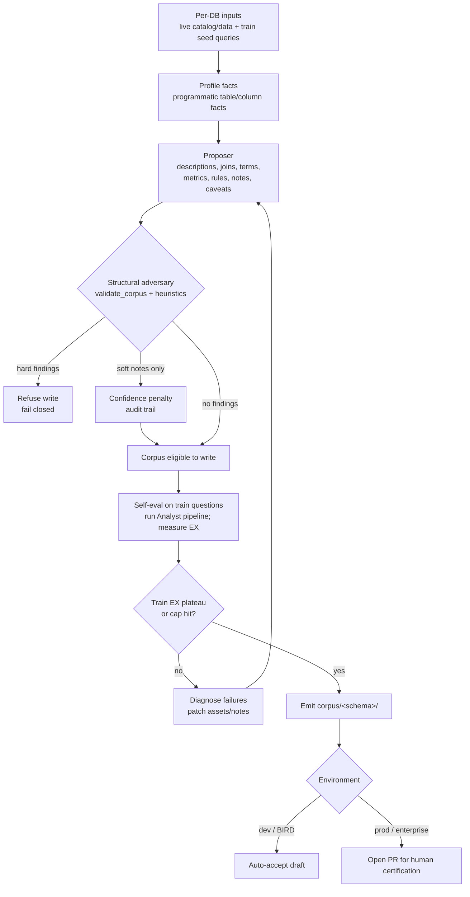

# Agentic BI Curator

The build-side agent for the [Agentic BI System](../architecture.md). It is the
offline agent that *produces* the corpus (two-harness split; `deepagents`). Runs
**per-DB, independently**. Writes the corpus defined in
[Asset schemas](asset-schemas.md); the serve-side counterpart is the
[Analyst](analyst.md). It is not a one-shot bootstrapper but a **permanent
maintainer**: cold-start plus ongoing drift-repair. Untended corpora rot
~95%→65%/month.

> **Multi-schema (D15).** "Per-DB" means one database per run — but that database now holds **many schemas**, and the **schema** (not the database) is the modeled corpus namespace (`schema -> table`). A run curates every schema in the DB plus any curated cross-schema relationships; the emitted corpus tree is `corpus/<schema>/` (the `db`→`schema` rename shipped, D15 increment 7; asset IDs unchanged). The per-DB framing below — Inputs, the loop — is unchanged in scope.

> Implementation: [`src/governed_bi/curator/`](../src/governed_bi/curator/).

> **Build status (scaffold vs seam).** A deterministic **scaffold** runs with no
> model and no network: programmatic Facts profiling (`profile`), naming-convention
> FK candidates, and an adversary `review` that wraps the CI validator with cheap
> self-consistency checks (hard findings **gate write**). The **LLM-authored
> Inference tier** is built by the deepagents harness (`curator/deep_agent.py`):
> `build_curator_agent` wires a deep agent over grounded tools — `profile_facts`
> (the Facts tier) and `run_probe_query` (a read-only SQL probe) — and Phase A
> authors descriptions, joins, terms, metrics and notes through `AssetBag`, while
> Phase B folds SME-answered clarifications back in. The `curated` rung's only
> reviewer is the structural gate: a per-asset LLM adversary that re-derives and
> falsifies each proposed claim was designed (see D10) but never reached a
> caller (`adversary.refute` raised `NotImplementedError` with zero call sites)
> and was deleted 2026-07-29 rather than left as a stub. The remaining seam is the
> **self-eval train-EX loop**. A step marked *(seam)* is not yet run.

## Inputs / outputs

- **Inputs (per DB):** the live DB (catalog + data); that DB's seed queries (`train_final.jsonl`: question + gold SQL + BIRD `evidence`). **Train only, never test (the leakage wall).**
- **Output:** the `corpus/<schema>/` tree of YAML typed assets, each carrying provenance.

## Proposer + adversary (D10)

The curator is **two roles, not one agent:**

- **Proposer:** hypothesizes Inference-tier assets (descriptions, joins, reliability caveats, terms/metrics/rules, routing/gotcha notes), probing the DB to ground each claim.
- **Adversary (structural gate, built):** wraps `validate_corpus` plus cheap self-consistency checks. Hard findings (dangling refs, bad / duplicate ids, missing physical tables, join-on failures, note-budget / excluded-identifier violations, …) **block corpus write** — fail closed. Soft heuristic notes (`missing-provenance`, `fk-missing-ref`) only discount confidence and are recorded on the asset audit trail. A per-asset LLM adversary that re-derives claims and runs falsifying probes was designed but never reached a caller (`adversary.refute` raised `NotImplementedError` with zero call sites) and was deleted 2026-07-29; the deep-agent author is told to self-review instead, and the structural gate is the only automated reviewer.

**The adversary boundary = the Facts/Inference boundary.** Facts (dtypes, nullability, uniqueness, samples, row counts) are generated **programmatically** as the deterministic foundation. They are never proposed and never checked. Everything the *model asserts* must clear the structural gate before emit. That gate is structural, not semantic: it checks reference integrity, id conventions, join-ON column membership and note budgets, so a corpus that passes it is not thereby semantically certified.

Status lifecycle in each asset's `provenance.status`:

`proposed` (proposer) → `draft` (adversary-passed) → `certified` (human sign-off, **prod only**, D6)

- **Dev (BIRD):** the structural gate is the automated reviewer that ships today; a green pass is required before write. The Phase A/B pipeline gates write and leaves status as authored unless the deterministic non-agent fold stamps certification.
- **Prod (enterprise):** the structural gate is the **automated first-line reviewer**. Human certification (D6) is a separate non-agent path — never a model-callable tool parameter.

Both the proposer's claim/evidence **and** the adversary's findings land in the asset's `audit` block → rendered in the viz/audit surface. This is the auditability payoff of an owner-less, AI-built layer.

## The loop (per DB)

1. **Profile (Facts, programmatic).** *(built)* Read catalog + sample data → emit the Facts tier for every table/column. Deterministic; no LLM; correct in every arm.
2. **Propose (Inference + notes).** *(built: the Phase A deep agent)* The proposer hypothesizes descriptions, joins (value-overlap + seed-SQL join patterns — **within a schema**; cross-schema joins are never FK/overlap-discovered, only curated from SME / example SQL / usage per D15, else the Analyst refuses), reliability caveats (execute-and-observe against the traps), terms/synonyms, metrics/rules (from `evidence` + recurring computations), and authors **routing/gotcha/pattern notes**. Free exploration is confined to this pocket. Roles, confidence and provenance come from Facts; the Phase A deep agent authors the descriptions, `suspect` caveats and derived assets (joins/terms/metrics/notes) through `AssetBag`.
3. **Adversary pass.** *(structural gate, built)* Hard structural findings refuse the write. Soft heuristic notes discount confidence only. `review` is the deterministic structural gate (CI validator + self-consistency); it is the only automated reviewer — a per-claim LLM refutation with probe queries was designed but deleted (never reached a caller).
4. **Self-eval & repair (inner loop, capped).** *(seam)* Assemble the draft layer → run the Analyst pipeline on the DB's **train** questions → measure EX → diagnose failures → proposer patches (a failed question often *becomes* the gotcha note that fixes it) → adversary re-checks the patch → repeat until train-EX plateaus or the iteration/budget cap hits. **Train-only.**
5. **Propose corpus.** *(emit downstream)* Structural gate green ∧ train-EX plateaued → emit (dev auto-accepts; prod opens a PR to the owner, D6).

**Done-enough criterion:** `CI green ∧ (train-EX plateaued ∨ cap)`. The built structural gate enforces the machine-checkable half (`CI green`) before write. The train-EX half arrives with the self-eval seam (step 4).

The build loop at a glance:

**A join is identified by its ON clause, not just by its endpoints.** `upsert_join`
keys the asset id on `(schema, left, right, digest(on))` — see
[Asset schemas](asset-schemas.md#id-conventions-ci-regex-checked). Until 2026-07-29
the id was `join_<schema>_<left>_<right>`, so two genuinely different relationships
between the same pair of tables collapsed onto one asset and the last write won, with
no error and no finding. On `soccer_2016` that cost 22 of 54 gold-derived edges,
including all three distinct `mannschaft`/`spiel` relationships the gold SQL uses, and
33 of 57 benchmark schemas lost at least one edge. It happened in `_apply_seed`, before
the agent ran, so it hit `seeded`, `curated` and `curated_sme` equally.
`on_clause_digest` normalises before hashing: an equality is unordered, the conjuncts
of a composite key are unordered, and case and whitespace do not count, so a
re-proposal of an edge already recorded still upserts onto it rather than accumulating
a duplicate. Anything that is not an equality (a `<`, a `BETWEEN`, a function call)
keeps its written order.

## Reliability inference (Phase 2 detail)

**Who may author what.** `reliability.status = suspect` is **AI-authorable**: the Phase A agent marks a column with `annotate_column(suspect=True, note=...)` or, for a whole table at once, `annotate_columns(table, columns=[...])`, and an SME answer that disowns a column folds into the same mark (`AssetBag.mark_unrecognised_columns`). `governance.excluded` is **human-only**, and it is enforced by absence — the curator's tool list has no exclusion tool and nothing under `src/governed_bi/curator/` references `excluded`. Do not add either. The distinction is what each does: `suspect` argues against a column and the analyst still sees it, while `excluded` removes it from the corpus, which is a decision a person signs for.

No deterministic path marks reliability any more. `_mark_columns_absent_from_gold` used to stamp every column that train gold SQL never referenced, and it is deleted: "BIRD never queried this column" is not evidence the column is unreliable, and where the gold SQL was defective the mask banned columns the generator needed. The curated arm's decoy defence is now exactly what the Phase A prompt's reliability sweep elicits plus what the SME round-trip returns, so a build's `run_manifest.json` reports `suspect_columns` and a zero there means the arm went out undefended.

The sweep is per column over schemas that run to 703 columns, so it is also the part of Phase A that the step budget kills first. `read_corpus(todo_only=true)` renders only the columns still lacking **both** a description and a reliability verdict, which is a worklist that shrinks as the agent writes rather than the full dump that grows. There is no `unknown` reliability status, so a column nobody looked at and a column considered and cleared are both `ok`; `todo_only` therefore treats a described-`ok` column as decided and a bare-`ok` one as not. See [The step budget](#the-step-budget) for why one call per column was not affordable.

*(Built: the Phase A agent sweeps every table and column and flags `suspect` from the table's Facts and probe results. The structured-signal scoring below is the fuller design the prompt approximates.)* The curator flags an unreliable column via **general data-quality anomalies, not BIRD-trap-specific detectors** (P2, so it transfers to an enterprise deployment; BIRD's traps merely validate that the signals fire). Each signal contributes to a confidence score. A column is marked `suspect` only above a threshold. A per-claim LLM adversary refutation of each caveat was designed but deleted (never reached a caller); only the structural gate runs before write.

| Signal | Generic form | Catches (BIRD trap) |
|---|---|---|
| **Referential-integrity break** | claims to be a key, doesn't join cleanly | permuted join keys |
| **Sibling inconsistency** | near-synonym column disagrees with its twin | sparse-perturb / cat-remap / date-offset |
| **Orphan duplicate table** | duplicates another table, no inbound FK, unused | clone tables |
| **Distributional implausibility** | values wrong for the apparent meaning | sparse-perturb / null |
| **Usage corroboration** (weak, never standalone) | unused while a near-synonym twin is used | (strengthens the above) |

**False-positive guards:** a confidence threshold; the designed-but-deleted LLM adversary would have pushed back ("unreliable, or just rare / legitimately different?"); flag only when a clear real alternative (the used twin) exists; in the enterprise setting a false positive only degrades the stamp, it never blocks (Analyst env-toggle). **Usage (#5) is corroborating-only.** Never flag on "unused" alone (rare ≠ fake, and it wouldn't transfer). **Grading (BIRD):** `decoy_touch_rate` from the run's metrics, against the trap manifest; the corpus side of it is the build manifest's `suspect_columns`.

**One granularity limit to know about.** An SME answer folds onto a column only when the clarification's scope names one (`table:<Table>.<column>`). A question scoped `table:<Table>` or `pair:<id>` has nowhere to put a column-level mark, so the answer reaches the corpus as a note instead; the Phase A prompt asks for column-scoped questions when the doubt is about one column, and Phase B's `unrecognised_column_marks.no_column_in_scope` counts the ones that still arrive too coarse.

## The step budget

Phase A is up to `MAX_PAIR_BATCHES` (3) agent invokes per schema, one per batch of train
pairs, and each invoke is bounded separately. The bound is denominated in **tool calls**,
not in LangGraph super-steps: `derive_step_budget(n_tables=, n_columns=, n_pairs=)`
returns `30 + 3*tables + columns//10 + pairs//2`, where `n_pairs` is now that **batch's**
width rather than the whole split, and each batch is granted the result. The manifest
records both: `tool_call_budget` stays the per-invocation scalar that
`recursion_limit_for` is checked against, and `tool_call_budget_total` sums the batches.
`recursion_limit_for(budget)` converts
it for the graph as `3 * budget + 4`. The factor of three is measured, not assumed:
the deepagents loop is `model -> TodoListMiddleware.after_model -> tools`, so one
*sequential* tool call costs three super-steps (deepagents 0.6.12 / langgraph 1.2.8).
The `+ 4` covers the one-off `before_agent` node and a final model turn that answers
without calling a tool. Phase B derives its own budget as `30 + 3 * n_answered`,
because its work is bounded by the clarification ledger rather than by schema width.
The validate fix pass runs on `max(budget // 2, 8)`.

`max_agent_steps=None` is the default and means "derive". An explicit int is an
operator override that caps cost, and it applies to every schema alike. This
replaced a constant: `build_curated_corpus` defaulted to `25` and computed
`recursion_limit = max(max_agent_steps * 4, 100)`, which pinned the real limit at 100
super-steps for every value at or below the default. So `--max-agent-steps` did
nothing until it was raised past 25, which is not what either driver's help text said,
and 100 super-steps buys only 33 sequential tool calls. Nothing framework-imposed was
being hit either way: `create_deep_agent` defaults `recursion_limit` to 9,999, and the
curator was lowering it.

A constant was the wrong shape for the pool. On the 2026-07-29 run, 30 of 57 Phase A
agents hit the limit. The median benchmark schema (8 tables, 74 columns, 40 rendered
pairs) needs roughly 126 tool calls read charitably and 238 read literally against the
33 it had, so it was oversubscribed by 3.8x to 7.2x, and the cap rate was flat across
schema size, which is the signature of a budget too small for the *fixed* costs rather
than one exhausted by hard schemas.

Concretely, the derivation gives that median schema 81 tool calls and a
`recursion_limit` of 247, a 3-table one about 46, and the 73-table / 703-column
extreme about 339. Note 81 is under the 126 the old prompt asked for. It is not meant
to cover a column-by-column sweep: `annotate_columns` collapses that sweep to one call
per table, and the `v2` prompt is what tells the agent to use it. The budget is
deliberately loose rather than tight, because the failure it replaces silently
discarded whole schemas from a paid run, but it is still a knob with a cost
consequence: every unit is up to one more model call.

**Batching is why the budget goes as far as it does.** Several tool calls emitted in
one assistant message cost a single `tools` super-step; the same calls spread over N
replies cost 3N. `annotate_columns(table, columns=[...])` exists for that reason and
makes the reliability sweep cost one call per *table* instead of one per column, which
is why the column term in the derivation is small (slack for probes, not a call each).
`SUPER_STEPS_PER_TOOL_CALL = 3` is the pessimistic fully serial rate; a batching agent
gets more than the budget nominally buys.

The budget is also stated to the agent. Nothing in the system prompt, the user turn or
the harness used to mention a limit, while the deepagents base prompt says to keep
working until the task is fully complete, so the agent could not triage against a
bound it could not see. `_budget_brief` appends a `## Budget` section to the Phase A
user turn giving the figure, the instruction to batch, and a triage order: mark
unreliable columns first (nothing else in the system writes reliability), then
descriptions, then clarifications, then few-shots and terms, and re-verifying seeded
joins and metrics last, since those are recorded deterministically before the agent
starts and survive whatever it does.

**What a build records about it.** `_invoke_agent` streams
(`stream_mode=["updates", "values"]`) instead of calling `.invoke()`, and keeps the
last `values` chunk. That is what makes an exhausted run diagnosable: `.invoke()`
returns accumulated state only on success, so every crash used to leave the tool
counts unmeasurable at exactly the moment they mattered. It is the same technique the
analyst already uses (`analyst/agent.py::_stream_agent`). `run_manifest.json` carries
`tool_call_budget` and, inside `tool_calls`, `n_super_steps`, `recursion_limit`,
`exhausted`, and a `repeats` block (`total`, `distinct`, `max_repeat`,
`top_repeated`). `distinct` against `total` is the churn measure: 300 calls over 40
distinct requests is a loop, and no other recorded field shows it. The manifest also
carries an `assets` block counting the joins, metrics, terms and few-shots actually in
the corpus, separately from the seed's *call* counts, so nobody has to difference a
call count against a YAML count again (doing that once produced a phantom "the agent
deleted 21 joins"). The run record's Tier A extra carries `n_tool_calls` and
`n_steps`, so the durable sqlite log has them too.

Verbatim tool arguments live in one place: `curator_trace.jsonl` (Phase A) and
`curator_sme_trace.jsonl` (Phase B), one JSON line per call with `i`, `tool`,
`args_digest` and `args`. Only the derived counts are promoted into the manifest and
the run record. A repeated `(tool, args_digest)` pair is a re-issued identical call,
which is what turns "it ran out of steps" into "it looped on this".

## Distillation discipline (curation beats accumulation)

The curator *selects and distills*; it never dumps. That is the memory doc's central law (raw grep <1pt; Spotify accepted 12.5%; more memory can hurt).

- **Few-shots:** a **per-pattern cap**. Cover query-pattern classes and the complexity spread, dedup near-identical examples, and keep the clearest exemplar per pattern. Not the whole train split.
- **Notes:** the highest-value output and the hardest. Distilled routing/gotchas, not transcripts. Maintained continuously.

## Maintenance (permanent maintainer)

Cold-start is the first job; drift-repair is ongoing. Serve-side signals (corrections, failures) are harvested back into proposer input. A correction ≈ a PR to a note/reference doc, so the memory/corpus distinction collapses (D8).

Links: [Design decisions](../design-decisions.md) · [Asset schemas](asset-schemas.md) · [Architecture](../architecture.md) §2 · *Data Agent Memory Design Overview*.
